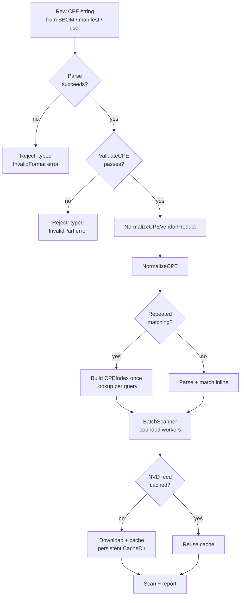

# ✅ Best Practices

Recommendations for using the `cpeskills` SDK safely and efficiently in production.

## Validate input at the boundary

Never trust CPE strings from SBOMs, manifests, or user input. Run them through `Parse` and `ValidateCPE` before storing or matching.

```go
import "github.com/scagogogo/cpe-skills"

func ingest(raw string) (*cpeskills.CPE, error) {
    c, err := cpeskills.Parse(raw) // auto-detects 2.2 / 2.3
    if err != nil {
        return nil, err
    }
    if err := cpeskills.ValidateCPE(c); err != nil {
        return nil, err
    }
    return cpeskills.NormalizeCPE(c), nil
}
```

## Handle typed errors, not just strings

The SDK returns `*CPEError` with an `ErrorType`. Use the `IsXxxError` predicates to branch on cause rather than string-matching messages.

```go
if err := cpeskills.ValidateCPE(c); err != nil {
    switch {
    case cpeskills.IsInvalidFormatError(err):
        log.Printf("reject malformed input")
    case cpeskills.IsInvalidPartError(err):
        log.Printf("reject bad part")
    case cpeskills.IsOperationFailedError(err):
        log.Printf("retryable storage failure: %v", err)
    }
}
```

See [/en/api/modules/errors](/en/api/modules/errors) for the full error taxonomy.

## Use `MustParse` only for literals

`MustParse` panics on failure. Reserve it for package-level variables whose value is known at compile time. For everything else, use `Parse` and propagate the error.

```go
var baseline = cpeskills.MustParse("cpe:2.3:a:microsoft:windows:10:*:*:*:*:*:*:*")
// runtime input: use Parse, never MustParse
```

## Normalise vendor and product names

Vendor spelling varies wildly (`Microsoft`, `microsoft`, `Microsoft Corp.`). `NormalizeCPEVendorProduct` and `VendorNormalizer` collapse aliases to a canonical form so matching doesn't miss duplicates.

```go
n := cpeskills.NewVendorNormalizer()
c2 := n.NormalizeCPE(c)              // canonicalise
n.RegisterVendorAlias("msft", "microsoft")
```

## Parallelise batch work, but bound it

`BatchScanner` runs scans with a concurrency limit. Pick a concurrency that matches your CPU and your data-source rate limits — don't just copy `runtime.NumCPU()`.

```go
idx := cpeskills.NewCPEIndex(cpes)
bs := cpeskills.NewBatchScanner(idx, 8) // 8 workers
bs.SetDataSources([]*cpeskills.VulnDataSource{src})
results, err := bs.Scan(components)
```

## Cache NVD data locally

NVD feeds are large and rate-limited. `DefaultNVDFeedOptions()` caches 24h in a temp dir; for production point `CacheDir` at a persistent volume and raise `CacheMaxAge` so restarts don't re-download.

```go
opts := cpeskills.DefaultNVDFeedOptions()
opts.CacheDir = "/var/cache/nvd"
opts.CacheMaxAge = 168
```

## Prefer `CPEIndex` lookup over linear scan

For repeated matching against a fixed set, build a `CPEIndex` once and call `Lookup`. Linear scans over large slices in a hot loop are the most common perf regression.

## Decision flow

The seven practices above form a single decision tree for any incoming CPE string. Follow it from the top:



::: tip MustParse shortcut
The tree above uses `Parse`. `MustParse` only skips the first decision box — and only for compile-time literals where a parse failure is a programmer bug, not a runtime condition.
:::

## Summary

Validate at the boundary, branch on typed errors, keep `MustParse` for literals, normalise names, bound concurrency, and cache NVD data. These habits prevent the vast majority of real-world incidents.
