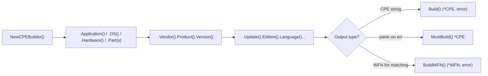

# 🏗️ CPE Builder Examples

Constructing a CPE 2.3 string by hand is error-prone — 13 colon-separated fields, escaping rules, and a part code (`a`/`h`/`o`) you must not mistype. The fluent `CPEBuilder` from the [`builder`](/en/api/modules/builder) module lets you set fields one method at a time and validates as it goes. This page shows the common shapes.

## Minimal Application CPE

`NewCPEBuilder()` returns a builder with an empty WFN inside. Chain `.Application()` (or `.OS()`, `.Hardware()`) plus the core fields, then `.Build()`:

```go
package main

import (
    "fmt"
    "log"

    "github.com/scagogogo/cpe-skills"
)

func main() {
    cpe, err := cpeskills.NewCPEBuilder().
        Application().
        Vendor("apache").
        Product("log4j").
        Version("2.14.0").
        Build()
    if err != nil {
        log.Fatal(err)
    }
    fmt.Println(cpe.Cpe23)
    // cpe:2.3:a:apache:log4j:2.14.0:*:*:*:*:*:*:*
}
```

## Operating System and Hardware

`.OS()` sets part `o`, `.Hardware()` sets part `h`. Everything else chains identically:

```go
rhel, _ := cpeskills.NewCPEBuilder().
    OS().
    Vendor("redhat").
    Product("enterprise_linux").
    Version("8.2").
    Build()
fmt.Println(rhel.Cpe23)
// cpe:2.3:o:redhat:enterprise_linux:8.2:*:*:*:*:*:*:*

cpu, _ := cpeskills.NewCPEBuilder().
    Hardware().
    Vendor("intel").
    Product("core_i7").
    Version("10700k").
    Build()
fmt.Println(cpu.Cpe23)
// cpe:2.3:h:intel:core_i7:10700k:*:*:*:*:*:*:*
```

## Setting Every Field

The builder exposes a setter for all 11 attributes. Missing fields default to `*` (ANY):

```go
c, err := cpeskills.NewCPEBuilder().
    Application().
    Vendor("oracle").
    Product("java_se").
    Version("17.0.1").
    Update("12").
    Edition("lse").
    Language("en").
    SoftwareEdition("jre").
    TargetSoftware("windows").
    TargetHardware("x64").
    Other("LTS").
    Build()
if err != nil {
    log.Fatal(err)
}
fmt.Println(c.Cpe23)
```

## `MustBuild` for Constants

When you know the values are valid at compile time, `MustBuild` panics on error so a typo fails fast in tests rather than in production:

```go
var log4j = cpeskills.NewCPEBuilder().
    Application().
    Vendor("apache").
    Product("log4j").
    Version("2.14.0").
    MustBuild()
```

## `BuildWFN` for WFN-Based Matching

`BuildWFN` returns a `*WFN` instead of a `*CPE`. WFN (Well-Formed Name) is the internal representation the [`matching`](/en/api/modules/matching) module compares against, so it's useful when you want to skip the round-trip through a CPE string:

```go
wfn, err := cpeskills.NewCPEBuilder().
    Application().
    Vendor("apache").
    Product("log4j").
    Version("*").
    BuildWFN()
if err != nil {
    log.Fatal(err)
}
// wfn is ready for CompareWFNs / FromCPE interplay
fmt.Println(wfn.Get(cpeskills.AttrVendor)) // apache
```

## Building from `Part(string)`

If your part code comes from config or user input, use `.Part("a")` rather than the named helpers — it accepts `a`/`h`/`o`:

```go
c, _ := cpeskills.NewCPEBuilder().
    Part("o").
    Vendor("linux").
    Product("linux_kernel").
    Version("5.15.0").
    Build()
```

## Compare with `GenerateCPE`

For the simplest cases the [`generator`](/en/api/modules/generator) module's `GenerateCPE` is terser, but it skips validation and offers no per-field chaining. Use the builder when you need validation, optional fields, or a WFN directly.



## Summary

- `NewCPEBuilder()` is the entry point; chain setters in any order. Use `.Application()`/`.OS()`/`.Hardware()` or `.Part("a")`.
- `.Build()` returns `(*CPE, error)`; `.MustBuild()` panics and suits package-level vars; `.BuildWFN()` returns a `*WFN` for the matching engine. Prefer the builder over hand-concatenating a 2.3 URI.
See the [`builder`](/en/api/modules/builder) and [`generator`](/en/api/modules/generator) module pages for the full API reference.
