# 🔄 CPE 2.2 vs 2.3

CPE has had two official string formats over its lifetime. **CPE 2.2** is the older *URI* style; **CPE 2.3** is the newer *formatted string* style that replaced it. Both still appear in real data — NVD historically shipped 2.2 URIs, while modern dictionaries and CVE feeds use 2.3 — so a robust tool must speak both.

## The two syntaxes

**CPE 2.2 URI** (11 conceptual fields packed into 7 URI slots):

```
cpe:/a:apache:http_server:2.4.58
cpe:/o:microsoft:windows:10:enterprise
```

**CPE 2.3 Formatted String** (13 fields, colon-separated, prefixed `cpe:2.3:`):

```
cpe:2.3:a:apache:http_server:2.4.58:*:*:*:*:*:*:*
cpe:2.3:o:microsoft:windows:10:*:en-US:*:enterprise:*:*:*
```



```mermaid
flowchart TB
    subgraph URI ["CPE 2.2 URI"]
        U1["cpe:"] --> U2["part"] --> U3["vendor"] --> U4["product"] --> U5["version"]
        U5 --> U6["update"] --> U7["edition"] --> U8["language"]
    end
    subgraph FS ["CPE 2.3 Formatted String"]
        F1["cpe:2.3"] --> F2["part"] --> F3["vendor"] --> F4["product"] --> F5["version"]
        F5 --> F6["update"] --> F7["edition"] --> F8["language"]
        F8 --> F9["sw_edition"] --> F10["target_sw"] --> F11["target_hw"] --> F12["other"]
    end
```

## Field comparison

| Concept            | 2.2 URI position     | 2.3 field # | Notes                              |
|-------------------|----------------------|-------------|------------------------------------|
| part              | 1                    | 1           | `a` / `o` / `h`                    |
| vendor            | 2                    | 2           |                                    |
| product           | 3                    | 3           |                                    |
| version           | 4                    | 4           |                                    |
| update            | 5                    | 5           |                                    |
| edition           | 6                    | 6           | 2.3 splits this into 4 sub-fields  |
| language          | 7                    | 7           |                                    |
| software edition  | packed into edition  | 8           | only expressible in 2.3           |
| target software   | packed into edition  | 9           | only expressible in 2.3           |
| target hardware   | packed into edition  | 10          | only expressible in 2.3           |
| other             | —                    | 11          | only expressible in 2.3           |

The key difference: **2.3 can express `sw_edition`, `target_sw`, `target_hw`, and `other` as distinct fields**, whereas 2.2 crams them into the single `edition` slot. This means a 2.3 name is strictly more expressive than a 2.2 URI.

## Converting between the two

Because 2.3 carries more information, the 2.3 → 2.2 direction is lossy: the four extra fields are folded back into `edition`. The 2.2 → 2.3 direction simply fills the missing fields with the logical value `*` (ANY).

```go
package main

import (
    "fmt"
    "github.com/scagogogo/cpe-skills"
)

func main() {
    // 2.3 -> 2.2
    uri22, err := cpeskills.ConvertFSToURI("cpe:2.3:a:apache:http_server:2.4.58:*:*:*:*:*:*:*")
    if err != nil { panic(err) }
    fmt.Println(uri22) // cpe:/a:apache:http_server:2.4.58

    // 2.2 -> 2.3
    fs23, err := cpeskills.ConvertURIToFS("cpe:/a:apache:http_server:2.4.58")
    if err != nil { panic(err) }
    fmt.Println(fs23) // cpe:2.3:a:apache:http_server:2.4.58:*:*:*:*:*:*:*
}
```

## Which to use?

- **Read** both — your input data may contain either.
- **Write** 2.3 when you control the output; it is unambiguous and current.
- Use `MustParse` if you do not care which form the input is in.

## Relationship to the modules

- [Parser 2.2](../api/modules/parser-2.2.md) — `ParseCpe22`, `FormatCpe22`.
- [Parser 2.3](../api/modules/parser-2.3.md) — `ParseCpe23`, `FormatCpe23`.
- [Binding](../api/modules/binding.md) — `ConvertURIToFS`, `ConvertFSToURI`.

## Summary

2.2 is legacy but ubiquitous; 2.3 is expressive but verbose. Treat them as two serializations of the same logical name, convert freely, and prefer 2.3 for new artifacts.
