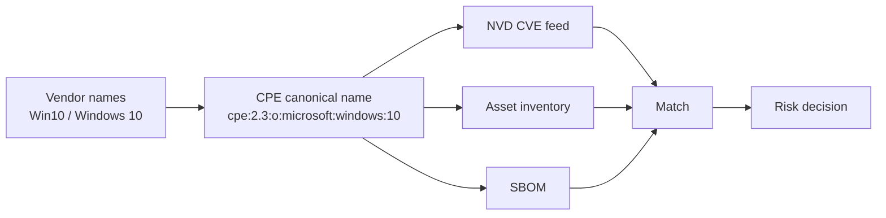
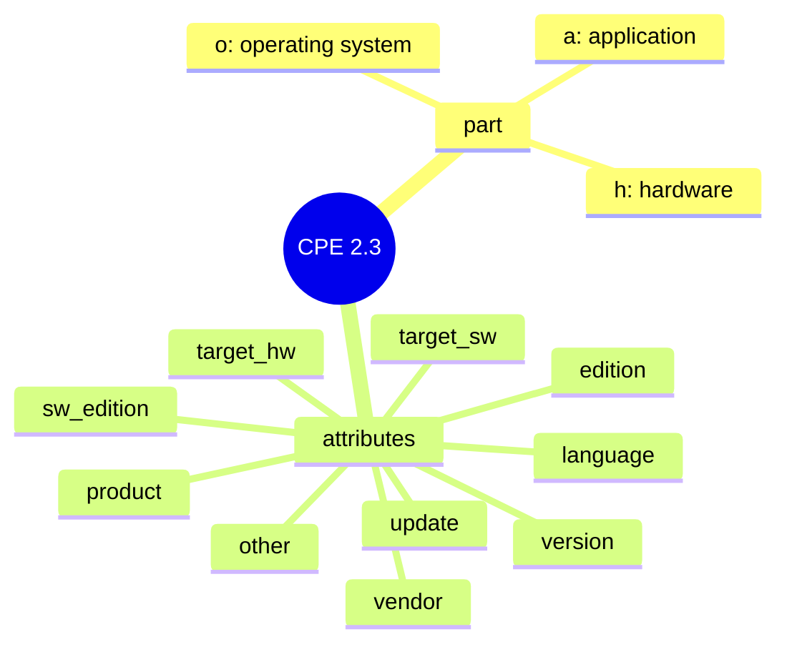

# 📋 What is CPE?

**Common Platform Enumeration (CPE)** is a structured naming scheme for identifying IT products — software, hardware, and operating systems. It is maintained by the **U.S. National Institute of Standards and Technology (NIST)** and published as part of the *NVD* (National Vulnerability Database) program. A CPE name is a canonical, vendor-independent identifier that lets one system say "Apache 2.4.58" and have every other system understand the exact same product.

## Why CPE exists

Vulnerability databases, asset inventories, and SBOMs each describe products in their own words — "Microsoft Windows 10", "Win10 x64", "Microsoft Corporation Windows 10 Pro". Without a shared key, correlating a CVE against an installed package becomes a fuzzy string-matching exercise. CPE provides that key.



## The three part types

Every CPE declares a `part` that classifies the product:

| Part | Short | Meaning           | Example                          |
|------|-------|-------------------|----------------------------------|
| `a`  | app   | Software application | `cpe:2.3:a:google:chrome:120`    |
| `o`  | os    | Operating system  | `cpe:2.3:o:microsoft:windows:10` |
| `h`  | hw    | Hardware device   | `cpe:2.3:h:cisco:rv340`          |

## Where CPE is used

- **CVE matching** — NVD records the list of vulnerable CPEs for every CVE; matching your inventory against those CPEs is how you know you are exposed.
- **SBOM** — CycloneDX and SPDX components can carry a CPE so downstream consumers can cross-reference vulnerability data.
- **Supply-chain security** — scanners translate between CPE and Package URL (PURL) to bridge the NVD world and the package-manager world.

## How cpe-skills simplifies it

Working with CPE by hand means parsing two different syntaxes (2.2 URI vs 2.3 formatted string), handling the special logical values, and binding names for comparison — all before any matching can happen. `cpe-skills` wraps this in one coherent Go API:

```go
package main

import (
    "fmt"
    "github.com/scagogogo/cpe-skills"
)

func main() {
    // MustParse accepts either CPE 2.2 URI or 2.3 formatted string
    cpe, err := cpeskills.ParseCpe23("cpe:2.3:a:apache:http_server:2.4.58:*:*:*:*:*:*:*")
    if err != nil {
        panic(err)
    }
    fmt.Println(cpe.Part.LongName, cpe.Vendor, cpe.ProductName, cpe.Version)
    // Output: Application apache http_server 2.4.58
}
```

`MustParse` is a convenience that panics on invalid input — handy for tests and literals. From a parsed `CPE` you can build a Well-Formed Name for matching, convert to a PURL, or attach the name to an SBOM component.

## The structure of a CPE 2.3 name

A 2.3 formatted string has 13 colon-separated fields. Only the first five (part, vendor, product, version, update) are usually populated; the rest default to the wildcard `*` (ANY):

```
cpe:2.3:<part>:<vendor>:<product>:<version>:<update>:<edition>:<language>:<sw_edition>:<target_sw>:<target_hw>:<other>
```

The mindmap below shows the three part types and the 11 logical attributes that follow:



The 2.2 URI form packs the same logical fields into fewer slots; see [CPE 2.2 vs 2.3](./cpe-22-vs-23.md) for the mapping.

## Who maintains CPE

CPE is a NIST-owned specification. The official dictionary — the list of accepted CPE names — is published by NVD alongside the CVE feed. Every CVE entry lists the CPE names it affects, which is why CPE is the natural join key between "what I have" and "what is broken".

## Relationship to the modules

- [CPE](../api/modules/cpe.md) — the `CPE` struct, `MatchCPE`, `FormatURI`.
- [Parser 2.2](../api/modules/parser-2.2.md) / [Parser 2.3](../api/modules/parser-2.3.md) — the two official syntaxes.
- [WFN](../api/modules/wfn.md) — the logical-name representation used for matching.

## Summary

CPE is the lingua franca of product identification in vulnerability management. Understanding its three part types, its two syntaxes, and its role as the join key between NVD and your inventory is the foundation for every other feature `cpe-skills` offers.
