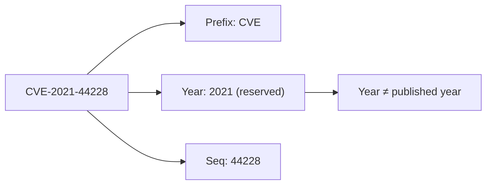
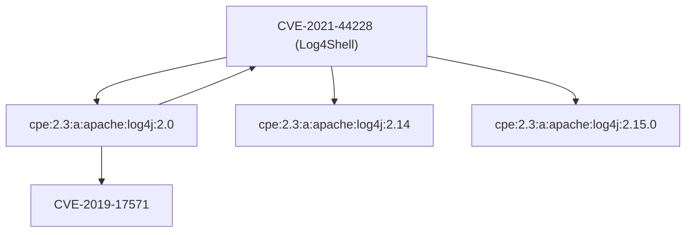
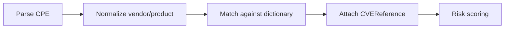

# 🐛 CVE Naming

A **CVE** (Common Vulnerabilities and Exposures) is a globally unique identifier assigned to a publicly disclosed cybersecurity vulnerability. CVE is the lingua franca that lets tools, databases, and humans talk about the *same* vulnerability without ambiguity. This page explains the CVE naming convention, who assigns the IDs, how CVEs relate to CPEs, and how cpe-skills models a CVE in code.

## The CVE-YYYY-NNNN Format

Every CVE ID follows the pattern `CVE-YYYY-NNNNNNN`:

- `CVE` — the fixed prefix.
- `YYYY` — the year the CVE ID was *reserved* (not necessarily the year it was published).
- `NNNNNNN` — a sequential number, at least 4 digits, that grows as needed (recent years use 5+ digits).

For example, `CVE-2021-44228` is the famous Log4Shell vulnerability. The year `2021` tells you when the ID was reserved; the `44228` is just the sequence counter for that year. The same identifier is used by NVD, OSV, vendors, and security teams worldwide.



cpe-skills validates this format with [`ValidateCVE`](/en/api/modules/cve) and accepts already-formatted or slightly malformed input via `NewCVEReference`, which normalizes the ID through the underlying `cve` library:

```go
package main

import (
    "fmt"
    "github.com/scagogogo/cpe-skills"
)

func main() {
    // NewCVEReference normalizes the ID for you
    ref := cpeskills.NewCVEReference("CVE-2021-44228")
    fmt.Println(ref.CVEID) // CVE-2021-44228

    // Validate checks the canonical format
    fmt.Println(cpeskills.ValidateCVE("CVE-2021-44228")) // true
    fmt.Println(cpeskills.ValidateCVE("2021-44228"))     // false
}
```

## CNAs — Who Assigns CVE IDs

CVE IDs are not assigned by one central office. The program is decentralized through **CNAs** (CVE Numbering Authorities):

| Role | Example | What they do |
|------|----------|--------------|
| Top-level Root | MITRE | Oversees the program, assigns ranges to CNAs |
| Root CNA | CISA, GitHub | Delegates ranges to sub-CNAs |
| CNA (vendor) | Apache, Microsoft, Google | Assigns CVEs for their own products |
| CNA-LR | Researchers | Assigns to third-party products they researched |

Because any given vulnerability may be reported by multiple parties, the *first* CNA to reserve an ID wins. This is why you sometimes see a vendor advisory and a MITRE record for the same issue — they should reference the same CVE ID.

## CVE ↔ CPE Relationship

A CVE answers *“what is the vulnerability?”*. A CPE answers *“what is the affected product?”*. A single CVE typically affects **many** CPEs (multiple versions, editions, or even products), and a single CPE can be affected by **many** CVEs over its lifetime.



This many-to-many mapping is the backbone of vulnerability scanning: given a product (CPE), find all known CVEs; given a CVE, find all affected products (CPEs).

## How cpe-skills Models a CVE

The [`CVEReference`](/en/api/modules/cve) struct is the library's in-memory model of a single CVE. It carries the metadata you'd expect (description, dates, CVSS score) plus the list of affected CPE URIs:

```go
ref := cpeskills.NewCVEReference("CVE-2021-44228")
ref.Description = "Log4j remote code execution"
ref.SetSeverity(10.0) // sets CVSSScore and Severity string
ref.AddAffectedCPE("cpe:2.3:a:apache:log4j:2.0:*:*:*:*:*:*:*")
ref.AddAffectedCPE("cpe:2.3:a:apache:log4j:2.14:*:*:*:*:*:*:*")
ref.AddReference("https://logging.apache.org/log4j/2.x/security.html")
```

A few helper functions operate on slices of `CVEReference`:

| Function | Purpose |
|----------|---------|
| `QueryByCVE` | Return CPEs affected by a given CVE ID |
| `GetCVEInfo` | Look up a `CVEReference` by ID |
| `ExtractCVEsFromText` | Pull CVE IDs out of free-form text |
| `GroupCVEsByYear` | Bucket a list of IDs by year |
| `RemoveDuplicateCVEs` | De-duplicate a CVE list |

## Relationship to This Project

cpe-skills treats CVEs as **first-class citizens** that bridge CPE matching and vulnerability data. The flow below shows where CVE modeling sits in the pipeline:



## Summary

- CVE IDs follow `CVE-YYYY-NNNNNNN`; the year is the *reservation* year.
- CNAs (a decentralized network) assign IDs, so the same issue may surface through multiple channels.
- One CVE maps to many CPEs and vice versa — this many-to-many link drives scanner logic.
- In cpe-skills, `CVEReference` plus helpers like `ValidateCVE` and `QueryByCVE` model the concept end to end. See the [cve module](/en/api/modules/cve) for the full API.
