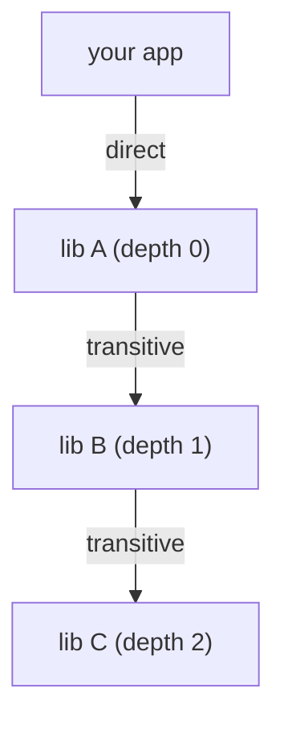
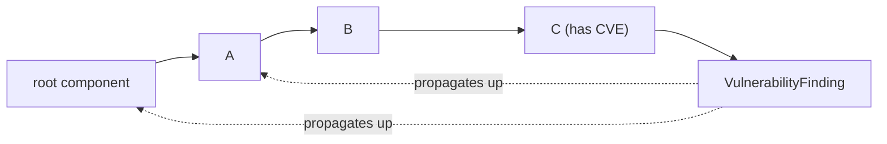
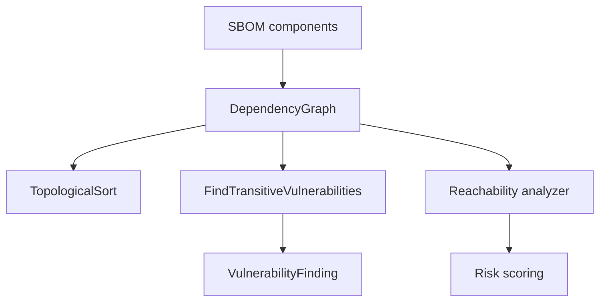

# 🕸️ Dependency Graph & Transitive Dependencies

Modern software is not a flat list of packages — it's a graph. Your application depends on library A, which depends on B, which depends on C. A vulnerability in C is *your* vulnerability, even though you never named C directly. cpe-skills' [`dependency-graph`](/en/api/modules/dependency-graph) package models this structure so you can compute transitive dependencies, walk dependency paths, and propagate vulnerabilities through the chain.

## Direct vs Transitive Dependencies

| Term | Meaning | Depth |
|------|---------|-------|
| Direct dependency | Something you declared in your manifest | 0 |
| Transitive dependency | Pulled in by a direct dependency | ≥ 1 |

The `DependencyNode` struct records both: a `Depth` integer (0 for direct) and a `Direct` boolean. `AddComponent` marks the component itself as direct (depth 0) and each declared dependency as transitive (depth 1); deeper levels are computed by `ComputeDepths` via BFS.



## Topological Sort

A dependency graph is a directed acyclic graph (DAG), so it admits a **topological order** — a linear sequence where every dependency appears before its dependents. `TopologicalSort` returns this order; it errors if a cycle exists, because cyclic dependencies are invalid for SBOMs.

```go
graph := cpeskills.NewDependencyGraph()
graph.AddComponent(appComponent, []*cpeskills.SBOMComponent{libA})
// ...add more nodes/edges...
order, err := graph.TopologicalSort() // build/install order
```

Topological order is what makes deterministic builds possible: process dependencies in this sequence and you'll never build something before its prerequisites.

## Transitive Vulnerability Propagation

`FindTransitiveVulnerabilities` is the killer feature: given a graph and an `NVDCPEData` snapshot, it walks the whole graph and collects every `VulnerabilityFinding` reachable from any node — not just the direct ones. This is how a CVE in a deeply nested library surfaces in your report.



You can also query the structure directly:

| Method | Returns |
|--------|---------|
| `GetDependencies(nodeID)` | Nodes this one depends on |
| `GetDependents(nodeID)` | Nodes that depend on this one |
| `GetDependencyPath(from, to)` | The path between two nodes |
| `SubGraph(rootID)` | A sub-graph rooted at a node |
| `GetDirectDependencies` / `GetTransitiveDependencies` | Filtered node lists |

## Why Reachability Affects Priority

A transitive vulnerability might still be **unreachable** if your code never invokes the vulnerable code path. The [`reachability`](/en/api/modules/reachability) analyzer walks the graph (using `Depth` as a proxy for call distance) and labels each finding `direct`, `transitive`, `conditional`, `not_reachable`, or `unknown`. A `not_reachable` finding is still reported, but the risk scorer down-weights it. So the graph serves a double purpose: it propagates vulnerabilities *and* gates their urgency.

## Relationship to This Project

The dependency graph is the backbone that connects SBOM components to vulnerability data and reachability:



## Summary

- A dependency graph distinguishes direct (depth 0) from transitive (depth ≥1) dependencies.
- `TopologicalSort` yields a valid build order and detects cycles.
- `FindTransitiveVulnerabilities` propagates CVEs from deep nodes up to your components.
- The same graph feeds the reachability analyzer, which is why transitive depth changes priority. See the [dependency-graph](/en/api/modules/dependency-graph) and [reachability](/en/api/modules/reachability) modules for the full API.
