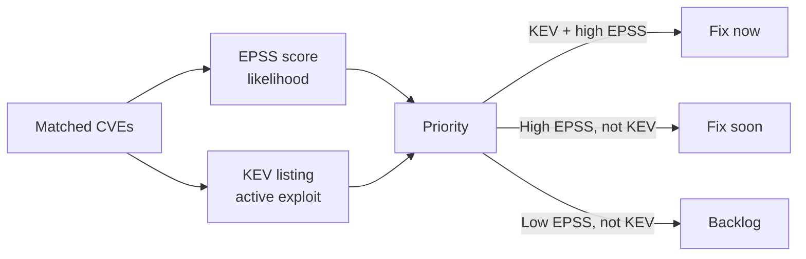

# ⚡ EPSS and CISA KEV

Two public data sources turn a flat list of matched CVEs into a *prioritized* list: **EPSS** tells you the probability a vulnerability will be exploited, and **CISA KEV** tells you it already *is* being exploited. Together they answer the question every defender faces first: "of all these CVEs, which do I fix tonight?"

## EPSS — Exploit Prediction Scoring System

[EPSS](https://www.first.org/epss) is operated by **FIRST.org**. For every published CVE it produces:

- **EPSS score** — a probability in `[0, 1]` that the vulnerability will be exploited in the wild within the next 30 days.
- **Percentile** — where that score ranks among all CVEs, also `[0, 1]`.

A CVE with EPSS `0.94` and percentile `0.99` is near-certain to be attacked; one with EPSS `0.0005` is, probabilistically, noise. EPSS is purely data-driven (it models real-world exploit telemetry), which makes it a far better triage signal than CVSS severity alone — CVSS measures *impact if exploited*, not *likelihood of exploitation*.

## CISA KEV — Known Exploited Vulnerabilities

The [CISA KEV catalog](https://www.cisa.gov/kev) is the authoritative list of vulnerabilities that CISA has confirmed are being exploited in the wild. Each entry carries:

- `cveID`, `vendorProject`, `product`
- `dateAdded`, `dueDate` — when it was cataloged and the federal remediation deadline
- `requiredAction` — what CISA expects operators to do
- `knownRansomwareCampaignUse` — whether ransomware actors are using it

A vulnerability on the KEV list is not a theoretical risk; it is an active threat. Federal agencies are bound to KEV deadlines, and the list is widely used as a must-fix baseline in the private sector too.

## Why both matter for prioritization



- **KEV + high EPSS** → fix immediately; this is being weaponized.
- **High EPSS, not KEV** → fix soon; exploitation is likely imminent.
- **Low EPSS, not KEV** → can wait; risk is theoretical.

## Querying the data

```go
package main

import (
    "fmt"
    "github.com/scagogogo/cpe-skills"
)

func main() {
    epss := cpeskills.NewEPSSClient()
    entry, err := epss.GetScore("CVE-2021-44228")
    if err != nil { panic(err) }
    fmt.Printf("EPSS=%.4f percentile=%.4f\n", entry.EPSSScore, entry.Percentile)

    kev := cpeskills.NewKEVClient()
    listed, err := kev.IsListed("CVE-2021-44228")
    if err != nil { panic(err) }
    if listed {
        k, _ := kev.GetEntry("CVE-2021-44228")
        fmt.Println("due:", k.DueDate, "ransomware:", k.KnownRansomwareCampaignUse)
    }
}
```

`GetScores` fetches EPSS for many CVEs at once; `KEVClient.GetAll` returns the whole catalog. Both clients cache responses and expose `EnrichVulnerabilityFindings` to stamp score/KEV status directly onto a finding list, so prioritization is a single call after matching.

## From score to risk weight

`EPSSScoreToRiskFactor` maps an EPSS score to a numeric risk multiplier, and `KEVSeverityBoost` upgrades a CVSS severity string when the CVE is on the KEV list — useful when feeding a composite risk score.

## Data sources

- **EPSS**: `https://api.first.org/data/v1/epss` (the library's `DefaultEPSSBaseURL`), operated by FIRST.org, updated daily.
- **KEV**: `https://www.cisa.gov/sites/default/files/feeds/known_exploited_vulnerabilities.json` (`DefaultKEVBaseURL`), published by CISA, updated as new exploits are confirmed.

## Relationship to the modules

- [EPSS](../api/modules/epss.md) — `EPSSClient`, `EPSSEntry`, `GetScore`, `EPSSScoreToRiskFactor`.
- [KEV](../api/modules/kev.md) — `KEVClient`, `KEVEntry`, `IsListed`, `GetEntry`, `KEVSeverityBoost`.

## Summary

EPSS quantifies exploit *likelihood*; KEV records exploit *actuality*. Layering both over a matched CVE list is the single most effective prioritization move in vulnerability management, and the two public feeds make it available to anyone.
