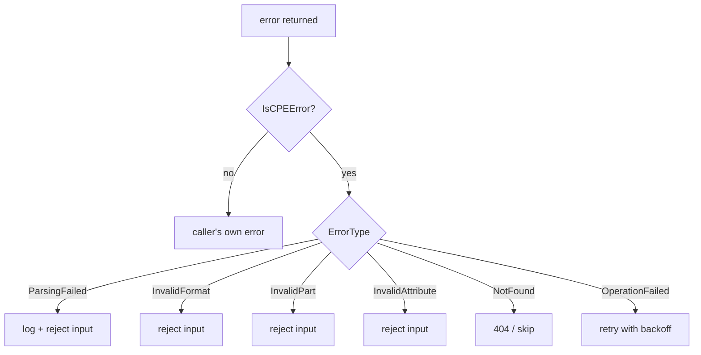

# 🚫 Error Handling Guide

The `cpeskills` SDK exposes a structured error model so callers can branch on cause rather than parsing message strings. Every operation that can fail returns a `*CPEError`.

## The CPEError type

`CPEError` is the single error struct for the whole SDK. It carries a typed `ErrorType`, a human-readable message, the offending CPE string (when relevant), and an optional wrapped `Err`.

```go
type CPEError struct {
    Type       ErrorType
    Message    string
    CPEString  string
    Err        error
}
```

It implements `error` via `Error()` and supports `errors.Is` / `errors.As` through `Unwrap()`, which returns the inner `Err`. See [/en/api/modules/errors](/en/api/modules/errors) for the source.

## The six ErrorType values

| Constant                       | When it is returned                              | Constructor                  |
|--------------------------------|--------------------------------------------------|------------------------------|
| `ErrorTypeParsingFailed`       | A CPE string could not be parsed                 | `NewParsingError`            |
| `ErrorTypeInvalidFormat`       | The string is not a recognised CPE format        | `NewInvalidFormatError`      |
| `ErrorTypeInvalidPart`         | The `part` field is not `a`/`o`/`h`              | `NewInvalidPartError`        |
| `ErrorTypeInvalidAttribute`    | An attribute value is illegal                    | `NewInvalidAttributeError`   |
| `ErrorTypeNotFound`            | A requested resource does not exist              | `NewNotFoundError`           |
| `ErrorTypeOperationFailed`     | A storage or network operation failed (retryable)| `NewOperationFailedError`    |

## Discriminating errors with IsXxx predicates

Each type has a predicate that returns `true` only when the error is a `*CPEError` of that specific type. Use them in a `switch` for clean branching.

```go
import "github.com/scagogogo/cpe-skills"

c, err := cpeskills.ParseCpe23(input)
if err != nil {
    switch {
    case cpeskills.IsInvalidFormatError(err):
        // reject: not a CPE string at all
    case cpeskills.IsInvalidPartError(err):
        // reject: part must be a/o/h
    case cpeskills.IsParsingError(err):
        // recoverable: malformed but recognisable
    case cpeskills.IsOperationFailedError(err):
        // retryable downstream failure
    default:
        // unknown — log and surface
    }
}
```



## Constructing errors in your own code

When wrapping SDK behaviour in higher-level APIs, use the `NewXxxError` constructors so downstream callers still see a consistent `*CPEError`.

```go
if err := storage.StoreCPE(c); err != nil {
    return cpeskills.NewOperationFailedError("store CPE", err)
}
if c == nil {
    return cpeskills.NewNotFoundError("CPE")
}
```

## Unwrapping the error chain

Because `CPEError.Unwrap()` returns `Err`, you can reach the root cause with `errors.Unwrap` or check for a sentinel with `errors.Is`.

```go
var opErr *cpeskills.CPEError
if errors.As(err, &opErr) {
    if errors.Is(opErr, sql.ErrConnDone) {
        // the wrapped cause was a DB connection close
    }
}
```

## Summary

Use `*CPEError` and its six `ErrorType` values as the contract for failure across the SDK. Branch with `IsParsingError` / `IsInvalidFormatError` / `IsInvalidPartError` / `IsInvalidAttributeError` / `IsNotFoundError` / `IsOperationFailedError`, wrap with the matching `NewXxxError`, and walk the chain with `Unwrap`. Full reference: [/en/api/modules/errors](/en/api/modules/errors).
