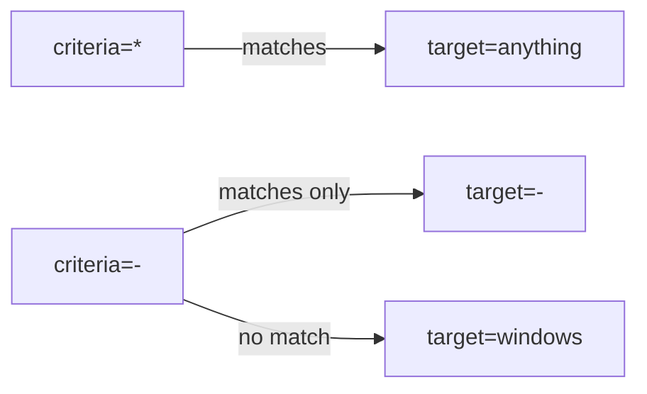

# ❓ FAQ

Frequently asked questions about the `cpeskills` Go SDK. Each entry pairs a concrete symptom with a fix grounded in the real API.

## Q1: Why does my CPE string fail to parse?

**A:** `Parse` only recognises strings that start with `cpe:2.3:` (CPE 2.3 Formatted String) or `cpe:/` (CPE 2.2 URI). Anything else returns the error `unable to determine CPE format`. Trailing whitespace, a missing `2.3` segment, or a stray quote all cause this. Use `Parse` for auto-detection, or call `ParseCpe23` / `ParseCpe22` directly.

```go
import "github.com/scagogogo/cpe-skills"

c, err := cpeskills.Parse("cpe:2.3:a:microsoft:windows:10:*:*:*:*:*:*:*")
if err != nil {
    if cpeskills.IsParsingError(err) || cpeskills.IsInvalidFormatError(err) {
        log.Printf("bad input: %v", err)
    }
    return
}
fmt.Println(c.Vendor, c.ProductName, c.Version)
```

## Q2: What is the difference between ANY (`*`) and NA (`-`)?

**A:** `*` means "match any value" — a wildcard. `-` means "not applicable" — the attribute has no meaningful value. In matching, `*` on either side matches anything, but `-` only matches another `-`. See [/en/api/modules/cpe](/en/api/modules/cpe).



## Q3: When should I use CPE 2.2 vs 2.3?

**A:** Use 2.3 for everything new — it has 11 fields (adds `sw_edition`, `target_sw`, `target_hw`, `other`) and is the format NVD publishes. Use 2.2 only when consuming legacy feeds. `FormatCpe22` and `FormatCpe23` convert between them.

## Q4: `Match` returns `false` — how do I debug it?

**A:** `Match` short-circuits on the first mismatched attribute in order: `Part`, `Vendor`, `Product`, `Version`, `Update`, `Edition`, `Language`, `SoftwareEdition`, `TargetSoftware`, `TargetHardware`, `Other`. Check each field. `Part` must be **exactly** equal (no wildcard). Use `MatchCPE` with `options.IgnoreVersion = true` to ignore version.

```go
ok, err := cpeskills.QuickMatch(
    "cpe:2.3:a:microsoft:windows:*:*:*:*:*:*:*:*",
    "cpe:2.3:a:microsoft:windows:10:*:*:*:*:*:*:*",
)
```

## Q5: NVD downloads are slow or failing. What can I do?

**A:** `DefaultNVDFeedOptions()` already caches 24h in a temp dir and limits concurrency to 3. Set `CacheDir` to a persistent path, raise `CacheMaxAge`, and provide a custom `HTTPClient` with a proxy or longer timeout.

```go
opts := cpeskills.DefaultNVDFeedOptions()
opts.CacheDir = "/var/cache/nvd-data"
opts.CacheMaxAge = 168 // one week
opts.HTTPClient = &http.Client{Timeout: 120 * time.Second}
dict, err := cpeskills.DownloadAndParseCPEDict(opts)
```

## Q6: The PURL conversion confidence is low — why?

**A:** `CPEToPURL` returns a confidence score in `[0, 1]`. Low confidence usually means the vendor/product pair did not map cleanly to a package ecosystem, or the version was `*`/empty (which multiplies confidence by 0.8). Register custom aliases via `VendorNormalizer` or use `MapCPEToPURLWithEcosystem` to force the ecosystem.

```go
purl, conf, err := cpeskills.CPEToPURL(c)
if conf < 0.7 {
    purl, err = cpeskills.MapCPEToPURLWithEcosystem(c, cpeskills.EcosystemNPM)
}
```

## Q7: `MustParse` panicked in production. Should I use it?

**A:** Only for compile-time-known literal strings (package-level vars). For any runtime input use `Parse` and handle the error.

## Q8: How do I store CPEs across restarts?

**A:** `NewFileStorage(baseDir, useCache)` persists to disk; `NewMemoryStorage()` is in-memory only. Both implement the `Storage` interface.

## Summary

Most issues come from malformed strings, `*` vs `-` confusion, or unconfigured NVD caching. Validate with `ValidateCPE`, normalise with `NormalizeCPE`, and always handle the typed errors from [/en/api/modules/errors](/en/api/modules/errors).
