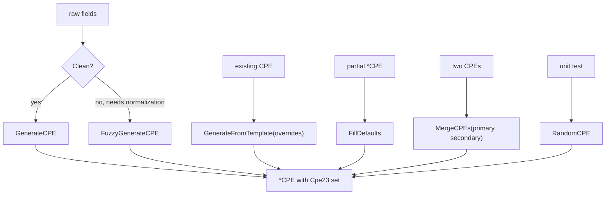

# ✨ CPE Generation Examples

Sometimes you don't have a CPE string — you have a vendor, product, and version from an SBOM or package manifest, and you need to synthesize a CPE. The [`generator`](/en/api/modules/generator) module offers five functions for this, from the strict `GenerateCPE` to the forgiving `FuzzyGenerateCPE`. This page shows when to reach for each.

## GenerateCPE: Strict Four-Argument

`GenerateCPE(part, vendor, product, version)` builds a CPE and fills every other field with `*` (ANY). It does no normalization — what you pass is what you get.

```go
package main

import (
    "fmt"

    "github.com/scagogogo/cpe-skills"
)

func main() {
    cpe := cpeskills.GenerateCPE("a", "apache", "log4j", "2.14.0")
    fmt.Println(cpe.Cpe23)
    // cpe:2.3:a:apache:log4j:2.14.0:*:*:*:*:*:*:*
}
```

## GenerateFromTemplate: Override a Few Fields

When you have a base CPE and want a new one that differs in one or two attributes, pass the base as a template and a map of overrides:

```go
base := cpeskills.MustParse("cpe:2.3:a:apache:log4j:2.14.0:*:*:*:*:*:*:*")
patched := cpeskills.GenerateFromTemplate(base, map[string]string{
    cpeskills.AttrVersion: "2.17.1",
})
fmt.Println(patched.Cpe23)
// cpe:2.3:a:apache:log4j:2.17.1:*:*:*:*:*:*:*
```

The map keys are WFN attribute constants (`AttrPart`, `AttrVendor`, `AttrProduct`, `AttrVersion`, etc.). Unset attributes are inherited from the template.

## FillDefaults: Normalize Empty Fields

`FillDefaults` takes a partially-populated `*CPE` and fills every empty field with `*`, then regenerates the `Cpe23` string. It also defaults an empty `Part` to `a` (Application).

```go
c := &cpeskills.CPE{
    Vendor:      "google",
    ProductName: "chrome",
    Version:     "120.0.6099.109",
}
filled := cpeskills.FillDefaults(c)
fmt.Println(filled.Cpe23)
// cpe:2.3:a:google:chrome:120.0.6099.109:*:*:*:*:*:*:*
```

## MergeCPEs: Combine Two Records

`MergeCPEs(primary, secondary)` keeps every non-empty field from `primary` and fills `primary`'s gaps from `secondary`. Use it when two feeds disagree and you trust one more:

```go
// Trust the SBOM for version, the advisory for everything else
sbom := cpeskills.GenerateCPE("a", "", "log4j", "2.14.0")
adv := cpeskills.MustParse("cpe:2.3:a:apache:log4j:*:*:*:*:*:*:*:*")
merged := cpeskills.MergeCPEs(adv, sbom)
fmt.Println(merged.Cpe23)
// cpe:2.3:a:apache:log4j:2.14.0:*:*:*:*:*:*:*
```

Here `primary` (adv) supplies vendor and product; `secondary` (sbom) supplies the version that the primary left as `*`.

## FuzzyGenerateCPE: Tolerant of Messy Input

`FuzzyGenerateCPE` runs `NormalizeComponent` on each argument — lowercasing, replacing spaces with underscores, stripping suffixes — so messy real-world strings still produce a valid CPE:

```go
c := cpeskills.FuzzyGenerateCPE("Application", "Apache Software Foundation", "Log4j", "2.14.0")
fmt.Println(c.Cpe23)
// cpe:2.3:a:apache_software_foundation:log4j:2.14.0:*:*:*:*:*:*:*
```

Compare with `GenerateCPE`, which would have left `Apache Software Foundation` untouched (and produced an invalid CPE with spaces).

## RandomCPE: Test Fixture

`RandomCPE` emits a fixed dummy CPE for unit tests. It is *not* random in the cryptographic sense — it returns the same test vendor/product/version every call.

```go
dummy := cpeskills.RandomCPE()
fmt.Println(dummy.Cpe23)
// cpe:2.3:a:test_vendor:test_product:1.0:*:*:*:*:*:*:*
```



## Summary

- `GenerateCPE` — strict, four arguments, no normalization; use when input is already clean.
- `FuzzyGenerateCPE` — same shape, but normalizes each field; use for SBOM/manifest input.
- `GenerateFromTemplate` — clone a base CPE and override a few WFN attributes.
- `FillDefaults` — backfill `*` into a partial CPE and regenerate `Cpe23`.
- `MergeCPEs` — combine two records, preferring `primary`'s non-empty fields.
- `RandomCPE` — a deterministic dummy for tests, not real randomness.

See the [`generator`](/en/api/modules/generator) module page for the full API reference.
