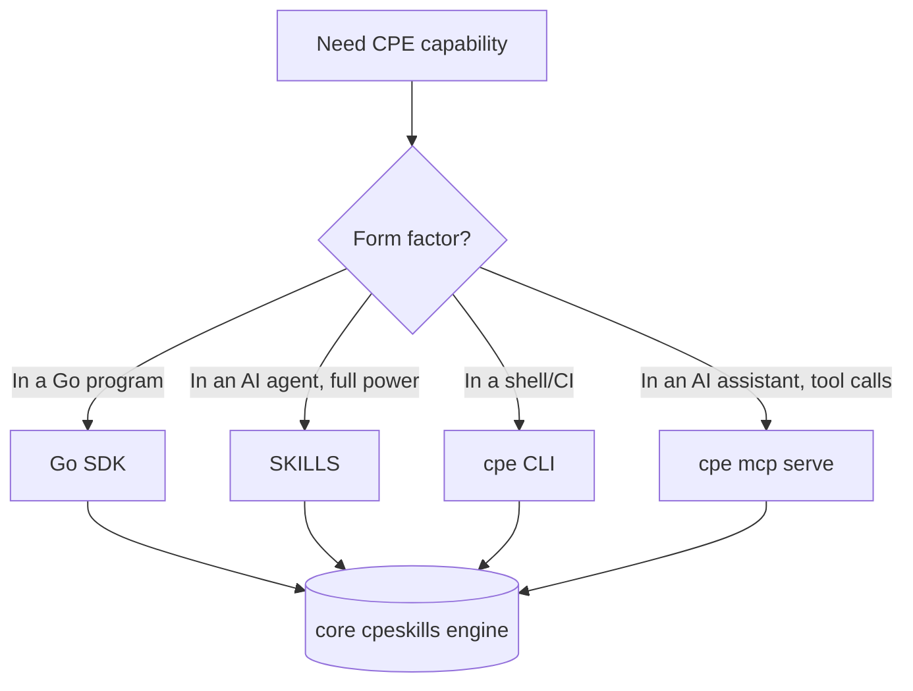

# 🔌 Integration Paths

`cpe-skills` ships four integration paths. They expose the same core capabilities — parse, match, validate, convert — at different ergonomics and latencies.

## Comparison at a glance

| Path        | Entry point                                   | Best for                          | Stateful | Latency    |
|-------------|-----------------------------------------------|-----------------------------------|----------|------------|
| SKILLS      | `SKILLS.md` + SDK, embedded in an AI agent    | LLM-driven workflows              | Yes      | Agent-bound|
| Go SDK      | `import "github.com/scagogogo/cpe-skills"`    | Go services, CLIs, pipelines      | Yes      | In-process |
| CLI         | `go install .../cmd/cpe@latest` → `cpe`       | Scripts, ad-hoc ops, CI steps     | No       | Process    |
| MCP server  | `cpe mcp serve` (stdio)                       | AI assistants (Claude, etc.)      | No       | IPC        |

## When to use which

- **SKILLS** — you are building an agent that reasons about CPE and wants the full SDK (storage, NVD, SBOM) available as a skill surface.
- **Go SDK** — you control a Go binary and need maximum control, in-memory caching, and zero IPC overhead.
- **CLI** — you need a one-liner in a shell script or CI job, with no Go code of your own.
- **MCP server** — you want an AI assistant to call CPE tools over the Model Context Protocol without writing glue code.



## Entry points

### Go SDK

```go
import "github.com/scagogogo/cpe-skills"

c, err := cpeskills.Parse("cpe:2.3:a:microsoft:windows:10:*:*:*:*:*:*:*")
ok := c.Match(cpeskills.MustParse("cpe:2.3:a:microsoft:windows:*:*:*:*:*:*:*:*"))
```

### CLI

```bash
cpe parse "cpe:2.3:a:microsoft:windows:10:*:*:*:*:*:*:*"
cpe match "cpe:2.3:a:microsoft:windows:*" "cpe:2.3:a:microsoft:windows:10"
cpe search "cpe:2.3:a:microsoft:windows:*"
cpe dict parse official-cpe-dictionary.xml
```

### MCP server

```bash
cpe mcp serve   # stdio transport; connect from an MCP-aware client
```

The server exposes `parse_cpe`, `format_cpe`, `match_cpe`, `validate_cpe`, `generate_cpe`, and `compare_versions` tools. See [/en/cli/mcp](/en/cli/mcp).

### SKILLS

The `SKILLS.md` manifest describes the SDK's capabilities to an agent runtime. The agent loads the manifest, decides which SDK function fits the task, and calls it directly — there is no separate HTTP or IPC layer.

## Choosing by requirement

| Requirement                       | Recommended path |
|-----------------------------------|------------------|
| Batch vulnerability scan, nightly | Go SDK or CLI    |
| Real-time API in a Go service     | Go SDK           |
| Enrich a CVE in a chat assistant  | MCP server       |
| Agent that builds SBOMs end-to-end| SKILLS           |
| Quick one-off "is this CPE valid" | CLI              |

## Summary

Pick by form factor: Go SDK for in-process power, CLI for shell scripts, MCP for AI assistants, SKILLS for agent-embedded full-SDK workflows. All four hit the same core engine, so behaviour and matching semantics are identical across paths.
