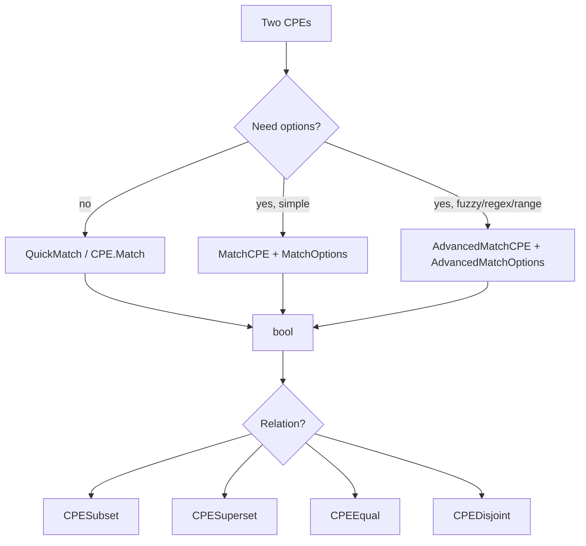

# 🎯 CPE Matching Examples

Matching answers one question: does this CPE pattern cover that CPE target? cpe-skills offers three increasing levels of power — `QuickMatch`, `MatchCPE`, and `AdvancedMatchCPE` — plus set-oriented helpers in the [`matching`](/en/api/modules/matching) module. This page shows each in action.

## Exact Match with `QuickMatch`

`QuickMatch` takes two raw strings, parses both, and returns whether they match. It's the simplest entry point — no structs, no options.

```go
package main

import (
    "fmt"
    "log"

    "github.com/scagogogo/cpe-skills"
)

func main() {
    a := "cpe:2.3:a:apache:log4j:2.14.0:*:*:*:*:*:*:*"
    b := "cpe:2.3:a:apache:log4j:2.14.0:*:*:*:*:*:*:*"
    ok, err := cpeskills.QuickMatch(a, b)
    if err != nil {
        log.Fatal(err)
    }
    fmt.Println("exact match:", ok) // true
}
```

## ANY Wildcards

In CPE matching, `*` (ANY) on either side matches anything. A pattern with `version=*` covers every version of that product:

```go
pattern := "cpe:2.3:a:apache:log4j:*:*:*:*:*:*:*:*"
target := "cpe:2.3:a:apache:log4j:2.14.0:*:*:*:*:*:*:*"
matched, _ := cpeskills.QuickMatch(pattern, target)
fmt.Println("any-version pattern covers 2.14.0:", matched) // true

// Different products don't match even with wildcard versions
other := "cpe:2.3:a:apache:tomcat:9.0.0:*:*:*:*:*:*:*"
matched, _ = cpeskills.QuickMatch(pattern, other)
fmt.Println("log4j pattern covers tomcat:", matched) // false
```

## Subset and Superset

The relation functions in the [`matching`](/en/api/modules/matching) module classify how two CPEs relate, per NISTIR 7696:

```go
pat, _ := cpeskills.Parse("cpe:2.3:a:microsoft:windows:*:*:*:*:*:*:*:*")
win10, _ := cpeskills.Parse("cpe:2.3:a:microsoft:windows:10:*:*:*:*:*:*:*")

fmt.Println("pattern is superset of win10:", cpeskills.CPESuperset(pat, win10)) // true
fmt.Println("win10 is subset of pattern:", cpeskills.CPESubset(win10, pat))     // true
fmt.Println("equal:", cpeskills.CPEEqual(pat, pat))                             // true
fmt.Println("disjoint with linux:", cpeskills.CPEDisjoint(win10,
    cpeskills.MustParse("cpe:2.3:o:linux:linux_kernel:5.15:*:*:*:*:*:*:*")))    // true
```

You can also use the method form: `pat.IsSupersetOf(win10)`.

## `MatchCPE` with Options

`MatchCPE` adds an options struct so you can, for example, ignore version when you only care about vendor+product. The `MatchOptions` type lives in the [`matching`](/en/api/modules/matching) module.

```go
criteria, _ := cpeskills.Parse("cpe:2.3:a:microsoft:windows:*:*:*:*:*:*:*:*")
xp, _ := cpeskills.Parse("cpe:2.3:a:microsoft:windows:xp:*:*:*:*:*:*:*")

// Strict: version must match → windows:* vs windows:xp differs
fmt.Println(cpeskills.MatchCPE(criteria, xp, &cpeskills.MatchOptions{})) // false

// Ignore version → matches
opts := &cpeskills.MatchOptions{IgnoreVersion: true}
fmt.Println(cpeskills.MatchCPE(criteria, xp, opts)) // true
```

## Batch Matching

When you have many criteria against many targets, build a [`CPEIndex`](/en/api/modules/cpe-index) once and let `BatchMatchCPEs` reuse it (the [`batch`](/en/api/modules/batch) module):

```go
targets := cpeskills.StringsToCPEs([]string{
    "cpe:2.3:a:apache:log4j:2.14.0:*:*:*:*:*:*:*",
    "cpe:2.3:a:apache:log4j:2.15.0:*:*:*:*:*:*:*",
    "cpe:2.3:a:apache:tomcat:9.0.0:*:*:*:*:*:*:*",
})
criteria := cpeskills.StringsToCPEs([]string{
    "cpe:2.3:a:apache:log4j:*:*:*:*:*:*:*:*", // all log4j
    "cpe:2.3:a:apache:tomcat:*:*:*:*:*:*:*:*", // all tomcat
})
results := cpeskills.BatchMatchCPEs(criteria, targets)
for _, r := range results {
    fmt.Printf("%s matched %d\n", r.Criteria.ProductName, r.Count)
}
```

## Advanced Fuzzy Matching

`AdvancedMatchCPE` (from the [`advanced-matching`](/en/api/modules/advanced-matching) module) handles regex, case-insensitivity, version ranges, and a similarity score threshold:

```go
crit, _ := cpeskills.Parse("cpe:2.3:a:apache:log4j:*:*:*:*:*:*:*:*")
opts := cpeskills.NewAdvancedMatchOptions()
opts.MatchMode = "exact"
opts.IgnoreCase = true
opts.VersionCompareMode = "range"
opts.VersionLower = "2.0.0"
opts.VersionUpper = "2.17.0"

target, _ := cpeskills.Parse("cpe:2.3:a:apache:log4j:2.14.0:*:*:*:*:*:*:*")
fmt.Println("advanced match:", cpeskills.AdvancedMatchCPE(crit, target, opts)) // true
```



## Summary

- `QuickMatch` — two strings in, one bool out. Best for one-off checks.
- `MatchCPE` — add `MatchOptions{IgnoreVersion:true,...}` for vendor/product-only logic.
- `AdvancedMatchCPE` — regex, case folding, version ranges, similarity scores.
- `CPESubset`/`CPESuperset`/`CPEEqual`/`CPEDisjoint` — the NISTIR 7696 relation.
- `BatchMatchCPEs` — scale to thousands of criteria/targets via an index.

See the [`matching`](/en/api/modules/matching), [`advanced-matching`](/en/api/modules/advanced-matching), and [`batch`](/en/api/modules/batch) module pages for the full API reference.
