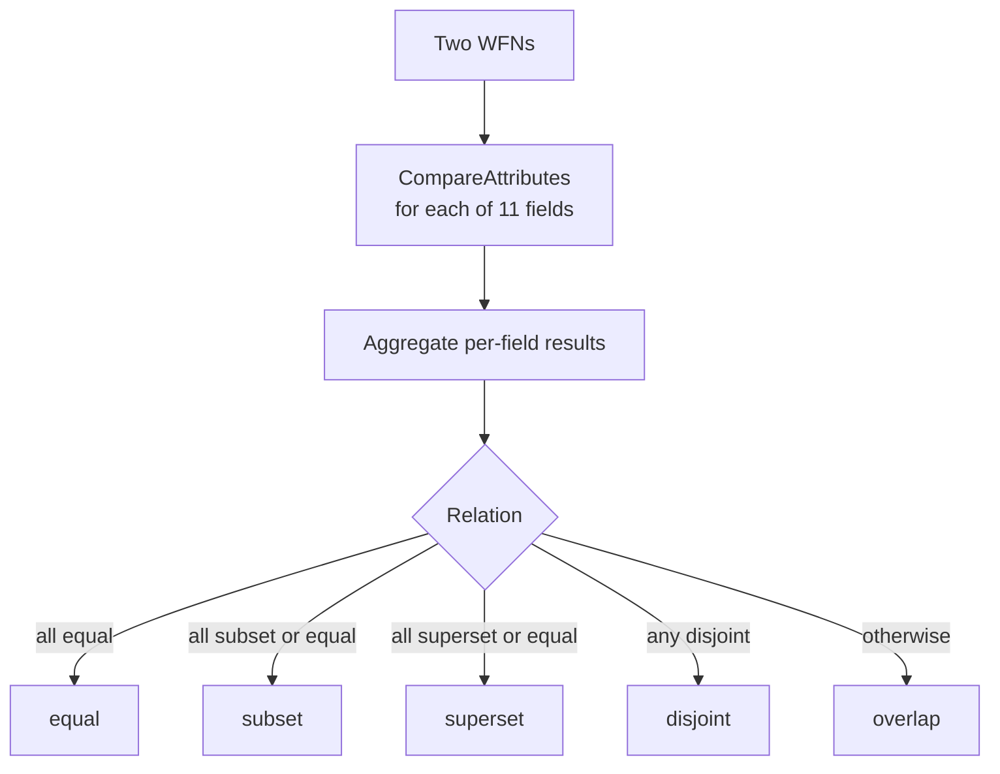

# 🎯 CPE Matching Relations

CPE matching is not a boolean "equal or not". Per **NISTIR 7696**, the relationship between two Well-Formed Names is one of several *relations* — equal, subset, superset, disjoint, or overlap — derived by comparing each attribute. `cpe-skills` implements this relation logic directly.

## The five relations

| Relation    | Meaning                                                |
|-------------|--------------------------------------------------------|
| `equal`     | The two WFNs match exactly on every attribute          |
| `subset`    | Source is more specific; target's ANYs cover it        |
| `superset`  | Source is more general (has more ANYs); it covers target |
| `disjoint`  | No overlap — at least one attribute conflicts          |
| `overlap`   | Mixed; not cleanly any of the above                    |

A `subset` or `superset` relation is still a *match* in vulnerability-scanning terms: if the CVE lists a broad CPE (with ANYs) and your inventory has a specific one, the broad name is a superset of yours and the vulnerability applies.

## Per-attribute comparison

`CompareAttributes(source, target)` returns an `int` describing how one attribute relates:

| Return | Meaning   | Example (source → target)        |
|--------|-----------|----------------------------------|
| `1`    | superset  | source `*` (ANY), target `2.4`   |
| `0`    | equal     | both `2.4.58`, or both `*`       |
| `-1`   | subset    | source `2.4`, target `*`         |
| `-2`   | disjoint  | source `2.4`, target `2.5`       |

The `ANY` wildcard is what makes superset/subset possible: `*` matches anything, so an ANY source is a superset of any concrete target, and an ANY target makes any concrete source a subset.



## Aggregate relation

`CompareWFNs` runs `CompareAttributes` across all attributes and returns the per-attribute map; `CompareWFNRelation` reduces that map to a single `Relation`. The reduction rules:

- If **any** attribute is disjoint (`-2`), the whole relation is `disjoint`.
- Otherwise, if every attribute is equal (`0`), the relation is `equal`.
- If every attribute is subset-or-equal, it is `subset`.
- If every attribute is superset-or-equal, it is `superset`.
- Otherwise it is `overlap`.

## Convenience predicates

For the common "do these match?" questions, `cpe-skills` exposes four predicates that wrap the relation:

```go
package main

import (
    "fmt"
    "github.com/scagogogo/cpe-skills"
)

func main() {
    broad, _ := cpeskills.ParseCpe23("cpe:2.3:a:apache:http_server:*:*:*:*:*:*:*:*")
    specific, _ := cpeskills.ParseCpe23("cpe:2.3:a:apache:http_server:2.4.58:*:*:*:*:*:*:*")

    fmt.Println(cpeskills.CPEEqual(broad, specific))    // false
    fmt.Println(cpeskills.CPESuperset(broad, specific)) // true  — broad covers specific
    fmt.Println(cpeskills.CPESubset(specific, broad))   // true
    fmt.Println(cpeskills.CPEDisjoint(broad, specific)) // false
}
```

`CPEEqual`, `CPESubset`, `CPESuperset`, and `CPEDisjoint` each return a bool by comparing the underlying WFNs.

## The ANY wildcard in practice

Because `ANY` is the source of superset/subset, the practical rule is: **a CPE with more ANY fields is more general**. A CVE entry typically lists a broad name (ANY version) so that it matches every affected version; your inventory carries the concrete version. The matcher correctly reports the CVE name as a superset of your component.

## Relationship to the modules

- [Matching](../api/modules/matching.md) — `CompareAttributes`, `CompareWFNs`, `CompareWFNRelation`, the four predicates.
- [Advanced Matching](../api/modules/advanced-matching.md) — `AdvancedMatchCPE` with extended options.

## Summary

CPE matching is a relation, not an equality. The four meaningful outcomes — equal, subset, superset, disjoint — flow from comparing WFN attributes where `ANY` acts as the wildcard that makes subset/superset possible. Use the predicate functions for everyday checks and the relation function when you need to know *how* two names relate.
