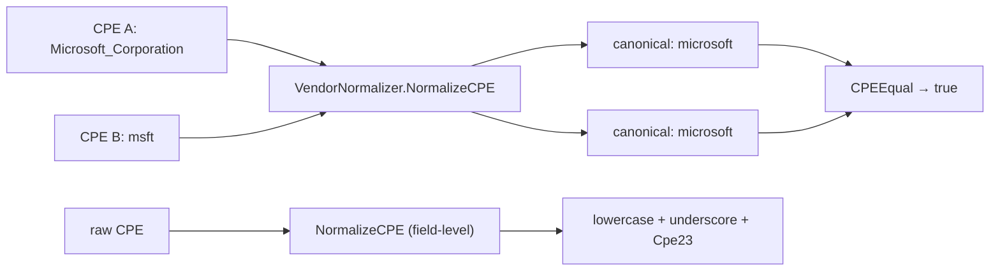

# 🧹 CPE Normalization Examples

CPE strings from different feeds rarely agree on casing, separators, or vendor spelling. Normalize before you store or match, or you'll miss real vulnerabilities. cpe-skills offers two layers: field-level normalization in the [`validation`](/en/api/modules/validation) module, and vendor/product alias resolution in the [`vendor-normalization`](/en/api/modules/vendor-normalization) module.

## NormalizeCPE: Field-Level Cleaning

`NormalizeCPE` lowercases each field, replaces spaces with underscores, and regenerates `Cpe23`. The original object is not mutated — a new `*CPE` is returned.

```go
package main

import (
    "fmt"

    "github.com/scagogogo/cpe-skills"
)

func main() {
    raw := &cpeskills.CPE{
        Part:        *cpeskills.PartApplication,
        Vendor:      "Microsoft",
        ProductName: "Windows 10",
        Version:     "10.0.19041",
    }
    n := cpeskills.NormalizeCPE(raw)
    fmt.Println(n.Vendor)      // microsoft
    fmt.Println(n.ProductName) // windows_10
    fmt.Println(n.Cpe23)       // cpe:2.3:a:microsoft:windows_10:10.0.19041:*:*:*:*:*:*:*
}
```

`NormalizeComponent` is the underlying helper if you only need to clean one string.

## Package-Level Vendor Normalizers

`NormalizeVendorName` and `NormalizeProductName` are conveniences over a package-global `VendorNormalizer` (`GlobalVendorNormalizer`), preloaded with aliases for major vendors:

```go
fmt.Println(cpeskills.NormalizeVendorName("Microsoft Corporation")) // microsoft
fmt.Println(cpeskills.NormalizeVendorName("msft"))                  // microsoft
fmt.Println(cpeskills.NormalizeProductName("microsoft", "Windows 10")) // windows_10
```

`NormalizeCPEVendorProduct` runs both on a whole CPE and rebuilds its `Cpe23`.

## VendorNormalizer: Register Custom Aliases

`NewVendorNormalizer()` returns an independent normalizer with the built-in alias table. `RegisterVendorAlias` maps any number of aliases onto one canonical form; `RegisterProductAlias` does the same for products.

```go
n := cpeskills.NewVendorNormalizer()
n.RegisterVendorAlias("mycompany", "my_company", "my company", "my-company", "MyCompany Inc.")
n.RegisterProductAlias("mycompany", "myapp", "my_app", "my-app")

fmt.Println(n.NormalizeVendor("MyCompany Inc.")) // mycompany
fmt.Println(n.NormalizeProduct("mycompany", "my-app")) // myapp
fmt.Println(n.HasVendor("my-company")) // true
fmt.Println(n.VendorCount())           // includes built-ins + your alias
```

All comparisons are case-insensitive and ignore separators, so `Microsoft Corp` and `microsoft_corp` resolve to one key.

## AreSameVendor: Compare Without Normalizing

`AreSameVendor` and `AreSameProduct` answer "do these refer to the same entity?" without forcing you to normalize both sides first:

```go
n := cpeskills.NewVendorNormalizer()
fmt.Println(n.AreSameVendor("microsoft_corporation", "msft"))        // true
fmt.Println(n.AreSameProduct("microsoft", "windows_10", "windows")) // true
fmt.Println(n.AreSameVendor("oracle", "google"))                     // false
```

## NormalizeCPE on a VendorNormalizer

`(n *VendorNormalizer).NormalizeCPE` clones the CPE, canonicalizes vendor and product, and rebuilds `Cpe23` — the right step before matching or storing:

```go
raw := cpeskills.MustParse("cpe:2.3:a:Microsoft_Corporation:Windows_10:10:*:*:*:*:*:*:*")
n := cpeskills.NewVendorNormalizer()
clean := n.NormalizeCPE(raw)
fmt.Println(clean.Vendor)      // microsoft
fmt.Println(clean.ProductName) // windows_10
fmt.Println(clean.Cpe23)       // cpe:2.3:a:microsoft:windows_10:10:*:*:*:*:*:*:*
```

## Normalize Before Matching

The [`matching`](/en/api/modules/matching) module compares attributes literally; if one side says `apache` and the other `apache_software_foundation`, `CPESubset` returns `Disjoint` and you silently drop a vulnerable match. Normalizing both sides first collapses them to the same canonical key:

```go
a := cpeskills.MustParse("cpe:2.3:a:apache:log4j:2.14.0:*:*:*:*:*:*:*")
b := cpeskills.MustParse("cpe:2.3:a:apache_software_foundation:log4j:2.14.0:*:*:*:*:*:*:*")
n := cpeskills.NewVendorNormalizer()
na, nb := n.NormalizeCPE(a), n.NormalizeCPE(b)
fmt.Println(cpeskills.CPEEqual(na, nb)) // true
```



## Summary

- `NormalizeCPE` (validation) — field-level: lowercase, underscore, rebuild `Cpe23`. Non-mutating.
- `NormalizeVendorName` / `NormalizeProductName` / `NormalizeCPEVendorProduct` — package-level conveniences over `GlobalVendorNormalizer`.
- `NewVendorNormalizer()` — independent normalizer; extend with `RegisterVendorAlias` / `RegisterProductAlias`.
- `AreSameVendor` / `AreSameProduct` — compare without explicit normalization.
- Always normalize before matching or storing so spelling drift doesn't break relations.

See the [`validation`](/en/api/modules/validation) and [`vendor-normalization`](/en/api/modules/vendor-normalization) module pages for the full API reference.
