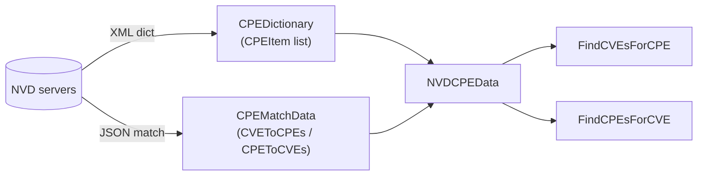
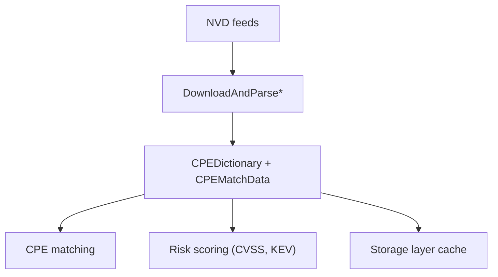

# 🏛️ NVD (National Vulnerability Database)

The **NVD** is the U.S. government's repository of standards-based vulnerability management data, operated by NIST. For the CPE ecosystem it is the single most important data source: it hosts the **official CPE Dictionary**, the **CPE Match** feed (the CVE↔CPE mapping), and rich vulnerability metadata (CVSS, references, dates). cpe-skills wraps all three with a small set of download-and-parse functions.

## What NVD Provides

| Feed | Contents | cpe-skills entry point |
|------|----------|-------------------------|
| CPE Dictionary | Every officially registered CPE item with titles and references | `DownloadAndParseCPEDict` |
| CPE Match | Bidirectional CVE↔CPE mapping (`CVEToCPEs`, `CPEToCVEs`) | `DownloadAndParseCPEMatch` |
| Combined | Dictionary + match data + download timestamp in one struct | `DownloadAllNVDData` |

The combined struct `NVDCPEData` is what most users want — it carries a `CPEDictionary` pointer, a `CPEMatchData` pointer, and a `DownloadTime`, and exposes the two queries you'll use most:

```go
data, err := cpeskills.DownloadAllNVDData(cpeskills.DefaultNVDFeedOptions())
if err != nil {
    log.Fatal(err)
}
// Which CVEs affect a given CPE?
cves := data.FindCVEsForCPE(cpe)
// Which CPEs does a given CVE affect?
cpes := data.FindCPEsForCVE("CVE-2021-44228")
```

## Feed Formats

NVD publishes its CPE data as XML. cpe-skills parses that XML into the [`CPEDictionary`](/en/api/modules/dictionary) struct, which holds `CPEItem` entries — each pairing a `CPE` with a human-readable title and `Reference` URLs. The match feed is consumed as JSON and reduced into the two `map[string][]string` lookups shown above.



## Downloading and Localizing

NVD feeds are large (the dictionary alone is tens of MB). Re-downloading on every run is wasteful and rate-limit-prone. `NVDFeedOptions` controls caching and concurrency:

| Field | Default | Why it matters |
|-------|---------|----------------|
| `CacheDir` | system temp + `cpe-cache` | Keep parsed feeds on disk across runs |
| `CacheMaxAge` | 24 hours | Reuse cache until stale |
| `MaxConcurrentDownloads` | 3 | Avoid hammering NVD |
| `HTTPClient` | 60s timeout | Set a proxy or custom transport |
| `ShowProgress` | true | Visible progress for long downloads |

Start from `DefaultNVDFeedOptions()` and tweak only what you need:

```go
opts := cpeskills.DefaultNVDFeedOptions()
opts.CacheDir = "/var/cache/nvd-data" // persist somewhere stable
opts.CacheMaxAge = 12                 // refresh twice a day
dict, err := cpeskills.DownloadAndParseCPEDict(opts)
```

Because the parsed result is an ordinary in-memory struct, you can *localize* it further by persisting it through the storage layer — for example with [`FileStorage.StoreDictionary`](/en/api/modules/file-storage), which serializes the dictionary to JSON on disk so subsequent processes reload it instantly without hitting NVD.

## Querying the Dictionary

Once you have a `CPEDictionary`, you can search it directly without round-tripping to NVD:

```go
// Look up an item by its title string
item := dict.FindItemByName("Apache Log4j 2.0")

// Find all dictionary items matching a CPE under given options
items := dict.FindItemsByCriteria(criteriaCPE, matchOpts)
```

This is what powers offline scanning: download once, query many times.

## Relationship to This Project

NVD is the upstream source of truth that cpe-skills depends on. The flow shows how a fresh feed flows through the library:



## Summary

- NVD supplies the authoritative CPE Dictionary, the CVE↔CPE match feed, and vulnerability metadata.
- `DownloadAllNVDData` is the convenient one-call entry point; `NVDFeedOptions` controls caching and concurrency.
- `NVDCPEData.FindCVEsForCPE` / `FindCPEsForCVE` are the two queries you'll use most.
- Persist parsed feeds via the [storage](/en/api/modules/storage) layer for fully offline operation. See the [nvd](/en/api/modules/nvd) and [dictionary](/en/api/modules/dictionary) modules for the full API.
