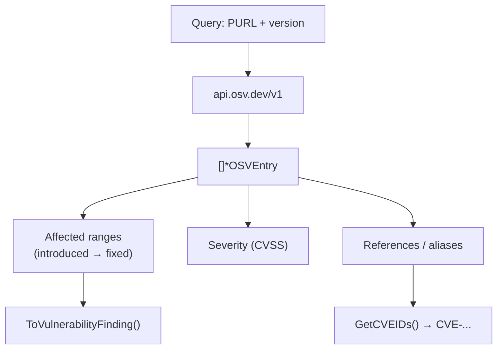
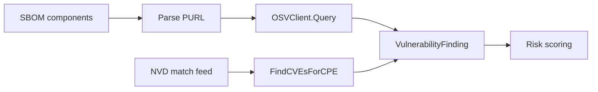

# 🌐 OSV (Open Source Vulnerabilities)

**OSV** is a distributed vulnerability database and API run by Google, born from the [Open Source Vulnerability format](https://ossf.github.io/osv-schema/). Where NVD focuses on CVE-centric, CPE-keyed data, OSV is **PURL-driven** (Package URL) and aggregates many independent ecosystem databases (PyPI, npm, crates.io, Go, Rust, etc.) into one queryable API. For open-source dependency scanning, OSV is often more current than NVD.

## Why OSV Complements NVD

| Aspect | NVD | OSV |
|--------|-----|-----|
| Primary key | CVE ID + CPE | Package URL (PURL) / ecosystem+name+version |
| Coverage | Curated, CVE-mandated | Many ecosystem-specific DBs merged |
| Timeliness | Slower curation | Often faster for upstream OSS fixes |
| Fix info | Indirect | First-class `introduced`/`fixed` ranges |
| Non-CVE | No | Yes (e.g. `PYSEC-`, `GHSA-`, `RUSTSEC-`) |

The two are **complementary**: NVD gives you the CPE-centric view; OSV gives you the package-centric view. cpe-skills exposes both so you can cross-reference.

## PURL-Driven Querying

Every OSV query is anchored on a package identity. cpe-skills' [`OSVClient`](/en/api/modules/osv) queries by `PackageURL`, by ecosystem+name+version, or by commit hash:

```go
client := cpeskills.NewOSVClient()

// Query by Package URL (preferred for SBOM-driven scanning)
purl, _ := cpeskills.ParsePURL("pkg:golang/github.com/apache/log4j@2.14")
entries, err := client.Query(purl)

// Or query by ecosystem coordinates
entries, err = client.QueryByEcosystem("Go", "github.com/apache/log4j", "2.14")
```

Because OSV results may or may not carry a CVE ID, the `OSVEntry` type exposes helpers to bridge back to the CVE world:

| Method | Returns |
|--------|---------|
| `GetCVEIDs` | CVE IDs linked to this entry (may be empty) |
| `HasCVE` | Whether any CVE is attached |
| `GetFixedVersion` | The version where the bug was fixed |
| `GetIntroducedVersion` | Where the vulnerable range starts |
| `GetMaxCVSSScore` | Best CVSS across all severity records |
| `GetSeverityLevel` | A normalized severity string |

## The OSV Data Model

An `OSVEntry` describes one vulnerability as recorded in OSV. Its affected ranges are the key advantage over NVD's flat CVE lists — they tell you *exactly* which versions are affected and where the fix landed.



The `ToVulnerabilityFinding()` method converts an OSV entry into cpe-skills' internal `VulnerabilityFinding`, so OSV data can flow into the same risk-scoring pipeline as NVD data.

## Batch Queries and Rate Limiting

Scanning a real SBOM means querying hundreds or thousands of packages. `QueryOSVBatch` (or the client's `QueryBatch`) submits many PURLs in one request, and `OSVClient` enforces a minimum interval between requests (`minRequestInterval: 100ms`) to stay polite to the public API:

```go
purls := []*cpeskills.PackageURL{p1, p2, p3}
results, err := cpeskills.QueryOSVBatch(purls)
for purl, entries := range results {
    fmt.Printf("%s: %d vulnerabilities\n", purl, len(entries))
}
```

For environments that need a mirror or custom timeout, `NewOSVClientWithOptions(baseURL, timeout, retryCount)` lets you point at an alternative endpoint.

## Relationship to This Project

OSV sits alongside NVD as a second vulnerability feed, unified through the common `VulnerabilityFinding` type:



## Summary

- OSV is a PURL-driven, ecosystem-aware vulnerability database that complements the CPE-centric NVD.
- `OSVClient` queries by PURL, ecosystem+name+version, or commit; batch queries keep SBOM-scale scans efficient.
- `OSVEntry` exposes fix ranges (`GetFixedVersion`/`GetIntroducedVersion`) and bridges to CVEs via `GetCVEIDs`.
- `ToVulnerabilityFinding()` unifies OSV data with NVD data for downstream scoring. See the [osv module](/en/api/modules/osv) for the full API.
