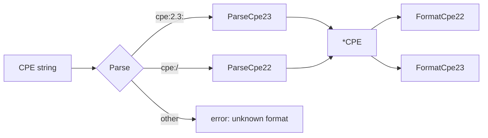

# 📝 CPE Parsing Examples

Parsing is the entry point to almost every cpe-skills workflow: you receive a CPE string from an NVD feed, an SBOM, or an advisory, and turn it into a `*CPE` struct you can match, store, and normalize. This page collects real parsing examples drawn from the [`parser-2.2`](/en/api/modules/parser-2.2), [`parser-2.3`](/en/api/modules/parser-2.3), and [`convenience`](/en/api/modules/convenience) modules.

## Parse Any Format with `Parse`

`Parse` autodetects 2.3 vs 2.2 by prefix (`cpe:2.3:` or `cpe:/`) and dispatches to the right parser, so it is the safest default for untrusted input.

```go
package main

import (
    "fmt"
    "log"

    "github.com/scagogogo/cpe-skills"
)

func main() {
    // 2.3 form (13 colon-separated fields)
    win, err := cpeskills.Parse("cpe:2.3:a:microsoft:windows:10:*:*:*:*:*:*:*")
    if err != nil {
        log.Fatal(err)
    }
    fmt.Printf("part=%s vendor=%s product=%s version=%s\n",
        win.Part.ShortName, win.Vendor, win.ProductName, win.Version)

    // 2.2 legacy URI form
    tomcat, err := cpeskills.Parse("cpe:/a:apache:tomcat:8.5.0")
    if err != nil {
        log.Fatal(err)
    }
    fmt.Printf("vendor=%s product=%s version=%s\n",
        tomcat.Vendor, tomcat.ProductName, tomcat.Version)
}
```

## Ten Real-World Strings

The table below lists strings that appear in real NVD/CVE records; each parses cleanly with `Parse` or `ParseCpe23`.

| # | CPE string | Part | Notes |
|---|------------|------|-------|
| 1 | `cpe:2.3:a:microsoft:windows:10:*:*:*:*:*:*:*` | a | Desktop OS as application |
| 2 | `cpe:2.3:o:linux:linux_kernel:5.15.0:*:*:*:*:*:*:*` | o | Operating system |
| 3 | `cpe:2.3:h:intel:core_i7:10700k:*:*:*:*:*:*:*` | h | Hardware device |
| 4 | `cpe:2.3:a:apache:log4j:2.14.0:*:*:*:*:*:*:*` | a | The Log4Shell version |
| 5 | `cpe:2.3:a:google:chrome:120.0.6099.109:*:*:*:*:*:*:*` | a | Long version with dots |
| 6 | `cpe:2.3:o:redhat:enterprise_linux:8.2:*:*:*:*:*:*:*` | o | Underscores in names |
| 7 | `cpe:2.3:a:oracle:java_se:17.0.1:*:*:*:*:*:*:*` | o→a | JDK is an application |
| 8 | `cpe:2.3:a:openssh:openssh:8.4:p1:*:*:*:*:*:*` | a | Has an `update` field (`p1`) |
| 9 | `cpe:2.3:*:*:*:*:*:*:*:*:*:*` | * | Fully wildcarded "ANY" |
| 10 | `cpe:2.3:a:adobe:acrobat_reader:2021.001.20150:*:*:*:*:*:*:*` | a | Reader DC |

```go
samples := []string{
    "cpe:2.3:a:microsoft:windows:10:*:*:*:*:*:*:*",
    "cpe:2.3:o:linux:linux_kernel:5.15.0:*:*:*:*:*:*:*",
    "cpe:2.3:h:intel:core_i7:10700k:*:*:*:*:*:*:*",
    "cpe:2.3:a:apache:log4j:2.14.0:*:*:*:*:*:*:*",
    "cpe:2.3:a:google:chrome:120.0.6099.109:*:*:*:*:*:*:*",
    "cpe:2.3:o:redhat:enterprise_linux:8.2:*:*:*:*:*:*:*",
    "cpe:2.3:a:oracle:java_se:17.0.1:*:*:*:*:*:*:*",
    "cpe:2.3:a:openssh:openssh:8.4:p1:*:*:*:*:*:*",
    "cpe:2.3:*:*:*:*:*:*:*:*:*:*",
    "cpe:2.3:a:adobe:acrobat_reader:2021.001.20150:*:*:*:*:*:*:*",
}
for _, s := range samples {
    c, err := cpeskills.Parse(s)
    if err != nil {
        fmt.Printf("FAIL %s: %v\n", s, err)
        continue
    }
    fmt.Printf("OK   part=%s vendor=%s product=%s\n",
        c.Part.ShortName, c.Vendor, c.ProductName)
}
```

## 2.2 ↔ 2.3 Conversion

`ParseCpe22` returns a `*CPE` whose `Cpe23` field is already populated, so you can convert a legacy URI straight to the modern form. The reverse uses `FormatCpe22`:

```go
// 2.2 (legacy) → 2.3
c, _ := cpeskills.ParseCpe22("cpe:/a:mysql:mysql:5.7.12:::~~~enterprise~~")
fmt.Println(c.Cpe23)
// cpe:2.3:a:mysql:mysql:5.7.12:*:*:*:enterprise:*:*

// 2.3 → 2.2
c2, _ := cpeskills.ParseCpe23("cpe:2.3:a:apache:tomcat:8.5.0:*:*:*:*:*:*:*")
fmt.Println(cpeskills.FormatCpe22(c2))
// cpe:/a:apache:tomcat:8.5.0

// FormatCPE picks the version for you
s, _ := cpeskills.FormatCPE(c2, "2.2") // → 2.2 string
s, _ = cpeskills.FormatCPE(c2, "2.3")  // → 2.3 string
```

## `MustParse` for Static Initialization

When a CPE is a compile-time constant, `MustParse` panics on a malformed string so the bug surfaces at startup. `ParseOr` is the forgiving counterpart — it returns a fallback instead of an error:

```go
var defaultWin = cpeskills.MustParse("cpe:2.3:a:microsoft:windows:10:*:*:*:*:*:*:*")
fallback := cpeskills.MustParse("cpe:2.3:*:*:*:*:*:*:*:*:*:*")
c := cpeskills.ParseOr(untrustedInput, fallback) // never errors
```

## Handling Bad Input

`Parse` returns typed errors from the [`errors`](/en/api/modules/errors) module. Format errors fire when the prefix or field count is wrong; part errors fire when the part is not `a`/`h`/`o`/`*`.

```go
bad := []string{
    "not a cpe",                                  // not a CPE at all
    "cpe:2.3:a:microsoft:windows:10",             // too few fields (needs 13)
    "cpe:2.3:z:microsoft:windows:10:*:*:*:*:*:*:*", // invalid part 'z'
}
for _, s := range bad {
    _, err := cpeskills.Parse(s)
    if err != nil {
        fmt.Printf("reject %q: %v\n", s, err)
    }
}
```

The two helpers `IsCPE23String` / `IsCPE22String` do a cheap prefix check when you want to route strings without parsing them. `CPEsToStrings` / `StringsToCPEs` convert between slices of strings and `[]*CPE` (the latter silently drops unparseable entries).



## Summary

- Prefer `Parse` for any input whose version you don't control; it auto-detects 2.2/2.3. Use `ParseCpe22`/`ParseCpe23` when you know the form.
- Use `MustParse` in package-level `var` blocks; `ParseOr` for graceful degradation; `FormatCpe22`/`FormatCpe23`/`FormatCPE` to convert between forms.
See the [`parser-2.2`](/en/api/modules/parser-2.2), [`parser-2.3`](/en/api/modules/parser-2.3), and [`convenience`](/en/api/modules/convenience) module pages for the full API reference.
