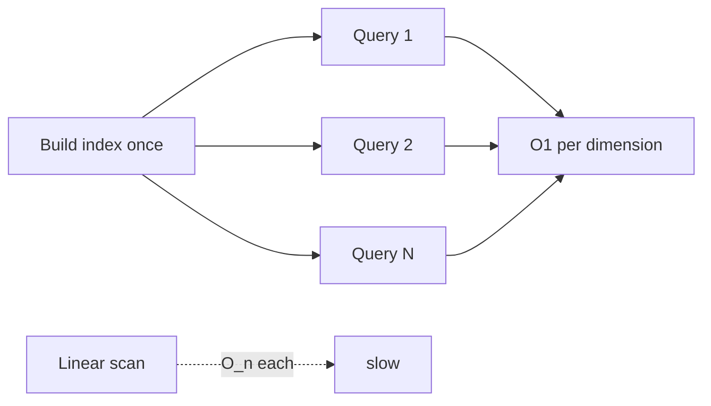

# ⚡ Performance Considerations

How to keep `cpeskills` fast as your CPE corpus and scan volume grow.

## CPEIndex lookup vs linear scan

The single biggest lever. `CPEIndex` builds lookup maps keyed by vendor, product, and part, so `Lookup` is roughly `O(1)` per dimension. A naive loop calling `Match` over a slice is `O(n)` per query and becomes painful past a few thousand entries.

```go
idx := cpeskills.NewCPEIndex(cpes)        // build once
hits := idx.Lookup(criteria)              // fast, repeated
_ = idx.LookupByPURL(purl)               // also indexed
```



## BatchScanner concurrency

`BatchScanner` scans `SBOMComponent` slices with a worker pool sized by the `concurrency` argument. Set it to match the slower of your CPU and your data-source rate limit. Each worker calls `scanComponent`, so raising concurrency past the number of data sources yields diminishing returns.

```go
bs := cpeskills.NewBatchScanner(idx, 8)
bs.SetDataSources(sources)
results, err := bs.Scan(components)
```

For pure in-memory CPE matching without vulnerability data, `BatchMatchCPEs` returns a result matrix in one pass.

## MemoryStorage vs FileStorage

| Backend        | Construction                         | Speed  | Persistence | When to use                          |
|----------------|-------------------------------------|--------|-------------|--------------------------------------|
| `MemoryStorage`| `NewMemoryStorage()`                | Fastest| None        | Short-lived jobs, unit tests, caches |
| `FileStorage`  | `NewFileStorage(dir, useCache)`     | Disk-bound| Yes       | Long-running services, caches        |

`FileStorage` with `useCache=true` keeps a hot in-memory layer over the on-disk store, so reads are fast while writes survive restarts.

## Localising NVD data

NVD feeds are hundreds of MB and rate-limited. `DefaultNVDFeedOptions()` downloads once and caches 24h in a temp dir. For production:

```go
opts := cpeskills.DefaultNVDFeedOptions()
opts.CacheDir = "/var/cache/nvd"   // persistent across restarts
opts.CacheMaxAge = 168             // one week
opts.MaxConcurrentDownloads = 3    // stay polite
```

`DownloadAllNVDData` fetches the dictionary, match data, and CVE feeds in one call, then `FindCVEsForCPE` queries the in-memory result without any network.

## Caching strategy

- **EPSS / KEV** — both clients keep an in-memory cache. `EnrichVulnerabilityFindings` batches so you pay one round-trip per batch, not per finding.
- **StorageManager** — wrap `FileStorage` (primary) with `MemoryStorage` (cache) via `SetCache`; `InvalidateCache` lets you evict on writes.
- **CPEIndex** — keep one instance for the lifetime of the process; `Add` / `Remove` mutate it incrementally.

## CPESet for repeated set operations

When you repeatedly filter, union, or intersect the same corpus, `CPESet` keeps an internal map so `Contains`, `Intersection`, and `Union` are sub-linear in common cases. Rebuild the set once, then chain operations.

```go
set := cpeskills.NewCPESet("assets", "production inventory")
for _, c := range cpes {
    set.Add(c)
}
subset := set.Filter(criteria, cpeskills.DefaultMatchOptions())
```

## Avoid re-parsing in hot loops

`Parse` is cheap but not free. If a string is read thousands of times, parse once, store the `*CPE`, and reuse. `CPEsToStrings` / `StringsToCPEs` help batch the boundary crossings.

```go
// build once
cpes := cpeskills.StringsToCPEs(rawStrs)
// reuse in the hot path — no re-parsing
idx := cpeskills.NewCPEIndex(cpes)
```

## Summary

Index for repeated lookup, bound `BatchScanner` concurrency to your bottleneck, prefer `MemoryStorage` for ephemeral work and `FileStorage` for persistence, and localise NVD feeds with a long `CacheMaxAge`. Together these keep the SDK within a few milliseconds per query even at large scale.
