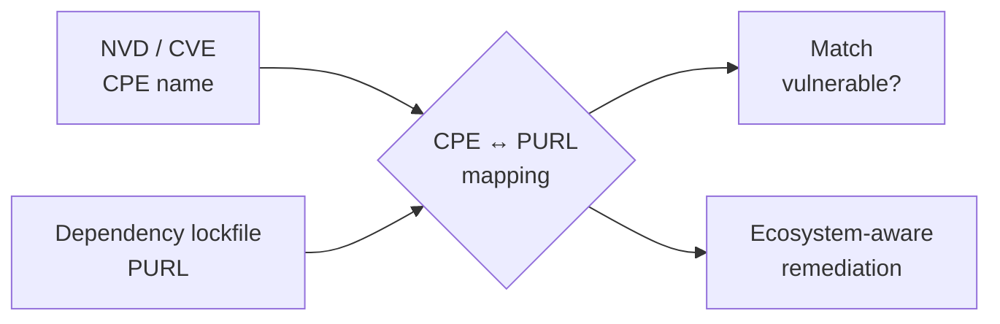

# 📦 Package URL (PURL)

A **Package URL (PURL)** is a compact, ecosystem-native identifier for a software package, specified by the [package-url project](https://github.com/package-url). Where CPE was designed around vendor-and-product names for the NVD world, PURL was designed around how packages are actually addressed in their package managers. A PURL looks like:

```
pkg:golang/github.com/scagogogo/cpe-skills@v0.5.0
pkg:npm/%40angular/core@17.0.0
pkg:maven/org.apache.logging.log4j/log4j-core@2.17.1
pkg:pypi/django@4.2
```

## Anatomy of a PURL

```
pkg:<type>/<namespace>/<name>@<version>?<qualifiers>#<subpath>
```

| Segment     | Required | Example                          |
|-------------|----------|----------------------------------|
| `type`      | yes      | `golang`, `npm`, `maven`, `pypi` |
| `namespace` | no       | `github.com/scagogogo`, `@angular` |
| `name`      | yes      | `cpe-skills`, `core`             |
| `version`   | no       | `v0.5.0`, `17.0.0`               |
| `qualifiers`| no       | `?arch=amd64&os=linux`           |
| `subpath`   | no       | `#internal/sub`                  |

## CPE vs PURL — different, complementary

| Aspect            | CPE                              | PURL                                  |
|-------------------|----------------------------------|---------------------------------------|
| Origin            | NIST / NVD                       | Open-source package-url spec          |
| Unit              | Vendor + product + version       | Ecosystem + namespace + name + version|
| Ecosystem-aware   | No (vendor string only)          | Yes (`type` is first-class)           |
| Primary use       | CVE matching in NVD              | Dependency / SBOM identification      |
| Wildcards         | Yes (`ANY`/`NA`)                 | No                                    |

They are complementary: **NVD speaks CPE, package managers and modern SBOMs speak PURL.** To correlate a CVE (CPE-listed) with a pinned dependency (PURL-addressed) you must translate between the two.



## Why conversion matters

The mapping is not 1:1 — a single CPE can correspond to several PURLs depending on the package ecosystem (the same library shipped as a Maven artifact and an npm package), and a PURL's vendor does not always match the CPE vendor string. `cpe-skills` performs the conversion heuristically and returns a **confidence score** alongside the result, so callers can decide whether to trust an automated match.

## Converting between CPE and PURL

```go
package main

import (
    "fmt"
    "github.com/scagogogo/cpe-skills"
)

func main() {
    cpe, _ := cpeskills.ParseCpe23("cpe:2.3:a:log4j:log4j:2.17.1:*:*:*:*:*:*:*")

    // CPE -> PURL (returns a confidence score 0..1)
    purl, conf, err := cpeskills.CPEToPURL(cpe)
    if err != nil { panic(err) }
    fmt.Println(purl.String(), conf)

    // PURL -> CPE (also returns a confidence score)
    parsed, _ := cpeskills.ParsePURL("pkg:maven/org.apache.logging.log4j/log4j-core@2.17.1")
    back, conf2, err := cpeskills.PURLToCPE(parsed)
    if err != nil { panic(err) }
    fmt.Println(back.Cpe23, conf2)
}
```

When you already know the target ecosystem, `MapCPEToPURLWithEcosystem` produces a more accurate PURL by using the ecosystem to choose the right `type` and `namespace` layout. Batch helpers `BatchCPEToPURL` and `BatchPURLToCPE` process whole inventories in one call.

## Ecosystem awareness

The library ships a fixed set of supported ecosystems — `npm`, `maven`, `pypi`, `golang` — exposed through the `Ecosystem` type and `ListEcosystems()`. `EcosystemFromPURLType` maps a PURL `type` string to the internal `Ecosystem`, and `CPEPartToEcosystemHint` offers a best-guess ecosystem from a CPE part. This ecosystem knowledge is what lets the CPE↔PURL mapping choose sensible defaults.

## Relationship to the modules

- [PURL](../api/modules/purl.md) — `PackageURL` struct, `ParsePURL`, `NewPURL`.
- [CPE-PURL Mapping](../api/modules/cpe-purl-mapping.md) — `CPEToPURL`, `PURLToCPE`, batch + ecosystem variants.
- [Ecosystem](../api/modules/ecosystem.md) — `Ecosystem` type, `ListEcosystems`, mapping helpers.

## Summary

PURL is the ecosystem-native counterpart to CPE. Because NVD and SBOM tooling each favor one of the two, the ability to convert between them — with an honest confidence score — is what makes end-to-end vulnerability correlation possible.
