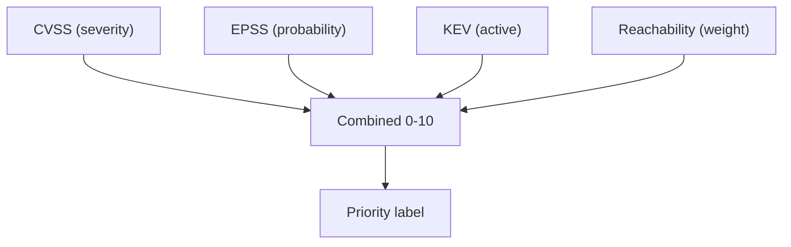
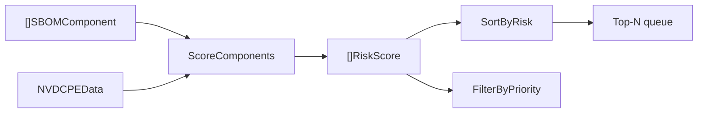
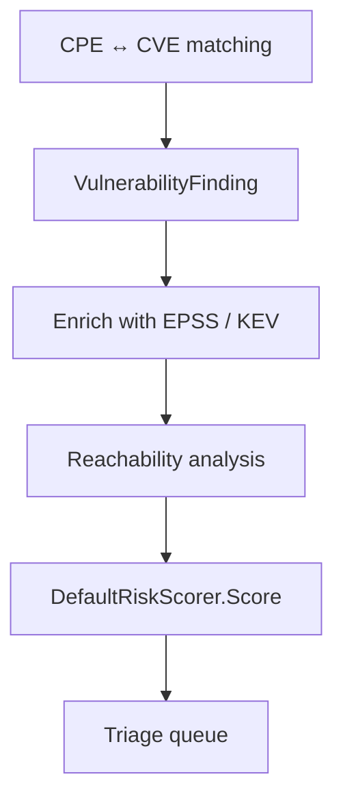

# 📊 Risk Scoring

Not every vulnerability deserves the same attention. A CVSS-9.0 bug in an unreachable transitive dependency is far less urgent than a CVSS-7.0 bug you call directly and that has a public exploit. cpe-skills' risk-scoring package combines **three orthogonal signals** — CVSS, EPSS, and KEV — plus **reachability** to produce a single 0–10 score and a five-tier priority label.

## The Three Signals

| Signal | Question it answers | Source | Range |
|--------|---------------------|--------|-------|
| CVSS | *How bad is the bug in theory?* | NVD / CVE record | 0.0–10.0 |
| EPSS | *How likely is it to be exploited in the wild?* | [EPSS](/en/api/modules/epss) | 0.0–1.0 |
| KEV | *Is it known to be actively exploited?* | CISA KEV catalog | boolean |

These measure different things, which is why combining them beats any single one. CVSS measures *severity*, EPSS measures *probability*, and KEV measures *confirmed activity*.



## Reachability Weighting

A vulnerability in a dependency you never call is noise. The [`reachability`](/en/api/modules/reachability) package classifies each finding into one of five levels: `direct`, `transitive`, `conditional`, `not_reachable`, `unknown`. The `DefaultRiskScorer` folds this into the final score — a `direct` finding contributes fully, a `transitive` finding contributes less, and an unreachable one is deprioritized. This is why reachability *changes priority*, not just decoration.

## The DefaultRiskScorer Model

[`DefaultRiskScorer`](/en/api/modules/risk-scoring) exposes tunable weights and produces a `RiskScore` carrying every contributing factor:

```go
scorer := cpeskills.NewDefaultRiskScorer()
// weights default to: CVSS 0.5, EPSS 0.2, KEV 0.2, Reachability 0.1
score := scorer.Score(findings, component)

fmt.Println(score.OverallScore) // 0-10
fmt.Println(score.CVSSMax)      // highest CVSS among findings
fmt.Println(score.EPSSScore)    // 0.0-1.0
fmt.Println(score.KEVListed)    // true if any finding is KEV-listed
fmt.Println(score.Priority)     // critical / high / medium / low / none
```

The `Factors` map records each signal's individual contribution, so you can explain *why* a component scored what it did.

## Priority Tiers

`determinePriority` maps the numeric score (and the KEV flag) onto a [`RiskPriority`](/en/api/modules/risk-scoring) string. KEV listing can escalate a finding regardless of raw score, because active exploitation overrides theoretical severity:

| Priority | Meaning |
|----------|---------|
| `critical` | Fix immediately — high score and/or KEV-listed |
| `high` | Strong score, schedule soon |
| `medium` | Notable but not urgent |
| `low` | Minor, track and patch opportunistically |
| `none` | No findings |

## Sorting and Filtering at Scale

For a whole SBOM, `ScoreComponents` scores every component against an `NVDCPEData` snapshot, and helpers let you prioritize the queue:

```go
scores := cpeskills.ScoreComponents(components, nvdData)
cpeskills.SortByRisk(scores)                              // highest first
criticalOnly := cpeskills.FilterByPriority(scores, cpeskills.RiskPriorityCritical)
```



## Relationship to This Project

Risk scoring is the capstone that turns raw CVE/CPE matching into a *prioritized* remediation list:



## Summary

- CVSS, EPSS, and KEV answer three different questions (severity, probability, activity) — combine them rather than rely on one.
- Reachability down-weights unreachable findings, so it changes priority, not just the score display.
- `DefaultRiskScorer` is the default weighted model; `Score`, `ScoreComponents`, `SortByRisk`, and `FilterByPriority` cover the common workflow.
- Priorities are `critical`/`high`/`medium`/`low`/`none`. See the [risk-scoring](/en/api/modules/risk-scoring) and [reachability](/en/api/modules/reachability) modules for the full API.
