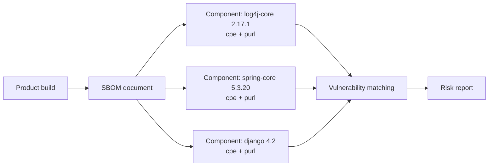

# 🗂️ SBOM Standards

A **Software Bill of Materials (SBOM)** is a formal inventory of the components that make up a software product, including transitive dependencies, versions, and identifiers. Two specifications dominate: **CycloneDX** (OWASP) and **SPDX** (Linux Foundation). Both can carry CPE and PURL identifiers per component, which is what makes them actionable for vulnerability matching.

## Why SBOMs exist

You cannot defend what you cannot see. Modern software is assembled from hundreds of third-party packages; when a CVE drops, the question "are we using log4j-core 2.14?" should be answerable in seconds, not days. An SBOM is the artifact that makes that answer possible.



## CycloneDX vs SPDX

| Aspect            | CycloneDX                          | SPDX                              |
|-------------------|------------------------------------|-----------------------------------|
| Steward           | OWASP                              | Linux Foundation                  |
| Focus             | Vulnerability / supply chain       | License compliance                |
| Format            | JSON, XML, Protobuf                | JSON, RDF, XSD, tag-value         |
| Component ID      | `bom-ref`, CPE, PURL               | `SPDXRef`, CPE, PURL              |
| Dependency graph  | First-class                        | First-class                       |
| VEX support       | Native                             | Via external refs / SPDX 3.x      |

Both are capable; CycloneDX tends to be favored in security tooling, SPDX in compliance and embedded contexts.

## NTIA minimum elements

The U.S. **NTIA** defined a "minimum elements" baseline that any SBOM should contain:

1. **Supplier** — who made the component
2. **Component name**
3. **Version string**
4. **Unique identifier** — CPE and/or PURL
5. **Dependency relationship** — what depends on what
6. **SBOM author**
7. **Timestamp**
8. Other optional but recommended fields

CPE appears directly in element #4. This is why `cpe-skills` cares about SBOMs: attaching a CPE to each component is what lets the NVD feed be applied to an SBOM.

## What cpe-skills supports

The library defines a neutral in-memory `SBOM` model and provides parsers for both formats:

```go
package main

import (
    "fmt"
    "github.com/scagogogo/cpe-skills"
)

func main() {
    // Parse either format into the neutral SBOM model
    sbom, err := cpeskills.ParseCycloneDXJSON(cycloneDXBytes)
    if err != nil { panic(err) }
    fmt.Println(sbom.ComponentCount(), sbom.DependencyCount())

    // Or build one from scratch
    doc := cpeskills.NewSBOM(cpeskills.SBOMFormatCycloneDX, "my-product")
    comp := cpeskills.NewSBOMComponent("log4j-core", "2.17.1")
    doc.AddComponent(comp)
}
```

`NewSBOM` accepts a `SBOMFormat` (`SBOMFormatCycloneDX`, `SBOMFormatSPDX`, or `SBOMFormatUnknown`); `ParseCycloneDXJSON` and `ParseSPDXJSON` each return the same neutral `*SBOM`, so downstream enrichment logic is format-agnostic.

## Enrichment

Once parsed, an SBOM can be *enriched* with vulnerability data — the library walks components, looks up each CPE/PURL against NVD, and flags vulnerable components. This is the operational payoff of having identifiers attached.

## Relationship to the modules

- [SBOM](../api/modules/sbom.md) — neutral `SBOM` model, `NewSBOM`, `EnrichWithVulnerabilities`.
- [SBOM CycloneDX](../api/modules/sbom-cyclonedx.md) — `ParseCycloneDXJSON`.
- [SBOM SPDX](../api/modules/sbom-spdx.md) — `ParseSPDXJSON`.

## Summary

CycloneDX and SPDX are the two SBOM formats the industry has converged on; both carry CPE and PURL per component. The NTIA minimum elements enshrine CPE as a required identifier, which is the connective tissue between an SBOM and the NVD vulnerability feed.
