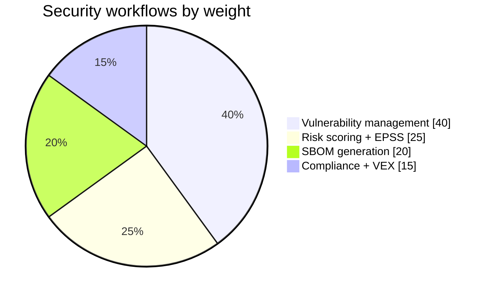
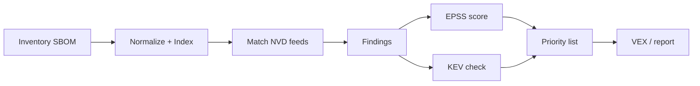

# 🛡️ Security Use Cases

The `cpeskills` SDK exists to answer four security questions: *What do I have? What's vulnerable? How bad is it? What do I do?* Each use case below maps to a concrete API path.



## Vulnerability management

Take an asset inventory, match each item against NVD's known-vulnerable CPE lists, and produce findings. `DownloadAllNVDData` loads the feeds once; `FindCVEsForCPE` queries them offline.

```go
import "github.com/scagogogo/cpe-skills"

opts := cpeskills.DefaultNVDFeedOptions()
opts.CacheDir = "/var/cache/nvd"
data, err := cpeskills.DownloadAllNVDData(opts) // one-time
for _, c := range inventory {
    for _, cve := range data.FindCVEsForCPE(c) {
        fmt.Printf("%s affected by %s\n", c.Cpe23, cve)
    }
}
```

## SBOM compliance

A compliant SBOM names components in a portable way. `ParseCycloneDXJSON` / `ParseSPDXJSON` read SBOMs; `ValidateCPE` and `NormalizeCPE` clean the CPEs inside before publication.

```go
sbom, err := cpeskills.ParseCycloneDXJSON(raw)
for _, comp := range sbom.Components {
    if comp.CPE != "" {
        c, err := cpeskills.Parse(comp.CPE)
        if err == nil {
            comp.CPE = cpeskills.FormatCpe23(cpeskills.NormalizeCPE(c))
        }
    }
}
```

## Supply-chain security

Cross-ecosystem supply-chain tooling speaks PURL, while NVD speaks CPE. `CPEToPURL` and `PURLToCPE` bridge the two, returning a confidence score so you can flag low-confidence mappings for review.

```go
purl, conf, err := cpeskills.CPEToPURL(c)
// reverse direction:
c, conf, err := cpeskills.PURLToCPE(purl)
if conf < 0.5 {
    alertManualReview(purl)
}
```

## Incident response

When a CVE drops, you need every affected asset fast. Build a `CPEIndex` of your inventory once; on incident, look up the disclosed CPE patterns.

```go
idx := cpeskills.NewCPEIndex(inventoryCPes)
pattern, _ := cpeskills.ParseCpe23("cpe:2.3:a:apache:log4j:2.0:*:*:*:*:*:*:*")
affected := idx.Lookup(pattern) // instant
```

`KEVClient.IsListed` tells you whether a CVE is on CISA's Known Exploited Vulnerabilities list, which escalates priority.

```go
kev := cpeskills.NewKEVClient()
listed, _ := kev.IsListed("CVE-2021-44228")
```

## Compliance reporting

Generate a VEX (Vulnerability Exploitability eXchange) document to assert which products are *not* impacted, and attach EPSS scores to prioritise remediation.

```go
epss := cpeskills.NewEPSSClient()
entry, _ := epss.GetScore("CVE-2021-44228")
fmt.Printf("EPSS %f, level %s\n", entry.Score, entry.GetRiskLevel())
```



## Summary

The SDK's security value comes from chaining parse → match → enrich → report. NVD gives the vulnerable set, EPSS and KEV rank it, and VEX/SBOM export let you communicate status to downstream consumers.
