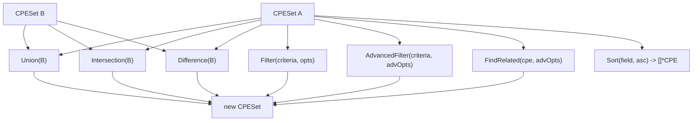

# 📦 CPE Set Examples

A `CPESet` is an ordered, deduplicated collection of CPEs with set-algebra and filter operations. It's the right structure when you hold a product inventory, a vendor's catalogue, or the result of a scan, and need to intersect/union/subtract it against another. The type lives in the [`set`](/en/api/modules/set) module.

## Create and Populate

`NewCPESet` takes a name and description (used in serialization); `Add` inserts a CPE, ignoring duplicates by URI:

```go
package main

import (
    "fmt"

    "github.com/scagogogo/cpe-skills"
)

func main() {
    ms := cpeskills.NewCPESet("Microsoft Products", "Windows + Office")
    ms.Add(cpeskills.MustParse("cpe:2.3:a:microsoft:windows:10:*:*:*:*:*:*:*"))
    ms.Add(cpeskills.MustParse("cpe:2.3:a:microsoft:office:2019:*:*:*:*:*:*:*"))
    ms.Add(cpeskills.MustParse("cpe:2.3:a:microsoft:windows:10:*:*:*:*:*:*:*")) // dedup
    fmt.Println("size:", ms.Size()) // 2
}
```

`FromArray` is a convenience constructor for a slice you already have:

```go
cpes := cpeskills.StringsToCPEs([]string{
    "cpe:2.3:a:microsoft:windows:10:*:*:*:*:*:*:*",
    "cpe:2.3:a:microsoft:windows:11:*:*:*:*:*:*:*",
})
winSet := cpeskills.FromArray(cpes, "Windows", "10 and 11")
```

## Union, Intersection, Difference

Each returns a *new* `CPESet`; neither operand is mutated.

```go
a := cpeskills.FromArray(cpeskills.StringsToCPEs([]string{
    "cpe:2.3:a:apache:log4j:2.14.0:*:*:*:*:*:*:*",
    "cpe:2.3:a:apache:tomcat:9.0.0:*:*:*:*:*:*:*",
}), "A", "")

b := cpeskills.FromArray(cpeskills.StringsToCPEs([]string{
    "cpe:2.3:a:apache:log4j:2.14.0:*:*:*:*:*:*:*",
    "cpe:2.3:a:apache:log4j:2.15.0:*:*:*:*:*:*:*",
}), "B", "")

fmt.Println("union size:", a.Union(b).Size())            // 3
fmt.Println("intersection size:", a.Intersection(b).Size()) // 1
fmt.Println("difference size:", a.Difference(b).Size())   // 1 (tomcat)
```

## Filter and AdvancedFilter

`Filter` takes a criteria CPE plus `MatchOptions` and keeps matching members; `AdvancedFilter` takes `AdvancedMatchOptions` for regex/version-range filtering:

```go
all := cpeskills.FromArray(cpeskills.StringsToCPEs([]string{
    "cpe:2.3:a:apache:log4j:2.14.0:*:*:*:*:*:*:*",
    "cpe:2.3:a:apache:log4j:2.15.0:*:*:*:*:*:*:*",
    "cpe:2.3:a:apache:tomcat:9.0.0:*:*:*:*:*:*:*",
}), "All", "")

crit := cpeskills.MustParse("cpe:2.3:a:apache:log4j:*:*:*:*:*:*:*:*")
log4js := all.Filter(crit, &cpeskills.MatchOptions{})
fmt.Println("log4j count:", log4js.Size()) // 2

adv := cpeskills.NewAdvancedMatchOptions()
adv.MatchMode = "exact"
related := all.AdvancedFilter(crit, adv)
fmt.Println("advanced-filtered:", related.Size())
```

## Sort

`Sort` returns a `[]*CPE` slice ordered by a field key (`"part"`, `"vendor"`, `"product"`, `"version"`):

```go
sorted := all.Sort("version", false) // descending
for _, c := range sorted {
    fmt.Println(c.Version)
}
```

## FindRelated

`FindRelated` returns the subset of members that relate to the given CPE under the advanced options (e.g. everything overlapping a wildcard pattern):

```go
pat := cpeskills.MustParse("cpe:2.3:a:apache:*:*:*:*:*:*:*:*")
opts := cpeskills.NewAdvancedMatchOptions()
opts.MatchMode = "exact"
related := all.FindRelated(pat, opts)
fmt.Println("related apache products:", related.Size())
```

## Containment and Subsets

```go
fmt.Println("contains tomcat:", all.Contains(
    cpeskills.MustParse("cpe:2.3:a:apache:tomcat:9.0.0:*:*:*:*:*:*:*"))) // true
fmt.Println("a is subset of a+b:", a.IsSubsetOf(a.Union(b))) // true
fmt.Println("a equals a:", a.Equals(a))                      // true
```

## Export

`ToString` serializes the set (name, description, members); `ToSlice` returns the raw slice for iteration.

```go
fmt.Println(all.ToString())
for _, c := range all.ToSlice() {
    fmt.Println(c.Cpe23)
}
```



## Summary

- `NewCPESet` / `FromArray` create sets; `Add` dedups by URI. `Union`, `Intersection`, `Difference` are non-mutating and return new sets.
- `Filter` uses `MatchOptions`; `AdvancedFilter` and `FindRelated` use `AdvancedMatchOptions`. `Sort(field, asc)` returns an ordered slice; `Contains`/`IsSubsetOf`/`IsSupersetOf`/`Equals` answer membership.
See the [`set`](/en/api/modules/set) module page for the full API reference.
