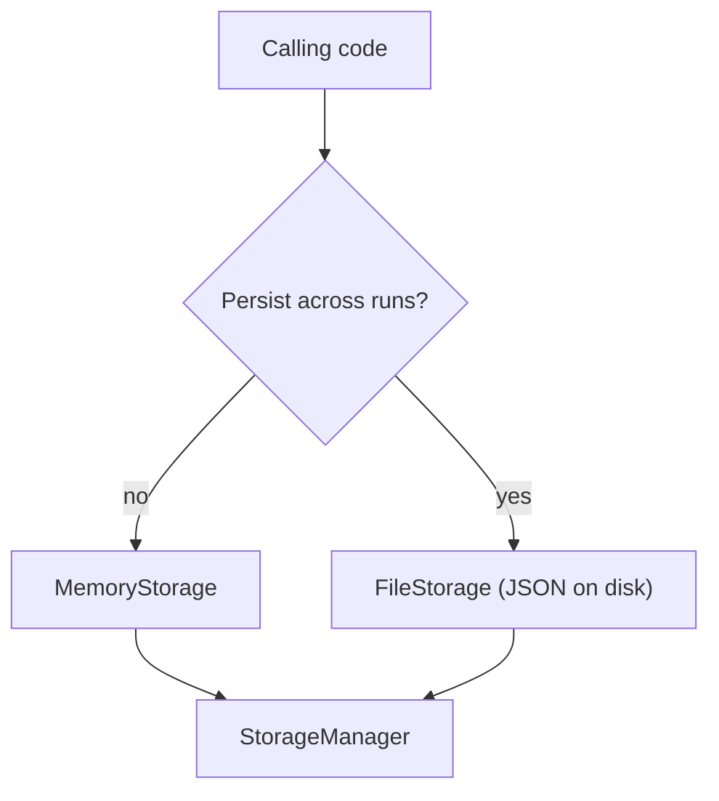
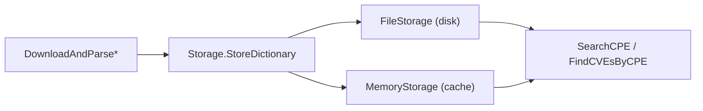

# 💾 Storage Backends

Once you've parsed CPEs and downloaded NVD feeds, you need somewhere to put them. cpe-skills abstracts persistence behind a single [`Storage`](/en/api/modules/storage) interface with two built-in implementations — [`MemoryStorage`](/en/api/modules/memory-storage) and [`FileStorage`](/en/api/modules/file-storage) — and a [`StorageManager`](/en/api/modules/storage) that layers a cache on top. The interface is uniform; the difference is *where* the bytes live and *how long* they survive.

## The Storage Interface

Every backend implements the same `Storage` interface, so calling code is identical regardless of where data is stored:

```go
type Storage interface {
    Initialize() error
    Close() error
    StoreCPE(cpe *CPE) error
    RetrieveCPE(id string) (*CPE, error)
    UpdateCPE(cpe *CPE) error
    DeleteCPE(id string) error
    SearchCPE(criteria *CPE, options *MatchOptions) ([]*CPE, error)
    AdvancedSearchCPE(criteria *CPE, options *AdvancedMatchOptions) ([]*CPE, error)
    StoreCVE(cve *CVEReference) error
    RetrieveCVE(cveID string) (*CVEReference, error)
    FindCVEsByCPE(cpe *CPE) ([]*CVEReference, error)
    FindCPEsByCVE(cveID string) ([]*CPE, error)
    StoreDictionary(dict *CPEDictionary) error
    RetrieveDictionary() (*CPEDictionary, error)
    StoreModificationTimestamp(key string, t time.Time) error
    RetrieveModificationTimestamp(key string) (time.Time, error)
}
```

Because everything goes through this contract, you can swap backends by changing one constructor call.

## Memory vs File Storage

| Aspect | `MemoryStorage` | `FileStorage` |
|--------|-----------------|---------------|
| Lifetime | Process only | Survives restarts |
| Speed | Fastest | Slower (JSON read/write) |
| Capacity | Bounded by RAM | Bounded by disk |
| Setup | `NewMemoryStorage()` | `NewFileStorage(baseDir, useCache)` |
| Best for | Caches, tests, ephemeral scans | Persistent local dictionaries |



```go
// In-memory, ephemeral
mem := cpeskills.NewMemoryStorage()
mem.Initialize()
defer mem.Close()

// Persistent on disk
file, err := cpeskills.NewFileStorage("/var/lib/cpe-skills", true) // useCache=true
if err != nil { log.Fatal(err) }
file.Initialize()
defer file.Close()
```

## When to Use Which

- **`MemoryStorage`** — short-lived CLI runs, unit tests, or as the *cache* tier under `StorageManager`. You lose nothing when the process exits because the data is cheap to rebuild.
- **`FileStorage`** — long-running services or repeated scans where you don't want to re-download the CPE dictionary every time. The `useCache` flag keeps parsed objects in memory for fast reads while persisting writes to JSON.
- **Both** — when you want persistence *and* speed: use `FileStorage` as the primary and `MemoryStorage` as a hot cache via `StorageManager`.

## The StorageManager Cache Layer

`StorageManager` wraps a primary `Storage` and an optional cache `Storage`. On reads (`GetCPE`, `GetCVE`) it consults the cache first; on writes (`StoreCPE`, `StoreCPE`) it writes through to both. The cache TTL defaults to 3600 seconds. `InvalidateCache(id)` evicts a single entry, `ClearCache()` drops everything, and `GetStats()` reports hit/miss counts via `StorageStats`.

```go
primary, _ := cpeskills.NewFileStorage("/var/lib/cpe-skills", true)
primary.Initialize()
defer primary.Close()

mgr := cpeskills.NewStorageManager(primary)
mgr.SetCache(cpeskills.NewMemoryStorage()) // enables CacheEnabled, TTL=3600s

cpe, err := mgr.GetCPE("cpe:2.3:a:apache:log4j:2.14:*:*:*:*:*:*:*")
mgr.StoreCPE(cpe)
stats, _ := mgr.GetStats() // hit/miss ratios
```

## Relationship to This Project

The storage layer is the persistence boundary that NVD download, matching, and CVE lookup all rely on:



## Summary

- One `Storage` interface unifies both backends; swapping is a one-line change.
- `MemoryStorage` is fast but ephemeral; `FileStorage` persists JSON to a directory and supports an in-process read cache.
- `StorageManager` layers a cache over a primary store, with TTL, invalidation, and stats.
- Pick by lifetime and speed needs: ephemeral work → memory; repeated scans → file; both → manager with cache. See the [storage](/en/api/modules/storage), [memory-storage](/en/api/modules/memory-storage), and [file-storage](/en/api/modules/file-storage) modules for the full API.
