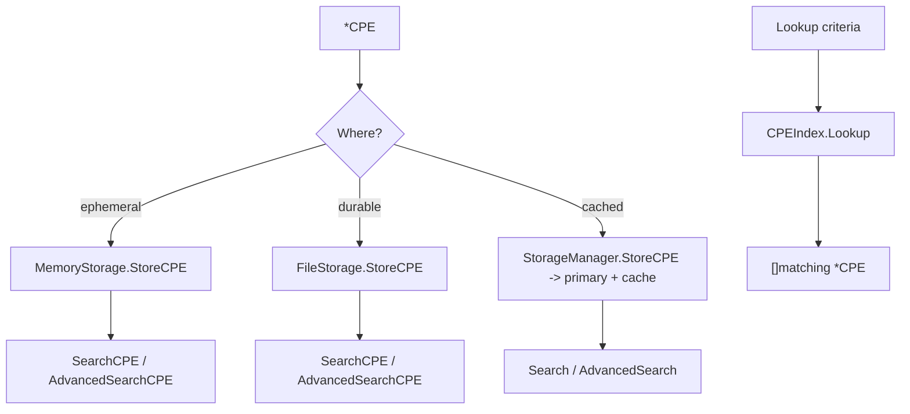

# 💾 CPE Storage Examples

Once CPEs are parsed, you need somewhere to put them — and a fast way to look them up later. cpe-skills abstracts persistence behind a single [`Storage`](/en/api/modules/storage) interface with two built-in implementations ([`MemoryStorage`](/en/api/modules/memory-storage) and [`FileStorage`](/en/api/modules/file-storage)), a [`StorageManager`](/en/api/modules/storage) that layers a cache on top, and an in-memory [`CPEIndex`](/en/api/modules/cpe-index) for fast lookup. This page shows each in use.

## MemoryStorage: Add, Retrieve, Delete

`MemoryStorage` keeps everything in maps — fast, ephemeral, ideal for tests and per-run scans.

```go
package main

import (
    "fmt"
    "log"

    "github.com/scagogogo/cpe-skills"
)

func main() {
    ms := cpeskills.NewMemoryStorage()
    if err := ms.Initialize(); err != nil {
        log.Fatal(err)
    }
    defer ms.Close()

    cpe := cpeskills.MustParse("cpe:2.3:a:apache:log4j:2.14.0:*:*:*:*:*:*:*")
    if err := ms.StoreCPE(cpe); err != nil {
        log.Fatal(err)
    }

    got, err := ms.RetrieveCPE(cpe.GetURI())
    if err != nil {
        log.Fatal(err)
    }
    fmt.Println("retrieved:", got.Cpe23)

    if err := ms.DeleteCPE(cpe.GetURI()); err != nil {
        log.Fatal(err)
    }
}
```

`UpdateCPE` replaces an existing entry by URI; `SearchCPE(criteria, &MatchOptions{})` runs a match query against the whole store.

## FileStorage: Persist to Disk

`FileStorage` writes each CPE to a JSON file under a base directory. Pass `useCache=true` to keep an in-memory mirror for fast reads.

```go
fs, err := cpeskills.NewFileStorage("/tmp/cpe-store", true)
if err != nil {
    log.Fatal(err)
}
if err := fs.Initialize(); err != nil {
    log.Fatal(err)
}
defer fs.Close()

win := cpeskills.MustParse("cpe:2.3:a:microsoft:windows:10:*:*:*:*:*:*:*")
if err := fs.StoreCPE(win); err != nil {
    log.Fatal(err)
}
got, err := fs.RetrieveCPE(win.GetURI()) // survives a process restart
if err != nil {
    log.Fatal(err)
}
fmt.Println("from disk:", got.Cpe23)

adv := cpeskills.NewAdvancedMatchOptions() // regex / version-range filtering
adv.MatchMode = "exact"
hits, err := fs.AdvancedSearchCPE(
    cpeskills.MustParse("cpe:2.3:a:microsoft:windows:*:*:*:*:*:*:*:*"), adv)
if err != nil {
    log.Fatal(err)
}
fmt.Println("hits:", len(hits))
```

## StorageManager: Cache Layer

`StorageManager` wraps a primary storage and an optional cache. Reads consult the cache first and fall back to the primary; writes propagate to both. Use it when your primary is a slow `FileStorage` but you want hot reads.

```go
primary, _ := cpeskills.NewFileStorage("/tmp/cpe-store", false)
sm := cpeskills.NewStorageManager(primary)
sm.SetCache(cpeskills.NewMemoryStorage()) // hot layer

cpe := cpeskills.MustParse("cpe:2.3:a:google:chrome:120.0.6099.109:*:*:*:*:*:*:*")
_ = sm.StoreCPE(cpe) // writes to primary + cache

got, err := sm.GetCPE(cpe.GetURI()) // cache hit
if err != nil {
    log.Fatal(err)
}
fmt.Println("via manager:", got.Cpe23)

sm.InvalidateCache(cpe.GetURI()) // drop one entry
sm.ClearCache()                  // drop everything

stats, _ := sm.GetStats()
fmt.Printf("stats: %+v\n", stats)
```

## CPEIndex: Fast Lookup

`CPEIndex` is not a `Storage` — it's a pure lookup structure built from a slice. `Lookup` returns every CPE matching the criteria (using the same `CPE.Match` rules); `GetByVendor` / `GetByProduct` / `GetByPart` are O(1) helpers.

```go
cpes := cpeskills.StringsToCPEs([]string{
    "cpe:2.3:a:apache:log4j:2.14.0:*:*:*:*:*:*:*",
    "cpe:2.3:a:apache:tomcat:9.0.0:*:*:*:*:*:*:*",
    "cpe:2.3:a:google:chrome:120:*:*:*:*:*:*:*",
})
idx := cpeskills.NewCPEIndex(cpes)

pat := cpeskills.MustParse("cpe:2.3:a:apache:*:*:*:*:*:*:*:*")
for _, c := range idx.Lookup(pat) {
    fmt.Println("apache:", c.Cpe23)
}
fmt.Println("by product log4j:", len(idx.GetByProduct("log4j")))
fmt.Println("by vendor google:", len(idx.GetByVendor("google")))
fmt.Println("by part a:", len(idx.GetByPart("a")))
fmt.Println("indexed:", idx.Size())
```

`Add` and `Remove` keep the index in sync; `LookupByPURL` / `IndexPURL` bridge to the PURL world.



## Summary

- `MemoryStorage` — in-process, fast, ephemeral; best for tests and ephemeral scans. `FileStorage` — JSON-per-CPE on disk, survives restarts, optional in-memory cache.
- `StorageManager` — primary + cache layer (`SetCache`). `CPEIndex` — not persistence, but the fastest way to find matching CPEs in a preloaded slice; powers `BatchMatchCPEs`. All storage reads share `SearchCPE` / `AdvancedSearchCPE` signatures.
See the [`memory-storage`](/en/api/modules/memory-storage), [`file-storage`](/en/api/modules/file-storage), [`storage`](/en/api/modules/storage), and [`cpe-index`](/en/api/modules/cpe-index) module pages for the full API reference.
