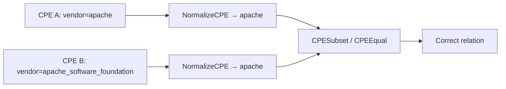
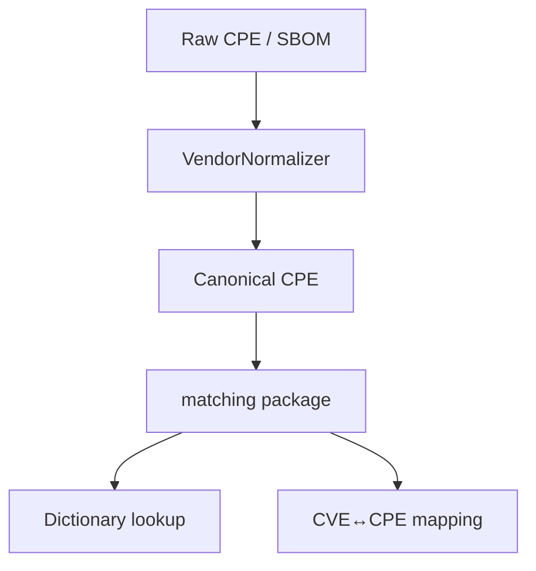

# 🏷️ Vendor Name Normalization

CPE vendor names are **not** consistent. The same company may appear as `microsoft`, `Microsoft`, `microsoft_corporation`, or `msft` across different feeds, advisories, and SBOMs. If you match literally, you'll miss real vulnerabilities simply because the vendor string differs by an underscore or a suffix. cpe-skills' [`vendor-normalization`](/en/api/modules/vendor-normalization) package collapses these variants onto one canonical form so matching is robust.

## Why CPE Vendor Names Aren't Unified

The CPE dictionary is curated, but CVE records and vendor advisories are written by many parties. A researcher filing a CVE might write `apache`, while the official CPE dictionary uses `apache_software_foundation`. SBOM generators emit yet another spelling depending on the package manager. None of these is "wrong" — they're just different representations of the same entity. The table below shows the kind of drift that exists in the wild:

| Canonical | Variants seen in the wild |
|-----------|---------------------------|
| `apache` | `apache_software_foundation`, `apache software foundation`, `the apache software foundation`, `apache.org` |
| `microsoft` | `microsoft_corporation`, `microsoft corp`, `ms`, `msft` |
| `google` | `google_inc`, `google_llc`, `google inc.`, `alphabet`, `google_chrome` |
| `oracle` | `oracle_corporation`, `oracle corporation`, `oracle_corp` |
| `redhat` | `red_hat`, `red hat, inc.`, `red_hat_software`, `rhel` |

## The Alias Mechanism

`VendorNormalizer` holds two alias maps: vendor aliases and product aliases. `RegisterVendorAlias(canonical, aliases...)` declares that the alias strings all refer to the canonical vendor; `RegisterProductAlias` does the same for products under a vendor. The package ships with a built-in catalog covering the major vendors shown above (see `registerBuiltinAliases`), and you can extend it at runtime:

```go
n := cpeskills.NewVendorNormalizer()
n.RegisterVendorAlias("mycompany", "my_company", "my company", "my-company")
n.RegisterProductAlias("mycompany", "myapp", "my_app", "my-app")
```

All comparisons are case-insensitive and ignore separators, so `Microsoft Corp` and `microsoft_corp` resolve to the same key. You can ask whether two names are the same entity without normalizing both explicitly:

```go
n.AreSameVendor("microsoft_corporation", "msft") // true
n.AreSameProduct("microsoft", "windows_10", "windows") // true
```

## How Normalization Affects Matching

The [`matching`](/en/api/modules/matching) package compares CPE attributes to derive a relation (`Equal`, `Subset`, `Superset`, `Disjoint`). If vendor names aren't normalized, `CPESubset` will wrongly return `Disjoint` for the same product listed under `apache` vs `apache_software_foundation`, silently dropping a vulnerable match. Running `NormalizeCPE` before matching collapses both sides to canonical form so the comparison succeeds.



## Normalizing a Whole CPE

`NormalizeCPE(cpe)` returns a new `CPE` with both vendor and product canonicalized, leaving other fields untouched. There are also package-level convenience functions `NormalizeVendorName`, `NormalizeProductName`, and `NormalizeCPEVendorProduct` for when you only have strings:

```go
n := cpeskills.NewVendorNormalizer()
canonicalCPE := n.NormalizeCPE(rawCPE)        // struct-aware
vendor := n.NormalizeVendorName("MSFT")       // "microsoft"
```

## Relationship to This Project

Normalization is the preprocessing step that makes every downstream comparison trustworthy:



## Summary

- CPE vendor names drift across feeds (`apache` vs `apache_software_foundation`); literal matching misses real vulnerabilities.
- `VendorNormalizer` maps variants to one canonical form via vendor/product alias tables, with built-in coverage for major vendors.
- Run `NormalizeCPE` before matching so `CPESubset`/`CPEEqual` see identical vendor strings.
- `AreSameVendor`/`AreSameProduct` answer identity questions without mutating your data. See the [vendor-normalization](/en/api/modules/vendor-normalization) and [matching](/en/api/modules/matching) modules for the full API.
