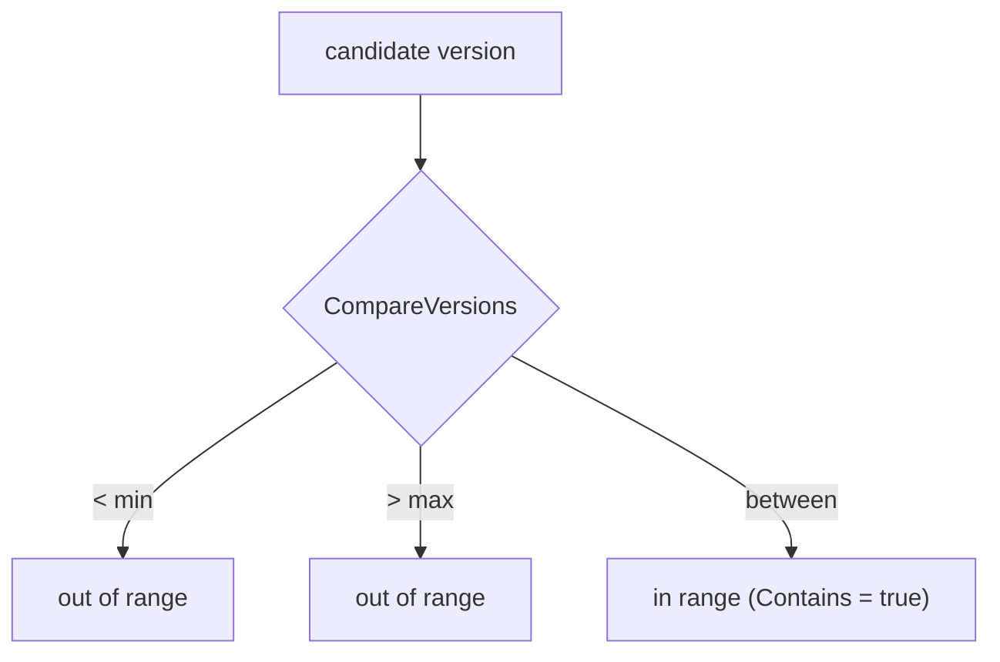
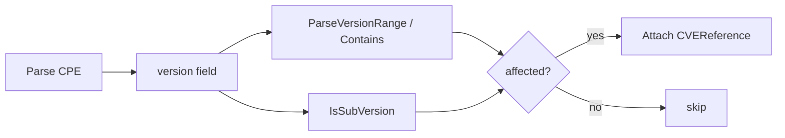

# 🔢 Version Semantics

"Is `2.0` affected? What about `2.0.1-beta`?" Answering these correctly is what separates a useful scanner from a noisy one. cpe-skills' [`version-compare`](/en/api/modules/version-compare) package handles semantic version comparison, range checks, sub-version detection, and the range syntax used throughout CPE vulnerability records.

## Semantic Version Comparison

`CompareVersions(v1, v2)` returns `-1`, `0`, or `1` (less, equal, greater). It delegates to the `github.com/scagogogo/versions` library, which parses numeric segments and an optional suffix (pre-release/build metadata) so that `2.0` < `2.0.1` < `2.1` and `2.0.0-alpha` < `2.0.0`.

```go
cpeskills.CompareVersions("2.0", "2.0.1")   // -1
cpeskills.CompareVersions("2.14", "2.14")    // 0
cpeskills.CompareVersions("3.0", "2.14")     // 1
```

## Version Ranges

Vulnerability advisories rarely name a single version — they describe an *interval*. `VersionRange` models a closed interval with `MinVersion` and `MaxVersion` (both inclusive). `ParseVersionRange` accepts three forms:

| Syntax | Meaning | Example |
|--------|---------|---------|
| `1.0` | Exact version (min == max) | only `1.0` |
| `1.0-2.0` | Closed range | `1.0` ≤ v ≤ `2.0` |
| `1.0+` | Half-open, unbounded above | v ≥ `1.0` |
| `-2.0` | Half-open, unbounded below | v ≤ `2.0` |

`IsVersionInRange(version, min, max)` is the lower-level check (empty bound means unbounded on that side), and `VersionRange.Contains(version)` is the object-oriented wrapper:

```go
vr, _ := cpeskills.ParseVersionRange("2.0-2.14.1")
vr.Contains("2.10")   // true — within the range
vr.Contains("2.15")   // false — above max

cpeskills.IsVersionInRange("2.10", "2.0", "2.14.1") // true
cpeskills.IsVersionInRange("2.10", "2.0+", "")       // error: "2.0+" is range syntax, not a version
```

The diagram shows how a candidate version is classified against a parsed range:



## Sub-Version Concept

Sometimes an advisory says "all 2.x versions" without naming each patch. `IsSubVersion(parentVersion, subVersion)` tests whether one version is a more specific child of another — e.g. `2.0.1` is a sub-version of `2.0`. It requires the child's numeric segments to share the parent's full prefix and be at least as long, and (when lengths are equal) requires matching suffixes.

```go
cpeskills.IsSubVersion("2.0", "2.0.1")  // true
cpeskills.IsSubVersion("2.0", "2.1")    // false — prefix differs
cpeskills.IsSubVersion("2.0", "2.0.0")  // true — longer numeric, shared prefix
```

## Wildcards and Ranges in CPE

In CPE 2.3, the `version` field can contain wildcards (`*` = any, `-` = undefined) as part of WFN (Well-Formed Name) semantics. The [`matching`](/en/api/modules/matching) package interprets these during comparison: a wildcard version matches anything, while a concrete version is checked against ranges like the ones above. This is why version comparison and CPE matching are separate but cooperating concerns — matching decides *whether* to compare, version logic decides *how*.

## Relationship to This Project

Version semantics sit between CPE parsing and vulnerability matching:



## Summary

- `CompareVersions` gives semantic ordering; `IsVersionInRange` does closed-interval checks.
- `ParseVersionRange` handles exact (`1.0`), closed (`1.0-2.0`), and half-open (`1.0+`, `-2.0`) forms.
- `IsSubVersion` detects parent/child version relationships for "all 2.x" style advisories.
- Wildcards in CPE version fields are handled by the matching layer; version logic handles the concrete comparisons. See the [version-compare](/en/api/modules/version-compare) module for the full API.
