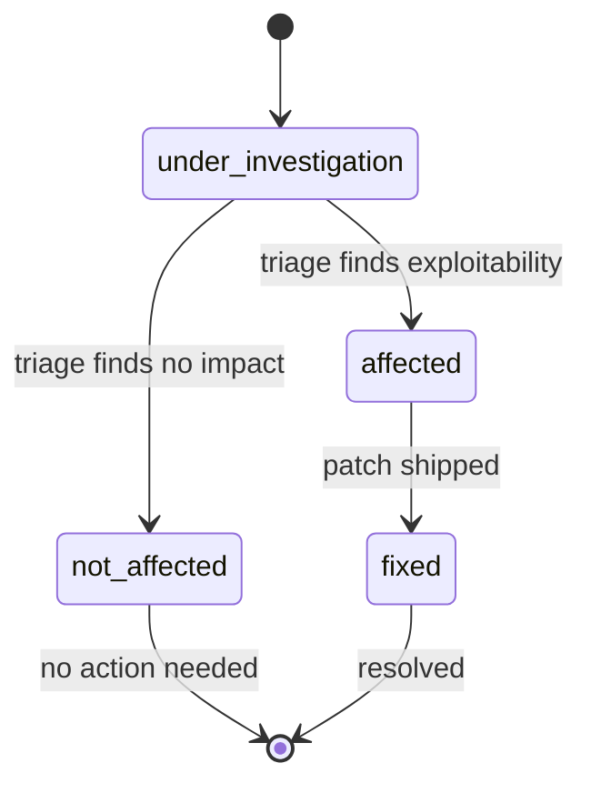
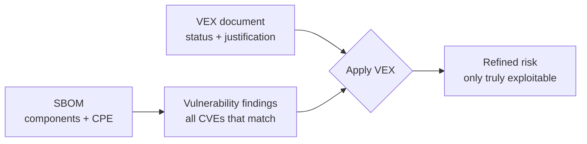

# ✅ VEX (Vulnerability Exploitability eXchange)

A **VEX document** is a companion to an SBOM that states, for a given product, whether a specific vulnerability is actually exploitable. Where an SBOM says "this product contains log4j-core 2.14" and a CVE feed says "CVE-2021-44228 affects log4j-core 2.14", VEX is the layer that says "but in *our* product, that code path is not reachable — **not_affected**".

## The problem VEX solves

Naive vulnerability scanning flags every component whose version matches a CVE. In practice most flagged vulnerabilities are not exploitable in a given deployment: the vulnerable function is never called, the feature is disabled, or a mitigation is already in place. VEX exists to record that expert judgment so it can be shared — between vendor and customer, between teams, between tools — instead of re-derived each time.

## The four statuses

| Status                 | Constant                   | Meaning                                               |
|------------------------|----------------------------|-------------------------------------------------------|
| `affected`             | `VEXAffected`              | The product is affected and exploitable               |
| `not_affected`         | `VEXNotAffected`           | The product is not exploitable (with a justification) |
| `fixed`                | `VEXFixed`                 | The product shipped a fixed version                   |
| `under_investigation`  | `VEXUnderInvestigation`    | Still being triaged                                   |

A `not_affected` statement must carry a **justification** explaining why. The library exposes the CSAF/CycloneDX justification vocabulary:

| Justification constant                              | Why not affected                                   |
|-----------------------------------------------------|----------------------------------------------------|
| `VEXComponentNotPresent`                            | The component isn't shipped in this product        |
| `VEXVulnerableCodeNotPresent`                       | Component is present, vulnerable code isn't        |
| `VEXVulnerableCodeNotInExecutePath`                 | Code exists but is never reached                   |
| `VEXVulnerableCodeCannotBeControlledByAdversary`    | Input cannot be controlled by an attacker          |
| `VEXInlineMitigationsExist`                         | A mitigation is already in place                   |

The statuses form a lifecycle. A newly discovered CVE typically starts `under_investigation`, then moves to `affected` or `not_affected`; `fixed` is the terminal state once a patch ships.



## VEX and SBOM

VEX does not replace an SBOM — it annotates it. The typical flow is: build the SBOM, run vulnerability matching to get findings, then produce a VEX document that downgrades the non-exploitable findings from "affected" to "not_affected".



## CISA SBOM/VEX alignment

The U.S. **CISA** has driven the joint adoption of SBOM and VEX: an SBOM answers "what's in it", VEX answers "so what". The two are meant to travel together so a consumer can reconcile a vendor's SBOM, the public CVE feeds, and the vendor's VEX statements into a single, trustworthy risk picture.

## Producing and applying VEX

```go
package main

import (
    "fmt"
    "github.com/scagogogo/cpe-skills"
)

func main() {
    // Author a statement: CVE not exploitable in this product
    stmt := cpeskills.NewVEXStatement(
        "CVE-2021-44228",
        "cpe:2.3:a:mycorp:myproduct:1.0:*:*:*:*:*:*:*",
        cpeskills.VEXNotAffected,
    )
    stmt.Justification = cpeskills.VEXVulnerableCodeNotInExecutePath

    doc := cpeskills.NewVEXDocument("cyclonedx", "myproduct", "My Product", "security-team")
    doc.Statements = append(doc.Statements, stmt)

    // Apply a VEX doc to a list of findings to filter out the non-affected
    refined := cpeskills.ApplyVEXToFindings(allFindings, doc)
    fmt.Println(len(refined), "truly exploitable findings remain")
}
```

`GenerateVEXFromFindings` produces a draft VEX document straight from matched findings on an SBOM component — every finding starts as `affected` and a human edits the ones that are not. `MergeVEXDocuments` combines statements from multiple sources, and `ParseVEXDocument` reads an existing VEX file.

## Relationship to the modules

- [VEX](../api/modules/vex.md) — `VEXDocument`, `VEXStatement`, status/justification constants, generate/apply/merge/parse.

## Summary

VEX is the "so what" layer over an SBOM. Its four statuses — affected, not_affected, fixed, under_investigation — turn a raw CVE/SBOM match list into an actionable risk statement, and the required justifications make the reasoning auditable.
