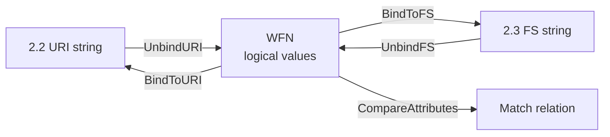

# 🔗 Well-Formed Name (WFN)

A **Well-Formed Name (WFN)** is the abstract, logical representation of a CPE defined by **NISTIR 7695**. While the 2.2 URI and 2.3 formatted string are text *serializations*, a WFN is the canonical form the spec uses to define matching. Every string is first *unbound* into a WFN, compared as a WFN, then *bound* back to a string for display.

## Why WFN exists

A CPE string like `cpe:2.3:a:apache:http_server:2.4.58` looks precise, but real-world data has gaps: some fields are blank, some are wildcards, some are "not applicable". WFN gives every attribute a well-defined logical value so that comparison never has to guess what an empty field means.

## The two special logical values

| Value | Constant       | Meaning                                            |
|-------|----------------|----------------------------------------------------|
| `*`   | `ValueANY`     | ANY — matches every possible value for the field   |
| `-`   | `ValueNA`      | NA — the field is not applicable to this product   |
| (text)| (a literal)   | A specific value, possibly with wildcards          |

`ANY` is the key concept: it is how a WFN says "this field is unspecified, so accept anything here". When you parse a 2.2 URI that omits the `language` field, that attribute becomes `ANY` in the WFN.



## Binding and unbinding

NISTIR 7695 defines *binding* as the act of serializing a WFN to a string, and *unbinding* as the reverse:

- `BindToFS(w)` — produce a 2.3 formatted string.
- `BindToURI(w)` — produce a 2.2 URI.
- `UnbindFS(s)` / `UnbindURI(s)` — parse a string back into a WFN.

In `cpe-skills` you usually work with the higher-level `CPE` struct, but the binding functions are exposed because they are the spec-defined bridge between the two syntaxes.

## WFN as the foundation of matching

Matching two CPEs is defined in terms of comparing their WFN attributes, not their strings. The reason is simple: string comparison cannot express `ANY`. Consider:

```
source: cpe:2.3:a:apache:http_server:*:*:*:*:*:*:*   (version = ANY)
target: cpe:2.3:a:apache:http_server:2.4.58:*:*:*:*:*:*:*
```

String-equal these and you get "not equal". Compare them as WFNs and the source's `ANY` version matches the target's `2.4.58` — source is a *superset* of target. That distinction is the entire reason WFN exists.

## Constructing a WFN

You can build a WFN directly, or derive it from a parsed CPE:

```go
package main

import (
    "fmt"
    "github.com/scagogogo/cpe-skills"
)

func main() {
    cpe, err := cpeskills.ParseCpe23("cpe:2.3:a:apache:http_server:2.4.58:*:*:*:*:*:*:*")
    if err != nil { panic(err) }

    wfn := cpeskills.FromCPE(cpe)         // CPE -> WFN
    fmt.Println(wfn.Vendor, wfn.Product, wfn.Version)
    // apache http_server 2.4.58

    // Bind back to either syntax
    fmt.Println(cpeskills.BindToFS(wfn))
    fmt.Println(cpeskills.BindToURI(wfn))
}
```

`NewWFN()` returns an empty WFN whose attributes default to `ANY`, which is the correct starting point for building a "match anything" criterion.

## Relationship to the modules

- [WFN](../api/modules/wfn.md) — the `WFN` struct, `FromCPE`, `NewWFN`.
- [Binding](../api/modules/binding.md) — `BindToFS`, `BindToURI`, unbind and convert functions.
- [Matching](../api/modules/matching.md) — `CompareAttributes`, the consumer of WFN comparison.

## Summary

WFN is the logical layer beneath both CPE syntaxes. Its `ANY` and `NA` values give comparison a precise semantics that raw strings cannot, which is why every matcher in the spec — and in `cpe-skills` — operates on WFNs.
