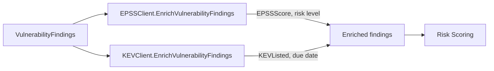

# 📊 EPSS & KEV

Two external threat-intelligence feeds sharpen prioritization. **EPSS** (Exploit Prediction Scoring System) gives the probability a CVE will be exploited in the wild. **CISA KEV** (Known Exploited Vulnerabilities) is the catalog of vulnerabilities confirmed to be actively exploited. `cpeskills` fetches both and attaches them to your findings.

## Concept

Each client caches responses. EPSS enriches findings with a 0.0–1.0 score and risk level; KEV flags findings that are listed, optionally adding due dates and required actions. The enriched fields are then consumed by the risk scorer.



## Enrich Findings with EPSS and KEV

```go
package main

import (
    "fmt"
    "log"

    cpeskills "github.com/scagogogo/cpe-skills"
)

func main() {
    epss := cpeskills.NewEPSSClient()
    if err := epss.EnrichVulnerabilityFindings(findings); err != nil {
        log.Fatal(err)
    }
    for _, f := range findings {
        fmt.Printf("%s epss=%.4f\n", f.CVE.CVEID, f.EPSSScore)
    }

    kev := cpeskills.NewKEVClient()
    if err := kev.EnrichVulnerabilityFindings(findings); err != nil {
        log.Fatal(err)
    }
}
```

## Direct Lookups

```go
entry, err := epss.GetScore("CVE-2021-44228")
if err == nil && entry.IsCriticalRisk() {
    fmt.Println("high exploit probability")
}

listed, err := kev.IsListed("CVE-2021-44228")
if err == nil && listed {
    ke, _ := kev.GetEntry("CVE-2021-44228")
    due, _ := kev.GetDueDate("CVE-2021-44228")
    fmt.Printf("KEV-listed, due %s, action: %s\n", due, ke.RequiredAction)
}
```

## Best Practices

- **Enrich EPSS and KEV together** — the risk scorer uses both signals; partial enrichment underweights a finding.
- **Run enrichment before scoring** so `DefaultRiskScorer` sees `EPSSScore` and `KEVListed` on each finding.
- **Treat KEV listing as a hard deadline** — `GetDueDate` returns the CISA remediation deadline; surface it in your tracker.

## Related Modules

- [Risk Scoring](./risk-scoring.md) — consumes EPSS/KEV fields into the priority bucket.
- [SBOM](./sbom.md) — source of findings to enrich.
- [Export Formats](./export.md) — enriched findings serialize cleanly to SARIF.
