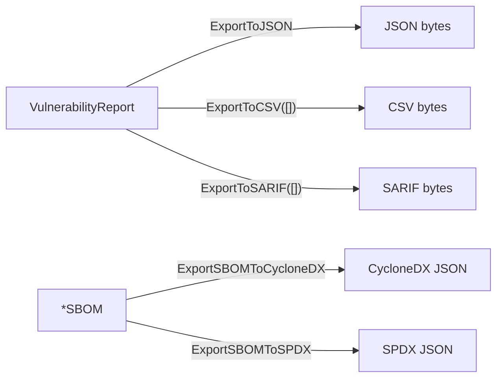

# 📤 Export Formats

Once you have a vulnerability report or an SBOM, you need to share it with downstream tools — CI dashboards, ticket trackers, auditors. `cpeskills` serializes vulnerability reports to JSON, CSV, and SARIF, and serializes SBOMs back to CycloneDX and SPDX.

## Concept

Two parallel export paths exist. **Report exports** take `*VulnerabilityReport` (or a batch) and an `ExportFormat` (`json`, `csv`, `sarif`). **SBOM exports** take an `*SBOM` and emit CycloneDX or SPDX JSON. CSV and SARIF are batch-oriented (they take slices) because a single finding is rarely useful on its own.



## Export a Vulnerability Report

```go
package main

import (
    "fmt"
    "os"

    cpeskills "github.com/scagogogo/cpe-skills"
)

func main() {
    comp := cpeskills.NewSBOMComponent("log4j-core", "2.14.0")
    report := cpeskills.NewVulnerabilityReport(comp)

    // SARIF integrates with GitHub Code Scanning.
    sarifBytes, err := cpeskills.ExportToSARIF([]*cpeskills.VulnerabilityReport{report})
    if err != nil {
        panic(err)
    }
    _ = os.WriteFile("results.sarif", sarifBytes, 0644)

    csvBytes, err := cpeskills.ExportToCSV([]*cpeskills.VulnerabilityReport{report})
    if err != nil {
        panic(err)
    }
    fmt.Printf("CSV: %d bytes\n", len(csvBytes))
}
```

## Export an SBOM to CycloneDX / SPDX

```go
sbom := cpeskills.NewSBOM(cpeskills.SBOMFormatCycloneDX, "my-app")
// ... add components ...

cdx, err := cpeskills.ExportSBOMToCycloneDX(sbom)
if err != nil {
    panic(err)
}
_ = os.WriteFile("bom.cdx.json", cdx, 0644)

spdx, err := cpeskills.ExportSBOMToSPDX(sbom)
if err != nil {
    panic(err)
}
_ = os.WriteFile("bom.spdx.json", spdx, 0644)
```

## Best Practices

- **Use SARIF for CI** — GitHub/GitLab ingest SARIF natively and surface findings as review annotations.
- **Use CSV for human triage** — spreadsheets are the lingua franca of remediation sprints.
- **Export both SBOM formats when unsure** — CycloneDX is richer for security; SPDX is preferred by some license-audit toolchains.

## Related Modules

- [SBOM](./sbom.md) — the `*SBOM` type the SBOM exporters consume.
- [VEX](./vex.md) — apply VEX before exporting reports to suppress `not_affected` noise.
- [Risk Scoring](./risk-scoring.md) — prioritize before exporting so the report leads with the worst items.
