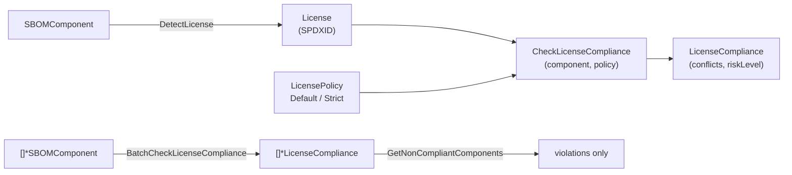

# 📜 License Compliance

Knowing the license of every component is a legal requirement, not just a security one. `cpeskills` detects the license of an SBOM component, checks it against an allow/deny policy, and runs batch compliance across a whole SBOM — surfacing copyleft and non-OSI-approved components before they ship.

## Concept

A `LicensePolicy` defines allowed/denied SPDX IDs and flags for copyleft and OSI approval. `CheckLicenseCompliance` returns a `*LicenseCompliance` describing detected vs. declared license, conflicts, and a risk level. Two ready-made policies ship out of the box: `DefaultLicensePolicy` (permissive) and `StrictLicensePolicy` (no copyleft, OSI-approved only).



## Detect and Check a Single Component

```go
package main

import (
    "fmt"

    cpeskills "github.com/scagogogo/cpe-skills"
)

func main() {
    comp := cpeskills.NewSBOMComponent("my-lib", "1.0")

    lic := cpeskills.DetectLicense(comp)
    fmt.Printf("detected license: %s\n", lic.SPDXID)

    result := cpeskills.CheckLicenseCompliance(comp, cpeskills.StrictLicensePolicy())
    if len(result.Conflicts) > 0 {
        fmt.Printf("conflicts: %v (risk=%s)\n", result.Conflicts, result.RiskLevel)
    }
}
```

## Batch Compliance Across an SBOM

```go
policy := cpeskills.DefaultLicensePolicy()

results := cpeskills.BatchCheckLicenseCompliance(allComponents, policy)
for _, bad := range cpeskills.GetNonCompliantComponents(results) {
    fmt.Printf("non-compliant: %s — %s\n", bad.Component.Name, bad.Conflicts)
}
```

## Best Practices

- **Start with `StrictLicensePolicy` for products you distribute** — copyleft licenses can force source disclosure; catch them early.
- **Use `DefaultLicensePolicy` for internal-only tooling** where copyleft is acceptable.
- **Run batch compliance on every SBOM build** — license violations are cheaper to fix at intake than at release.

## Related Modules

- [SBOM](./sbom.md) — components carry `Licenses` that detection reads.
- [Manifest to SBOM](./manifest.md) — manifest parsers preserve declared license text.
- [Export Formats](./export.md) — serialize compliance reports for auditors.
