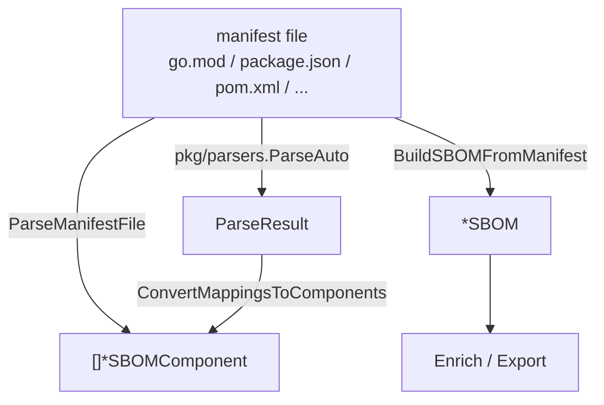

# 🧾 Manifest to SBOM

Most projects already declare their dependencies in a manifest file — `go.mod`, `package.json`, `pom.xml`, `Cargo.toml`, `requirements.txt`, and more. `cpeskills` parses these manifests into SBOM components directly, so you generate an SBOM from source without manually building it component by component.

## Concept

`BuildSBOMFromManifest` takes a filename and its contents and returns a ready-to-use `*SBOM`; `ParseManifestFile` returns just the components. The `pkg/parsers` sub-package exposes individual parsers (`ParseGoMod`, `ParsePackageJSON`, …) and an auto-detecting `ParseAuto` that picks the parser from the filename.



## Build an SBOM From a go.mod

```go
package main

import (
    "fmt"
    "os"

    cpeskills "github.com/scagogogo/cpe-skills"
)

func main() {
    content, err := os.ReadFile("go.mod")
    if err != nil {
        panic(err)
    }

    sbom, err := cpeskills.BuildSBOMFromManifest("go.mod", string(content), "my-app")
    if err != nil {
        panic(err)
    }
    fmt.Printf("SBOM with %d components\n", sbom.ComponentCount())
}
```

## Use a Specific Parser via the Parsers Sub-Package

```go
import "github.com/scagogogo/cpe-skills/pkg/parsers"

// Parse a go.mod directly.
result, err := parsers.ParseGoMod(strings.NewReader(goModContent))
if err != nil {
    log.Fatal(err)
}

// Or auto-detect from the filename.
auto, err := parsers.ParseAuto("package.json", strings.NewReader(jsonContent))
```

## Best Practices

- **Pin lockfiles over manifests when available** — `package-lock.json`, `go.sum`-resolved, and `composer.lock` carry exact resolved versions, giving a more accurate SBOM.
- **Enrich after building** — feed the resulting SBOM into `EnrichWithVulnerabilities` to attach CVEs.
- **Use `ParseAuto` for heterogeneous repos** — it dispatches on the filename so a single code path handles every manifest type.

## Related Modules

- [SBOM](./sbom.md) — the output type these builders produce.
- [PURL & Ecosystem](./purl.md) — parsed components carry PURLs by ecosystem.
- [Export Formats](./export.md) — serialize the generated SBOM to CycloneDX/SPDX.
