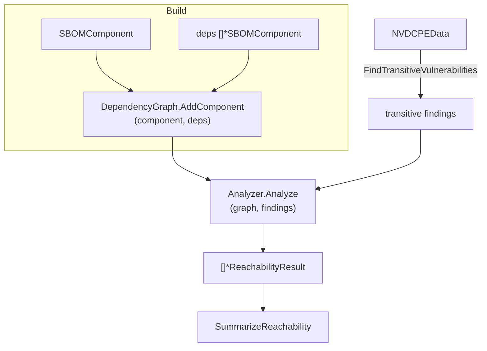

# 🕸️ Dependency Graph & Reachability

Not every vulnerability in your dependency tree is reachable from your application code. Reachability analysis walks the dependency graph and labels each finding as `direct`, `transitive`, or `unknown`, so you can focus remediation on vulnerabilities that are actually exercisable.

## Concept

You build a `DependencyGraph` by adding each component together with its direct dependencies. A reachability analyzer then walks that graph against a set of findings and reports, per finding, whether the vulnerable component is reachable from the root.



## Build a Graph and Analyze

```go
package main

import (
    "fmt"

    cpeskills "github.com/scagogogo/cpe-skills"
)

func main() {
    graph := cpeskills.NewDependencyGraph()

    app := cpeskills.NewSBOMComponent("my-app", "1.0")
    lib := cpeskills.NewSBOMComponent("log4j-core", "2.14.0")
    transitive := cpeskills.NewSBOMComponent("jackson-databind", "2.9.0")

    graph.AddComponent(app, []*cpeskills.SBOMComponent{lib})
    graph.AddComponent(lib, []*cpeskills.SBOMComponent{transitive})

    analyzer := cpeskills.NewDependencyGraphReachabilityAnalyzer()
    results, err := analyzer.Analyze(graph, findings)
    if err != nil {
        panic(err)
    }

    summary := cpeskills.SummarizeReachability(results)
    fmt.Printf("direct=%d transitive=%d\n", summary.Direct, summary.Transitive)
}
```

## Transitive Vulnerabilities & Quick Check

```go
// Discover vulnerabilities reachable transitively from the graph against NVD.
transitiveFindings := graph.FindTransitiveVulnerabilities(nvdData)

// Fast single-finding check without running full analysis.
result := cpeskills.QuickReachabilityCheck(graph, lib, singleFinding)
if result.Level == cpeskills.ReachabilityDirect ||
    result.Level == cpeskills.ReachabilityTransitive {
    fmt.Println("vulnerability is reachable from the root component")
}
```

## Best Practices

- **Add the application as the graph root** — reachability is computed from roots; without a root, every component is treated as isolated.
- **Run `FindTransitiveVulnerabilities` before analysis** to populate the findings set the analyzer consumes.
- **Use `SummarizeReachability` for reporting** and `GetActionableFindings(results)` to extract only the reachable findings for risk scoring.

## Related Modules

- [SBOM](./sbom.md) — components and `AddDependency` relations feed the graph.
- [Risk Scoring](./risk-scoring.md) — reachable findings score higher.
- [EPSS & KEV](./epss-kev.md) — enrich reachable findings before prioritization.
