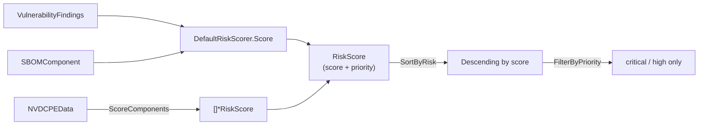

# 🎯 Risk Scoring

Risk scoring turns a flat list of vulnerabilities into a prioritized, actionable queue. `cpeskills` combines CVSS severity, EPSS exploit probability, KEV listing, and reachability into a single numeric score and a `RiskPriority` bucket, so engineers know what to fix first.

## Concept

The `DefaultRiskScorer` weighs several signals per finding and emits a `*RiskScore`. You can score one component at a time, or batch-score every component in an SBOM against an NVD dataset. Results are sortable and filterable by priority.



`RiskPriority` buckets: `critical`, `high`, `medium`, `low`, `none`.

## Score a Single Component

```go
package main

import (
    "fmt"

    cpeskills "github.com/scagogogo/cpe-skills"
)

func main() {
    scorer := cpeskills.NewDefaultRiskScorer()
    // findings come from sbom.FindVulnerableComponents(cves)[i].Vulnerabilities
    score := scorer.Score(findings, comp)
    fmt.Printf("score=%.2f priority=%s\n", score.OverallScore, score.Priority)
}
```

## Batch-Score an SBOM and Filter

```go
nvdData, err := cpeskills.DownloadAllNVDData(&cpeskills.NVDFeedOptions{Years: []int{2024}})
if err != nil {
    log.Fatal(err)
}

scores := cpeskills.ScoreComponents(allComponents, nvdData)
cpeskills.SortByRisk(scores) // highest risk first

// Triage only critical items this sprint; defer the rest.
critical := cpeskills.FilterByPriority(scores, cpeskills.RiskPriorityCritical)
fmt.Printf("%d critical items to remediate\n", len(critical))
```

## Best Practices

- **Enrich before scoring** — run EPSS and KEV enrichment (see [EPSS & KEV](./epss-kev.md)) on findings first; the scorer consumes those signals.
- **Combine with VEX** — apply VEX to remove `not_affected` findings *before* scoring, otherwise non-exploitable items can still float to the top.
- **Use `FilterByPriority` for sprints** — sort once, then slice by priority bucket to size remediation work realistically.

## Related Modules

- [SBOM](./sbom.md) — components and findings that feed the scorer.
- [EPSS & KEV](./epss-kev.md) — enrich findings to feed richer scores.
- [Reachability](./reachability.md) — reachable findings score higher.
