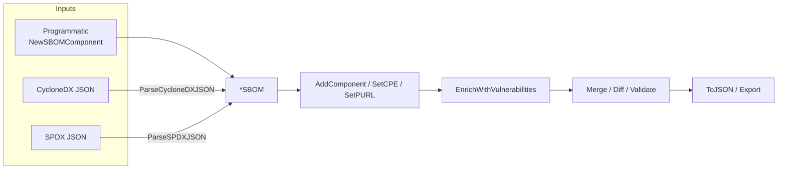

# 📦 SBOM (Software Bill of Materials)

An SBOM is a formal, machine-readable inventory of every component in a software product — including names, versions, identifiers (CPE / PURL), and dependency relationships. `cpeskills` treats the SBOM as the central object that parsing, vulnerability enrichment, risk scoring, VEX, and export all revolve around.

## Concept

The library supports two industry-standard SBOM formats — **CycloneDX** and **SPDX** — behind a unified `*SBOM` type. You can either build an SBOM programmatically from components, or parse an existing CycloneDX/SPDX document. Once built, the SBOM can be enriched with NVD vulnerability data, merged with other SBOMs, diffed for change tracking, and validated.



## Build an SBOM Programmatically

```go
package main

import (
    "fmt"

    cpeskills "github.com/scagogogo/cpe-skills"
)

func main() {
    sbom := cpeskills.NewSBOM(cpeskills.SBOMFormatCycloneDX, "my-app")

    cpe := cpeskills.MustParse("cpe:2.3:a:log4j:log4j:2.14.0:*:*:*:*:*:*:*")
    purl, _ := cpeskills.ParsePURL("pkg:maven/org.apache.logging.log4j/log4j-core@2.14.0")

    comp := cpeskills.NewSBOMComponent("log4j-core", "2.14.0")
    comp.SetCPE(cpe)
    comp.SetPURL(purl)
    sbom.AddComponent(comp)

    data, err := sbom.ToJSON()
    if err != nil {
        panic(err)
    }
    fmt.Printf("SBOM with %d components, %d bytes JSON\n", sbom.ComponentCount(), len(data))
}
```

## Parse Existing CycloneDX / SPDX

```go
cdxData, _ := os.ReadFile("bom.cdx.json")
sbom, err := cpeskills.ParseCycloneDXJSON(cdxData)
if err != nil {
    log.Fatal(err)
}

spdxData, _ := os.ReadFile("bom.spdx.json")
spdxSbom, err := cpeskills.ParseSPDXJSON(spdxData)
if err != nil {
    log.Fatal(err)
}
```

## Enrich, Merge, Diff, Validate

```go
// Pull NVD feeds and attach vulnerability findings to matching components.
nvdData, err := cpeskills.DownloadAllNVDData(&cpeskills.NVDFeedOptions{Years: []int{2021}})
if err != nil {
    log.Fatal(err)
}
if err := sbom.EnrichWithVulnerabilities(nvdData); err != nil {
    log.Fatal(err)
}

// Merge multiple SBOMs (e.g. app + base image) into one.
merged, err := cpeskills.MergeSBOMs([]*cpeskills.SBOM{sbom, spdxSbom},
    cpeskills.SBOMFormatCycloneDX, "merged-bom")
if err != nil {
    log.Fatal(err)
}

// Diff two SBOMs for change tracking (added / removed / changed).
diff := cpeskills.DiffSBOMs(oldSBOM, merged)
fmt.Printf("changes: %s\n", diff.Summary())

// Validate catches missing identifiers, duplicate refs, etc.
for _, problem := range cpeskills.ValidateSBOM(merged) {
    fmt.Println("validation issue:", problem)
}
```

## Best Practices

- **Always set both CPE and PURL** on a component — CPE matches NVD, PURL matches package ecosystems, and enrichment uses both.
- **Validate after merging or parsing external SBOMs** — third-party SBOMs frequently have missing versions or duplicate `bomRef` values.
- **Cache `*NVDCPEData`** across runs; downloading feeds is expensive and the data is reusable for enrichment, risk scoring, and reachability analysis.

## Related Modules

- [VEX](./vex.md) — declare exploitability status on top of SBOM findings.
- [Risk Scoring](./risk-scoring.md) — prioritize the findings attached to an SBOM.
- [Manifest to SBOM](./manifest.md) — build an SBOM straight from `go.mod` / `package.json`.
- [Export Formats](./export.md) — serialize the SBOM back to CycloneDX / SPDX.
