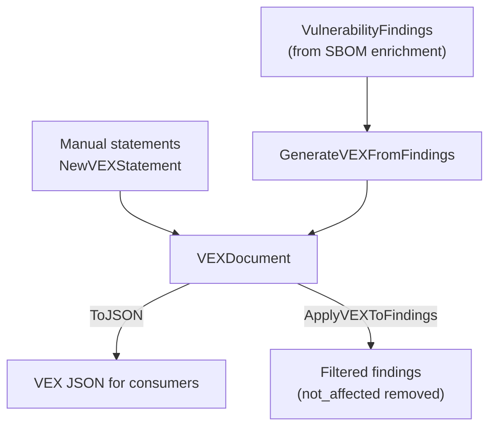

# 🛡️ VEX (Vulnerability Exploitability eXchange)

A VEX document answers one question for a *specific* product: *"Is vulnerability CVE-XXXX-YYYY actually exploitable in my build?"* It lets you ship authoritative statements that suppress noise from vulnerabilities a component is not affected by, rather than forcing consumers to re-analyze.

## Concept

A VEX document is a collection of **statements**. Each statement binds a vulnerability ID to a product ID with one of four statuses. `cpeskills` can build a VEX document by hand, or — more usefully — generate one automatically from the findings attached to an SBOM component, then later *apply* that document to filter findings.



The four `VEXStatus` values are:

| Status | Meaning |
|---|---|
| `not_affected` | The vulnerable code path is not present/reachable. |
| `affected` | The product is exploitable. |
| `fixed` | The product already contains the fix. |
| `under_investigation` | Still being analyzed. |

## Create a VEX Document Manually

```go
package main

import (
    "fmt"

    cpeskills "github.com/scagogogo/cpe-skills"
)

func main() {
    doc := cpeskills.NewVEXDocument("cyclonedx", "my-app:1.0", "My App", "security-team")
    doc.AddStatement(cpeskills.NewVEXStatement(
        "CVE-2021-44228", "my-app:1.0", cpeskills.VEXNotAffected,
    ))
    doc.AddStatement(cpeskills.NewVEXStatement(
        "CVE-2023-1234", "my-app:1.0", cpeskills.VEXAffected,
    ))

    data, err := doc.ToJSON()
    if err != nil {
        panic(err)
    }
    fmt.Printf("VEX with %d statements, %d bytes\n", doc.StatementCount(), len(data))
}
```

## Generate VEX From Findings, Then Apply It

This is the typical pipeline: enrich an SBOM, generate VEX for the findings, then re-apply the VEX to filter out `not_affected` items before reporting.

```go
// Obtain findings for a component, e.g. via sbom.FindVulnerableComponents(cves)
// which returns []*VulnerableComponent, each carrying .Vulnerabilities.
var findings []*cpeskills.VulnerabilityFinding
doc := cpeskills.GenerateVEXFromFindings(comp, findings, "my-app:1.0")

// Triage: flip statements you have investigated.
if stmt := doc.FindStatement("CVE-2021-44228"); stmt != nil {
    stmt.Status = cpeskills.VEXNotAffected // code path not reachable
}

// Re-apply: not_affected findings are removed from the result set.
actionable := cpeskills.ApplyVEXToFindings(findings, doc)
fmt.Printf("%d actionable findings remain\n", len(actionable))
```

## Best Practices

- **Keep VEX documents product-scoped** — a `not_affected` statement for `my-app:1.0` does not transfer to a different build configuration.
- **Generate, then triage** — `GenerateVEXFromFindings` seeds every finding as `under_investigation`; let your team update each one rather than defaulting to `not_affected`.
- **Re-apply VEX on every SBOM refresh** — statuses are tied to specific versions; a `fixed` statement is invalidated by a downgrade.

## Related Modules

- [SBOM](./sbom.md) — the source of findings that VEX statements annotate.
- [Risk Scoring](./risk-scoring.md) — VEX-filtered findings feed the scorer for accurate prioritization.
- [Export Formats](./export.md) — serialize findings (with VEX applied) to SARIF/CSV.
