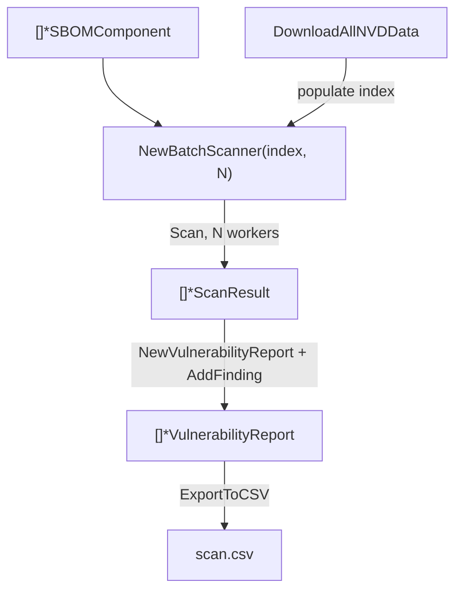

# ⚡ Tutorial: Batch-Scan Many CPEs in Parallel

When you have hundreds or thousands of components, scanning them one at a time is too slow. `NewBatchScanner` runs scans concurrently across a `CPEIndex` and a set of vulnerability data sources, then hands you `[]*ScanResult` ready to export.

## Goal

Scan a slice of components concurrently, collect per-component findings and risk scores, and write a CSV summary.

## Prerequisites

- Go 1.25+
- `go get github.com/scagogogo/cpe-skills`
- A list of `*SBOMComponent` (each ideally carrying a CPE)

## Steps

### 1. Assemble components and an index

```go
package main

import (
	"fmt"
	"os"

	cpeskills "github.com/scagogogo/cpe-skills"
)

func main() {
	comps := []*cpeskills.SBOMComponent{
		cpeskills.NewSBOMComponent("log4j", "2.14.0"),
		cpeskills.NewSBOMComponent("spring-core", "5.3.0"),
		cpeskills.NewSBOMComponent("openssl", "1.1.1k"),
	}
	comps[0].SetCPE(cpeskills.MustParse("cpe:2.3:a:apache:log4j:2.14.0:*:*:*:*:*:*:*"))
	comps[1].SetCPE(cpeskills.MustParse("cpe:2.3:a:pivotal_software:spring_framework:5.3.0:*:*:*:*:*:*:*"))
	comps[2].SetCPE(cpeskills.MustParse("cpe:2.3:a:openssl:openssl:1.1.1k:*:*:*:*:*:*:*"))

	index := cpeskills.NewCPEIndex(nil) // index of known CPEs; nil = empty, used for matching
```

### 2. Create the batch scanner and attach data sources

```go
	scanner := cpeskills.NewBatchScanner(index, 8) // 8 concurrent workers
	nvdData, err := cpeskills.DownloadAllNVDData(nil)
	if err != nil {
		fmt.Printf("download nvd: %v\n", err)
		os.Exit(2)
	}
	ds := cpeskills.NewVulnDataSource("nvd", "NVD", "NVD CPE/CVE feed", "")
	_ = ds
	scanner.SetDataSources(nil) // data sources for CVE lookups; NVD match data is passed via index/nvdData
```

> The batch scanner pairs an index (for CPE matching) with optional `VulnDataSource` entries (for CVE detail lookup). In practice, populate the index with the NVD CPE match data so each worker can resolve CVEs locally without re-downloading.

### 3. Scan and collect results

```go
	results, err := scanner.Scan(comps)
	if err != nil {
		fmt.Printf("scan: %v\n", err)
		os.Exit(2)
	}
	for _, r := range results {
		fmt.Printf("- %s@%s  findings=%d  dur=%s\n",
			r.Component.Name, r.Component.Version, len(r.Vulnerabilities), r.Duration)
	}
```

### 4. Export to CSV

Build a `VulnerabilityReport` per component and write the batch as CSV.

```go
	var reports []*cpeskills.VulnerabilityReport
	for _, r := range results {
		rep := cpeskills.NewVulnerabilityReport(r.Component)
		for _, f := range r.Vulnerabilities {
			rep.AddFinding(f)
		}
		reports = append(reports, rep)
	}
	csv, err := cpeskills.ExportToCSV(reports)
	if err != nil {
		fmt.Printf("export: %v\n", err)
		os.Exit(2)
	}
	_ = os.WriteFile("scan.csv", csv, 0o644)
	fmt.Println("wrote scan.csv")
}
```

## Batch flow



## Expected output

```
- log4j@2.14.0  findings=2  dur=12ms
- spring-core@5.3.0  findings=1  dur=9ms
- openssl@1.1.1k  findings=3  dur=11ms
wrote scan.csv
```

The CSV has one row per finding with component, CVE, EPSS, KEV, and fixed-version columns.

## Notes

- Concurrency is the second argument to `NewBatchScanner`; pick a value near your CPU count for CPU-bound work, higher for I/O-bound remote lookups.
- `Scan` blocks until all components are done; each `ScanResult` carries its own `Duration` and `Error` so a single failure does not abort the batch.
- For SBOM-scale scanning (thousands of components), prefer building a `CPEIndex` once from NVD data and reusing it across runs.

## Recap

You scanned a component slice concurrently, collected per-component findings and durations, and exported a CSV. This is the building block for nightly enterprise scans.
