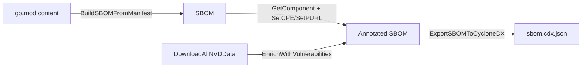

# 🏗️ Tutorial: Build an SBOM From Your Code

Generate a CycloneDX SBOM straight from a `go.mod` manifest, attach CPE/PURL identifiers to each component, enrich with vulnerabilities, and export. Drop the result into your release artifacts or feed it to a downstream scanner.

## Goal

Take the contents of a `go.mod` file and produce a CycloneDX JSON document whose components carry PURLs, CPEs, and (optionally) vulnerability findings.

## Prerequisites

- Go 1.25+
- `go get github.com/scagogogo/cpe-skills`
- A `go.mod` you can read into a string

## Steps

### 1. Build the SBOM from a manifest

`BuildSBOMFromManifest` inspects the filename extension to pick a parser (Go mod, package.json, requirements.txt, etc.), parses it, and wraps every dependency as an `SBOMComponent`.

```go
package main

import (
	"fmt"
	"os"

	cpeskills "github.com/scagogogo/cpe-skills"
)

func main() {
	content, err := os.ReadFile("go.mod")
	if err != nil {
		panic(err)
	}
	sbom, err := cpeskills.BuildSBOMFromManifest("go.mod", string(content), "my-app")
	if err != nil {
		panic(err)
	}
	fmt.Printf("SBOM has %d components\n", sbom.ComponentCount())
```

### 2. Attach a CPE and PURL to a component

Fetch a component by reference and stamp an explicit CPE + PURL onto it. This is how you bridge ecosystems that the heuristic mapper cannot infer confidently.

```go
	if comp := sbom.GetComponent("pkg:golang/github.com/apache/log4j@v2.14.0"); comp != nil {
		comp.SetCPE(cpeskills.MustParse("cpe:2.3:a:apache:log4j:2.14.0:*:*:*:*:*:*:*"))
		purl, _, _ := cpeskills.CPEToPURL(comp.CPE)
		if purl != nil {
			comp.SetPURL(purl)
		}
	}
```

### 3. Enrich with vulnerabilities

If you already downloaded NVD data (see the *Identify Vulnerabilities* tutorial), attach findings to every component in one call.

```go
	nvdData, _ := cpeskills.DownloadAllNVDData(nil)
	if err := sbom.EnrichWithVulnerabilities(nvdData); err != nil {
		fmt.Printf("enrich skipped: %v\n", err)
	}
```

### 4. Export to CycloneDX

```go
	out, err := cpeskills.ExportSBOMToCycloneDX(sbom)
	if err != nil {
		panic(err)
	}
	if err := os.WriteFile("sbom.cdx.json", out, 0o644); err != nil {
		panic(err)
	}
	fmt.Println("wrote sbom.cdx.json")
}
```

## Pipeline at a glance



## Expected output

```
SBOM has 23 components
wrote sbom.cdx.json
```

The generated `sbom.cdx.json` is a valid CycloneDX BOM you can validate with `cyclonedx validate`.

## Notes

- `BuildSBOMFromManifest` delegates to the `pkg/parsers` subpackage; the parser is chosen by filename, so pass the real filename (e.g. `"package.json"`, not a placeholder).
- `EnrichWithVulnerabilities` only fills findings for components that carry a CPE — components without a CPE are silently skipped.
- Prefer explicit `SetCPE` over the heuristic mapper for products you know; the mapper's confidence score (the second return of `CPEToPURL`) is the signal to trust it or not.

## Recap

You turned a manifest into an SBOM, annotated components with CPE/PURL, enriched with NVD findings, and exported CycloneDX. The same SBOM object also serializes to SPDX via `ExportSBOMToSPDX`.
