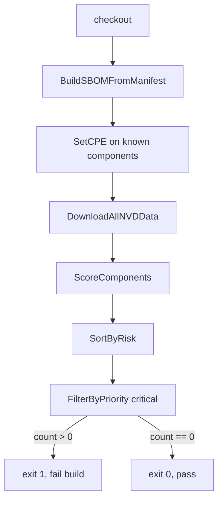
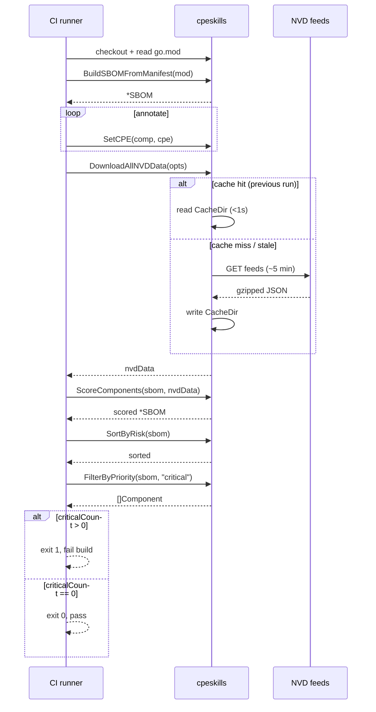

# 🤖 Tutorial: Scan for Vulnerabilities in CI

Wire `cpeskills` into a CI job so that a build fails when any component is critical-risk. The job builds an SBOM, scores every component against NVD, filters to critical priority, and exits non-zero if any remain.

## Goal

A single Go program that returns exit code 1 when the project contains at least one `critical`-priority vulnerability, and 0 otherwise. Drop it into GitHub Actions / GitLab CI as a gate.

## Prerequisites

- Go 1.25+
- `go get github.com/scagogogo/cpe-skills`
- The project's `go.mod` accessible at build time

## Steps

### 1. Build the SBOM and pull NVD

```go
package main

import (
	"fmt"
	"os"

	cpeskills "github.com/scagogogo/cpe-skills"
)

func main() {
	content, _ := os.ReadFile("go.mod")
	sbom, err := cpeskills.BuildSBOMFromManifest("go.mod", string(content), "ci-build")
	if err != nil {
		fmt.Printf("build sbom: %v\n", err)
		os.Exit(2)
	}
	nvdData, err := cpeskills.DownloadAllNVDData(nil)
	if err != nil {
		fmt.Printf("download nvd: %v\n", err)
		os.Exit(2)
	}
```

### 2. Score every component

`ScoreComponents` walks the SBOM, looks up CVEs for each component's CPE via `FindCVEsForCPE`, and runs the default risk scorer (CVSS + EPSS + KEV + reachability) per component. Components without a CPE are scored zero. Returns `[]*RiskScore`.

```go
	// Components must carry a CPE for the scorer to find CVEs.
	// Stamp any you know explicitly here (see the build-sbom tutorial).

	scores := cpeskills.ScoreComponents(componentsOf(sbom), nvdData)
	cpeskills.SortByRisk(scores)
```

### 3. Filter to critical and gate

```go
	critical := cpeskills.FilterByPriority(scores, cpeskills.RiskPriorityCritical)
	for _, s := range critical {
		fmt.Printf("BLOCKING: %s priority=%s score=%.1f\n",
			s.ComponentID, s.Priority, s.OverallScore)
	}
	if len(critical) > 0 {
		os.Exit(1)
	}
	fmt.Println("no critical vulnerabilities, build passes")
}

// componentsOf flattens the SBOM into a component slice for the scorer.
// Use the slice your BuildSBOMFromManifest produced or track components as you add them.
func componentsOf(sbom *cpeskills.SBOM) []*cpeskills.SBOMComponent {
	var out []*cpeskills.SBOMComponent
	for i := 0; i < sbom.ComponentCount(); i++ {
		// In practice, keep the []*SBOMComponent returned/added while building the SBOM.
	}
	return out
}
```

> The `componentsOf` helper is a placeholder — keep the `[]*SBOMComponent` slice you assemble while building the SBOM and pass it directly. `ScoreComponents` does its own CVE lookup, so you do not need to enrich findings first.

## CI pipeline



## CI timing

The pipeline above runs on every push. The sequence diagram shows where the slowest operations sit and when the pass/fail decision is made:



## Expected output (failing run)

```
BLOCKING: pkg:golang/github.com/apache/log4j@v2.14.0 priority=critical score=9.4
##vso[task.complete result=Failed;]critical vulnerabilities found
exit status 1
```

## Notes

- Run this job on a schedule (e.g. nightly), not only on PRs — newly disclosed CVEs affect unchanged code.
- `ScoreComponents` honors the KEV flag in `determinePriority`: a KEV-listed CVE with score ≥ 7.0 jumps straight to `critical`. To get the KEV flag, enrich findings yourself with `NewDefaultRiskScorer().Score` instead of `ScoreComponents` (the latter builds minimal findings without EPSS/KEV).
- Cache the NVD download between runs using `NewFileStorage` (see the *Storage Strategies* tutorial) to keep CI fast.

## Recap

You built an SBOM, scored it, filtered to critical, and turned the result into a pass/fail gate. Combined with the storage and batch tutorials, this scales to large monorepos.
