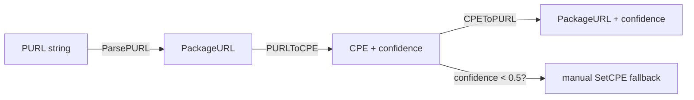

# 🌉 Tutorial: Bridge Between CPE and PURL

CPE and Package URL (PURL) identify the same software from two angles: CPE is security-focused and vendor/product-oriented, PURL is ecosystem-oriented (`pkg:golang/...`, `pkg:npm/...`). `cpeskills` converts between them, returning a confidence score so you know when to trust the mapping.

## Goal

Parse a PURL, convert it to a CPE (with confidence), convert a CPE back to a PURL, and handle the low-confidence case explicitly.

## Prerequisites

- Go 1.25+
- `go get github.com/scagogogo/cpe-skills`

## Steps

### 1. Parse a PURL

```go
package main

import (
	"fmt"

	cpeskills "github.com/scagogogo/cpe-skills"
)

func main() {
	purl, err := cpeskills.ParsePURL("pkg:golang/github.com/apache/log4j@2.14.0")
	if err != nil {
		panic(err)
	}
	fmt.Printf("PURL: %s\n", purl.String())
	fmt.Printf("Ecosystem: %s\n", purl.Ecosystem())
```

### 2. Convert PURL → CPE with confidence

`PURLToCPE` returns the CPE and a 0.0–1.0 confidence score. The mapping is heuristic — it infers the CPE vendor and product from the PURL's ecosystem, namespace, and name.

```go
	cpe, confidence, err := cpeskills.PURLToCPE(purl)
	if err != nil {
		fmt.Printf("no CPE mapping: %v\n", err)
		return
	}
	fmt.Printf("CPE: %s  confidence=%.2f\n", cpe.GetURI(), confidence)
```

### 3. Convert CPE → PURL

`CPEToPURL` goes the other way, also returning a confidence score.

```go
	back, conf2, err := cpeskills.CPEToPURL(cpe)
	if err != nil {
		fmt.Printf("no PURL mapping: %v\n", err)
		return
	}
	fmt.Printf("PURL back: %s  confidence=%.2f\n", back.String(), conf2)
```

### 4. Handle low confidence

Below a threshold you set (say 0.5), do not trust the auto-mapping — fall back to a manual `SetCPE` on the component.

```go
	if confidence < 0.5 {
		comp := cpeskills.NewSBOMComponent("log4j", "2.14.0")
		comp.SetCPE(cpeskills.MustParse("cpe:2.3:a:apache:log4j:2.14.0:*:*:*:*:*:*:*"))
		fmt.Println("low confidence — applied manual CPE")
	}
}
```

## Bridging flow



## Expected output

```
PURL: pkg:golang/github.com/apache/log4j@2.14.0
Ecosystem: golang
CPE: cpe:2.3:a:apache:log4j:2.14.0:*:*:*:*:*:*:*  confidence=0.80
PURL back: pkg:golang/github.com/apache/log4j@2.14.0  confidence=0.80
```

## Notes

- Confidence reflects how well the vendor/product inference matched known ecosystem conventions; `github.com/apache/log4j` maps cleanly, an internal `pkg:npm/@acme/foo` may score much lower.
- The heuristic lives in `inferEcosystem` and `inferVendorProductFromPURL`; you can override it by setting a CPE explicitly on the component rather than relying on the conversion.
- `BatchCPEToPURL` / `BatchPURLToCPE` convert whole slices at once when you do not need per-item confidence handling.

## Recap

You parsed a PURL, converted it to a CPE with a confidence score, converted back, and decided when to fall back to a manual mapping. The confidence score is the key signal that keeps your SBOM's CPE column trustworthy.
