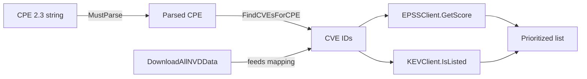
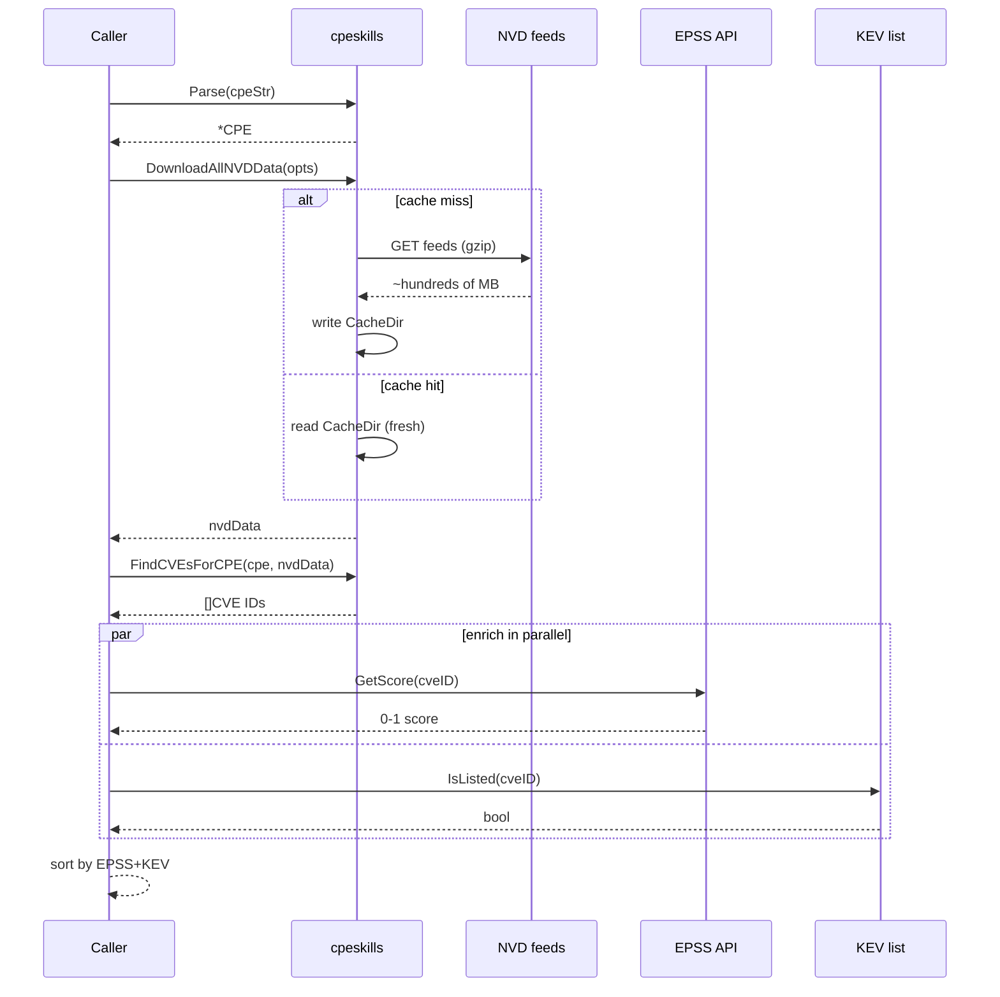

# 🔍 Tutorial: Identify Known Vulnerabilities for a Product

Walk through the full pipeline: parse a CPE → download NVD data → find CVEs → enrich with EPSS and KEV. By the end you will have a prioritized vulnerability list for any product you can name as a CPE.

## Goal

Given a product CPE (for example `log4j`), produce a list of CVEs that affect it, each annotated with an EPSS exploit-likelihood score and a CISA KEV "actively exploited" flag.

## Prerequisites

- Go 1.25+
- Module initialized: `go mod init example.com/vulnscan`
- Dependency added: `go get github.com/scagogogo/cpe-skills`
- Outbound network access (the NVD, EPSS, and KEV feeds are fetched live)

## Steps

### 1. Parse the CPE

Start from a CPE 2.3 string. `MustParse` panics on a malformed string — fine for a hardcoded value.

```go
package main

import (
	"fmt"
	"log"

	cpeskills "github.com/scagogogo/cpe-skills"
)

func main() {
	cpe := cpeskills.MustParse("cpe:2.3:a:apache:log4j:2.14.0:*:*:*:*:*:*:*")
	fmt.Println("Parsed:", cpe.GetURI())
```

### 2. Download NVD CPE/CVE mapping data

`DownloadAllNVDData` pulls the official CPE dictionary plus the bidirectional CPE↔CVE match data. Pass `nil` for default feed options.

```go
	data, err := cpeskills.DownloadAllNVDData(nil)
	if err != nil {
		log.Fatalf("download NVD: %v", err)
	}
```

### 3. Find CVEs affecting this CPE

```go
	cveIDs := data.FindCVEsForCPE(cpe)
	fmt.Printf("Found %d CVE(s)\n", len(cveIDs))
```

### 4. Enrich each CVE with EPSS and KEV

EPSS gives a 0.0–1.0 exploit-likelihood score; KEV tells you whether CISA has confirmed active exploitation.

```go
	epss := cpeskills.NewEPSSClient()
	kev := cpeskills.NewKEVClient()
	for _, id := range cveIDs {
		entry, _ := epss.GetScore(id)
		listed, _ := kev.IsListed(id)
		score := 0.0
		if entry != nil {
			score = entry.GetRiskLevel() // "high" | "critical" | ...
		}
		fmt.Printf("- %s  EPSS=%s  KEV=%v\n", id, score, listed)
	}
}
```

## Pipeline at a glance



## Request lifecycle

The pipeline above looks linear, but the NVD fetch and the enrichment fan out at specific moments. The sequence diagram shows where caching short-circuits the slow path:



## Expected output

```
Parsed: cpe:2.3:a:apache:log4j:2.14.0:*:*:*:*:*:*:*
Found 2 CVE(s)
- CVE-2021-44228  EPSS=critical  KEV=true
- CVE-2021-45046  EPSS=high  KEV=true
```

## Notes

- The NVD download is several hundred MB on first run; subsequent runs are cached by the feed options' cache settings.
- `GetScore` and `IsListed` both cache internally, so looping over many CVEs is cheap after the first call.
- A CVE flagged `KEV=true` should be treated as a defensible-patch emergency regardless of CVSS.

## Recap

You parsed a CPE, downloaded the NVD mapping, enumerated CVEs, and ranked them with EPSS + KEV. From here, feed the CVE IDs into a `VulnerabilityReport` (see the next tutorial) or sort them with the risk scorer.
