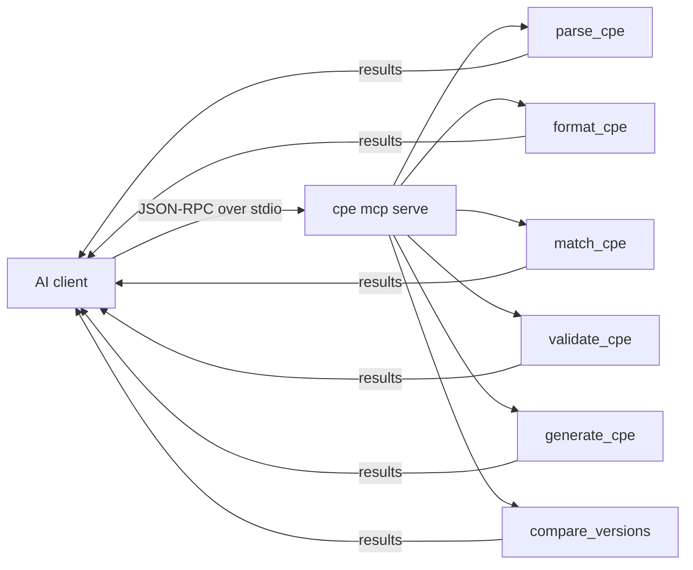

# 🧠 Tutorial: Connect cpe-skills to an AI Client via MCP

The `cpe mcp serve` subcommand runs cpe-skills as a Model Context Protocol (MCP) server over stdio. Any MCP-aware client — Claude Desktop, Continue, custom agents — can then call CPE parsing, matching, and validation as tools without you writing glue code.

## Goal

Configure Claude Desktop so it can parse a CPE, validate it, and compare two versions by calling the cpe-skills MCP server.

## Prerequisites

- The `cpe` binary on your `PATH` (build it: `go install ./cmd/cpe` from the repo root)
- Claude Desktop installed, or any MCP client that reads an `mcpServers` config

## Steps

### 1. Verify the server starts

```bash
cpe mcp serve
```

It reads from stdin and writes JSON-RPC to stdout. Type Ctrl-C to stop; there is no interactive output until a client sends a request.

### 2. Register the server in Claude Desktop

Open Claude Desktop's config file:

- macOS: `~/Library/Application Support/Claude/claude_desktop_config.json`
- Windows: `%APPDATA%\Claude\claude_desktop_config.json`

Add the `cpe-skills` entry:

```json
{
  "mcpServers": {
    "cpe-skills": {
      "command": "cpe",
      "args": ["mcp", "serve"]
    }
  }
}
```

Restart Claude Desktop. The tools appear under the cpe-skills server.

### 3. Use the tools in a conversation

Ask Claude something like:

> "Parse `cpe:2.3:a:apache:log4j:2.14.0:*:*:*:*:*:*:*`, then tell me whether version 2.14.1 is newer than 2.14.0."

Claude will call `parse_cpe` to decompose the string, then `compare_versions` to order the two. You see the tool calls inline.

### 4. Confirm the tools are registered

After restart, open the connectors panel in Claude Desktop and expand `cpe-skills`. You should see all six tools listed. If the panel shows a connection error, the `cpe` binary was not found — fix the `command` path and restart again.

A quick smoke test: ask Claude "validate `cpe:2.3:a:apache:log4j:2.14.0:*:*:*:*:*:*:*`". It should call `validate_cpe` and report the CPE is well-formed.

## The six exposed tools



| Tool | Input | Returns |
|------|-------|---------|
| `parse_cpe` | a CPE 2.2/2.3 string | part, vendor, product, version, update, … |
| `format_cpe` | components + target format (`2.2`/`2.3`/`wfn`) | formatted CPE string |
| `match_cpe` | two CPE strings | boolean match (NISTIR 7696) |
| `validate_cpe` | a CPE string | validity + error message |
| `generate_cpe` | part, vendor, product, version | a CPE 2.3 URI |
| `compare_versions` | two version strings | ordering (`-1`/`0`/`1`) |

## Expected behavior

After restart, the cpe-skills server is listed in Claude Desktop's connectors panel. Asking it to "generate a CPE for Apache log4j 2.14.0" yields:

```
generate_cpe(part="a", vendor="apache", product="log4j", version="2.14.0")
  → cpe:2.3:a:apache:log4j:2.14.0:*:*:*:*:*:*:*
```

## Notes

- If `cpe` is not on your PATH, use the absolute path in `command` (e.g. `/home/me/go/bin/cpe`).
- The server is stateless across tool calls — each call is independent, so you can run many in parallel.
- `cpe mcp serve` is implemented in `cmd/cpe/mcp.go` using the official `modelcontextprotocol/go-sdk`.

## Recap

You exposed cpe-skills as six MCP tools and pointed Claude Desktop at them. The AI can now parse, generate, validate, match, and compare CPEs without you shipping a wrapper.
