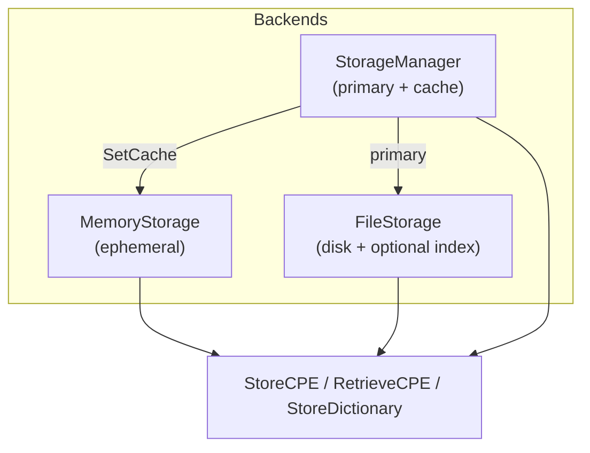

# 💾 Tutorial: Choose and Configure Storage

`cpeskills` decouples persistence behind a `Storage` interface with three ready-made implementations: in-memory (fast, ephemeral), file (persistent on disk), and `StorageManager` (a primary store with an optional cache layer). This tutorial shows when to use each and how to manage a CPE dictionary through them.

## Goal

Store and retrieve CPEs and a CPE dictionary using each storage backend, and layer a cache in front of a persistent store.

## Prerequisites

- Go 1.25+
- `go get github.com/scagogogo/cpe-skills`

## Steps

### 1. In-memory storage (tests and scratch work)

`MemoryStorage` lives only for the process lifetime. Use it in unit tests and ad-hoc scripts.

```go
package main

import (
	"fmt"
	"log"

	cpeskills "github.com/scagogogo/cpe-skills"
)

func main() {
	mem := cpeskills.NewMemoryStorage()
	if err := mem.Initialize(); err != nil {
		log.Fatal(err)
	}
	defer mem.Close()

	cpe := cpeskills.MustParse("cpe:2.3:a:apache:log4j:2.14.0:*:*:*:*:*:*:*")
	_ = mem.StoreCPE(cpe)
	got, _ := mem.RetrieveCPE(cpe.GetURI())
	fmt.Println("memory:", got.GetURI())
```

### 2. File storage (persistence)

`FileStorage` writes CPEs, CVEs, and dictionaries to a base directory. Pass `useCache=true` to keep an in-memory index of what is on disk for faster lookups.

```go
	file, err := cpeskills.NewFileStorage("./.cpe-store", true)
	if err != nil {
		log.Fatal(err)
	}
	if err := file.Initialize(); err != nil {
		log.Fatal(err)
	}
	defer file.Close()
	_ = file.StoreCPE(cpe)
```

### 3. StorageManager with a cache layer

`StorageManager` wraps a primary store and an optional cache. Reads check the cache first, then fall through to the primary; writes go to the primary (and invalidate the cache entry). This is the right shape when your primary is slow (remote DB) but you want a fast local cache.

```go
	primary := cpeskills.NewMemoryStorage()   // stand-in for a remote/DB store
	_ = primary.Initialize()

	mgr := cpeskills.NewStorageManager(primary)
	mgr.SetCache(mem) // reuse the in-memory store as a read-through cache
	_ = mgr.StoreCPE(cpe)
	got, _ = mgr.GetCPE(cpe.GetURI())
	fmt.Println("manager:", got.GetURI())
```

### 4. Manage a CPE dictionary

A `CPEDictionary` (official list of all CPE entries) can be stored and retrieved from any storage that supports it.

```go
	// Parse a dictionary from a reader (e.g. an NVD feed file), then persist it.
	// dict, _ := cpeskills.ParseDictionary(fileReader)
	// _ = mem.StoreDictionary(dict)
	// later:
	// dict, _ = mem.RetrieveDictionary()
	fmt.Println("storage demo done")
}
```

## Storage backends



## Expected output

```
memory: cpe:2.3:a:apache:log4j:2.14.0:*:*:*:*:*:*:*
manager: cpe:2.3:a:apache:log4j:2.14.0:*:*:*:*:*:*:*
storage demo done
```

## Notes

- `MemoryStorage` is the only backend that needs no `Initialize`/`Close` of external resources, but calling them is harmless and keeps code portable across backends.
- `FileStorage`'s `useCache` flag trades memory for speed — turn it on for read-heavy workloads, off for very large stores that do not fit in RAM.
- `StorageManager.InvalidateCache(id)` lets you evict a single entry after a write; `ClearCache()` drops everything.

## Recap

You used in-memory storage for ephemeral work, file storage for persistence, and `StorageManager` to layer a cache over a primary store, then stored and retrieved a CPE dictionary through the same interface. Pick the backend by lifetime and speed needs; the API is identical.
