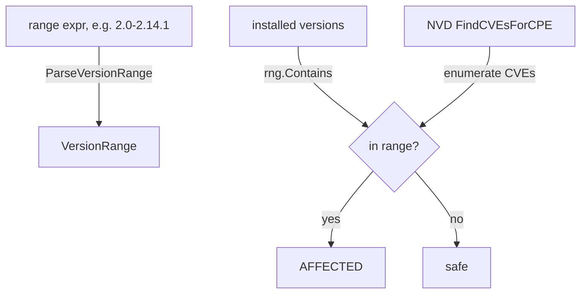

# 🎚️ Tutorial: Filter Affected Components by Version Range

A CVE rarely affects every version of a product. `ParseVersionRange` turns a range expression like `2.0-2.14.1` or `1.2+` into a `VersionRange` you can test against with `Contains`, so you can decide which of your components are actually exposed.

## Goal

Given a CVE's affected version range and a list of installed components, print only the components whose version falls inside the range.

## Prerequisites

- Go 1.25+
- `go get github.com/scagogogo/cpe-skills`

## Steps

### 1. Parse a range expression

`ParseVersionRange` accepts three forms: a single exact version (`1.2.3`), an inclusive range (`1.2-2.0`), or an open floor (`1.2+`).

```go
package main

import (
	"fmt"

	cpeskills "github.com/scagogogo/cpe-skills"
)

func main() {
	rng, err := cpeskills.ParseVersionRange("2.0.0-2.14.1")
	if err != nil {
		panic(err)
	}
	fmt.Printf("min=%s max=%s\n", rng.MinVersion, rng.MaxVersion)
```

### 2. Test installed versions against the range

```go
	installed := []string{"1.7.0", "2.0.0", "2.10.0", "2.14.1", "2.15.0"}
	for _, v := range installed {
		fmt.Printf("%s affected=%v\n", v, rng.Contains(v))
	}
```

### 3. Combine with NVD data to find affected components

Pull NVD match data, list the CVEs for a CPE, then for each CVE compare your installed version against the range the CVE reports. The example below uses `FindCVEsForCPE` to enumerate CVEs and filters by a known range.

```go
	cpe := cpeskills.MustParse("cpe:2.3:a:apache:log4j:2.14.0:*:*:*:*:*:*:*")
	data, err := cpeskills.DownloadAllNVDData(nil)
	if err != nil {
		fmt.Printf("download nvd: %v\n", err)
		return
	}
	cves := data.FindCVEsForCPE(cpe)
	myVersion := "2.14.0"
	for _, id := range cves {
		// Use the CVE's published affected range (here we re-use the parsed range
		// as a stand-in; in production read the range from the CVE's CPE match data).
		if rng.Contains(myVersion) {
			fmt.Printf("AFFECTED: %s affects my version %s\n", id, myVersion)
		}
	}
}
```

## Decision flow



## Expected output

```
min=2.0.0 max=2.14.1
1.7.0 affected=false
2.0.0 affected=true
2.10.0 affected=true
2.14.1 affected=true
2.15.0 affected=false
AFFECTED: CVE-2021-44228 affects my version 2.14.0
```

## Notes

- The open-floor form `1.2+` sets `MinVersion="1.2"` and `MaxVersion=""`; `Contains` then only checks the floor.
- `Contains` delegates to `IsVersionInRange`, which uses `CompareVersions` — it handles dotted numeric versions but not arbitrary semver pre-release suffixes the same way; normalize before parsing if needed.
- For real CVE-to-range mapping, read the affected version range from the NVD CPE match data (`CPEMatchData`) rather than hard-coding it.

## Recap

You parsed a version range, tested versions against it, and combined it with NVD's CVE list to flag only the versions you actually run. This keeps your findings honest instead of over-reporting.
