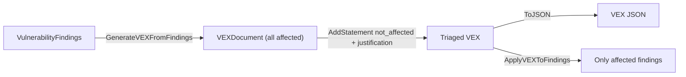

# ✅ Tutorial: Generate VEX Statements for Non-Affected Components

A Vulnerability Exploitability eXchange (VEX) document lets you assert that a CVE does *not* apply to your product — because the vulnerable code isn't present, isn't on the execution path, or is mitigated. `cpeskills` generates VEX from findings and applies it back to filter out false positives.

## Goal

Take a component with vulnerability findings, auto-generate a VEX document, manually mark one finding as `not_affected` with a justification, and then filter the findings so only true positives remain.

## Prerequisites

- Go 1.25+
- `go get github.com/scagogogo/cpe-skills`
- A `*SBOMComponent` with at least one `VulnerabilityFinding` (see earlier tutorials)

## Steps

### 1. Auto-generate VEX from findings

`GenerateVEXFromFindings` creates a VEX document with one statement per finding, defaulting each to `affected`. This is your starting point — you then flip the ones you have triaged.

```go
package main

import (
	"fmt"

	cpeskills "github.com/scagogogo/cpe-skills"
)

func main() {
	comp := cpeskills.NewSBOMComponent("log4j", "2.14.0")
	comp.SetCPE(cpeskills.MustParse("cpe:2.3:a:apache:log4j:2.14.0:*:*:*:*:*:*:*"))
	findings := []*cpeskills.VulnerabilityFinding{
		{CVE: &cpeskills.CVEReference{CVEID: "CVE-2021-44228"}},
		{CVE: &cpeskills.CVEReference{CVEID: "CVE-2021-45046"}},
	}

	doc := cpeskills.GenerateVEXFromFindings(comp, findings, "product-42")
	fmt.Printf("VEX has %d statements\n", doc.StatementCount())
```

### 2. Manually mark a finding as not_affected

Suppose your audit determined `CVE-2021-45046` does not apply because the JNDI lookup code path was removed in your build. Add an explicit statement overriding the auto-generated one.

```go
	stmt := cpeskills.NewVEXStatement("CVE-2021-45046", "product-42", cpeskills.VEXNotAffected)
	stmt.Justification = cpeskills.VEXVulnerableCodeNotPresent
	stmt.ImpactStatement = "JNDI lookup removed in our build; code path unreachable"
	doc.AddStatement(stmt)
```

### 3. Export the VEX document

```go
	out, err := doc.ToJSON()
	if err != nil {
		panic(err)
	}
	fmt.Printf("VEX JSON: %d bytes\n", len(out))
```

### 4. Apply VEX back to filter findings

`ApplyVEXToFindings` returns only the findings whose VEX status is `affected` — dropping the ones you marked `not_affected`.

```go
	remaining := cpeskills.ApplyVEXToFindings(findings, doc)
	fmt.Printf("after VEX: %d findings remain\n", len(remaining))
	for _, f := range remaining {
		fmt.Printf("- %s\n", f.CVE.CVEID)
	}
}
```

## VEX workflow



## Expected output

```
VEX has 2 statements
VEX JSON: 412 bytes
after VEX: 1 findings remain
- CVE-2021-44228
```

## Notes

- `GenerateVEXFromFindings` sets every statement to `affected` initially; the value is in the manual overrides you add afterward.
- A `not_affected` statement should always carry a `Justification` (one of the `VEX...` constants) — auditors and downstream tools expect a reason.
- Re-applying VEX is idempotent: running `ApplyVEXToFindings` twice yields the same filtered set.

## Recap

You generated a VEX document from findings, marked a CVE as not exploitable with a justification, exported the JSON, and filtered your findings down to the true positives. Ship the VEX alongside your SBOM so consumers can suppress the same CVEs.
