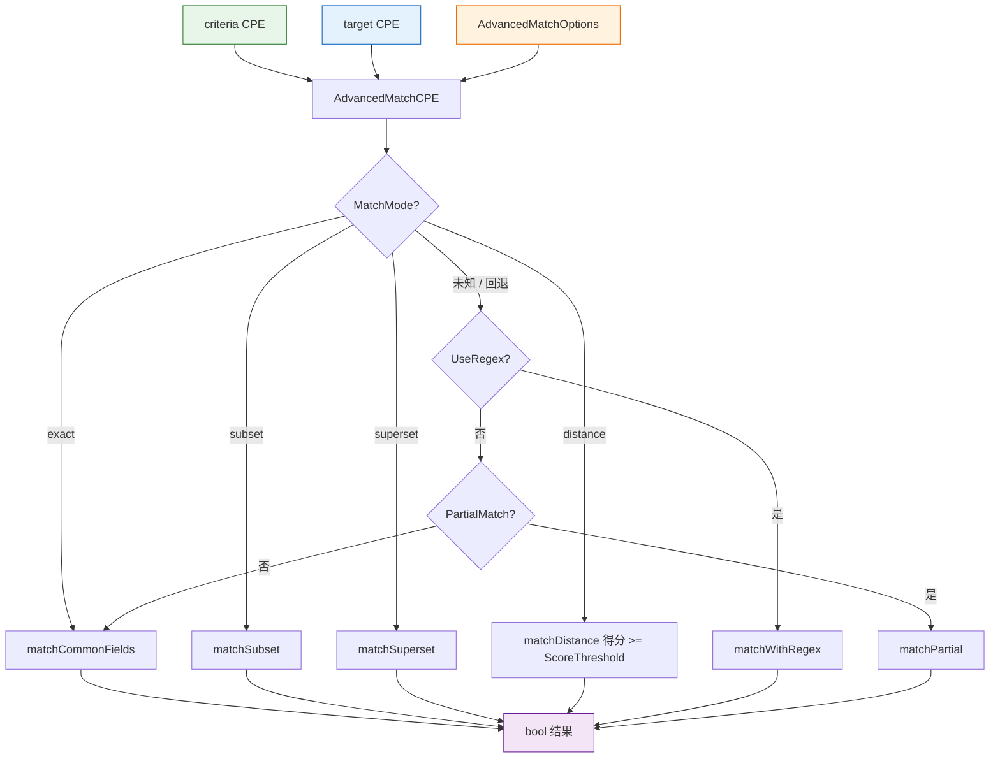

# 🎛️ 高级匹配

`advanced_matching` 模块提供了基于选项的细粒度 CPE 匹配，超越严格的 NISTIR 7696 规则。它支持精确、子集、超集与距离（加权相似度）四种匹配模式，支持正则与模糊字段匹配、可配置的大小写敏感性，以及通过 `versions` 包进行的版本比较（大于/小于/范围）。

## 类型：AdvancedMatchOptions

```go
type AdvancedMatchOptions struct {
    UseRegex           bool                       // 将字符串字段作为正则表达式匹配
    IgnoreCase         bool                       // 忽略大小写
    UseFuzzyMatch      bool                       // 基于子串的模糊匹配
    MatchCommonOnly    bool                       // 仅匹配 part、vendor、product、version
    PartialMatch       bool                       // 仅匹配 criteria 中非空的字段
    MatchMode          string                     // "exact"、"subset"、"superset"、"distance"
    VersionCompareMode string                     // "exact"、"greater"、"greaterOrEqual"、"less"、"lessOrEqual"、"range"
    VersionLower       string                     // 范围下界（含），VersionCompareMode 为 "range" 时生效
    VersionUpper       string                     // 范围上界（含），VersionCompareMode 为 "range" 时生效
    FieldOptions       map[string]FieldMatchOption // 各字段的权重、必匹配标记、匹配方法
    ScoreThreshold     float64                    // distance 模式的相似度阈值（0.0-1.0）
}
```

`NewAdvancedMatchOptions` 返回一个带有合理默认值的实例：`MatchMode = "exact"`、`VersionCompareMode = "exact"`、`ScoreThreshold = 0.7`。

## 类型：FieldMatchOption

```go
type FieldMatchOption struct {
    Weight      float64 // 字段权重，0.0-1.0
    Required    bool    // 该字段是否必须匹配
    MatchMethod string  // 匹配方法名称
}
```

`FieldMatchOption` 配置单个字段在 `distance` 模式下的匹配参与方式。条目以字段名（`part`、`vendor`、`product`、`version`、`update`、`edition`、`language`、`softwareEdition`、`targetSoftware`、`targetHardware`、`other`）为键存放在 `AdvancedMatchOptions.FieldOptions` 中。

## 🆕 NewAdvancedMatchOptions

```go
func NewAdvancedMatchOptions() *AdvancedMatchOptions
```

返回一个填充了默认值的新 `AdvancedMatchOptions` 指针。

| 返回值 | 类型 | 说明 |
| --- | --- | --- |
| 第 1 个 | `*AdvancedMatchOptions` | 默认选项实例 |

```go
opts := cpeskills.NewAdvancedMatchOptions()
opts.MatchMode = "distance"
opts.ScoreThreshold = 0.8
```

## 🎯 AdvancedMatchCPE

```go
func AdvancedMatchCPE(criteria *CPE, target *CPE, options *AdvancedMatchOptions) bool
```

依据 `options` 对 `criteria` 与 `target` 执行高级匹配。任一 CPE 为 `nil` 时返回 `false`。`options` 为 `nil` 时使用默认选项。

分派依据 `options.MatchMode`：

- `"exact"` — 按配置的字段匹配规则匹配公共字段（part、vendor、product、version）；当 `VersionCompareMode` 不为 `"exact"` 时版本走版本比较逻辑。
- `"subset"` — 检查 `target` 是否是 `criteria` 的子集（criteria 字段作为约束，`*`/空 criteria 字段跳过）。
- `"superset"` — 检查 `target` 是否是 `criteria` 的超集。
- `"distance"` — 跨所有（或仅公共）字段计算加权相似度得分；当 `score >= options.ScoreThreshold` 时匹配成功。在 `FieldOptions` 中标记为 `Required` 的字段若未匹配则直接判定失败。

对于未知的 `MatchMode`，函数依次回退到 `UseRegex`、`PartialMatch`，最终回退到公共字段精确匹配。

| 参数 | 类型 | 说明 |
| --- | --- | --- |
| `criteria` | `*CPE` | 匹配条件（模式） |
| `target` | `*CPE` | 被匹配的目标 CPE |
| `options` | `*AdvancedMatchOptions` | 匹配选项，`nil` 表示默认 |

| 返回值 | 类型 | 说明 |
| --- | --- | --- |
| 第 1 个 | `bool` | `target` 在给定选项下匹配 `criteria` 返回 `true`，否则 `false` |

```go
criteria := cpeskills.MustParse("cpe:2.3:a:microsoft:windows:10:*:*:*:*:*:*:*")
target := cpeskills.MustParse("cpe:2.3:a:microsoft:windows:10:*:*:*:*:*:*:*")

// 忽略大小写的精确匹配
opts := cpeskills.NewAdvancedMatchOptions()
opts.IgnoreCase = true
fmt.Println(cpeskills.AdvancedMatchCPE(criteria, target, opts)) // true

// 版本范围匹配
rangeOpts := cpeskills.NewAdvancedMatchOptions()
rangeOpts.VersionCompareMode = "range"
rangeOpts.VersionLower = "9.0"
rangeOpts.VersionUpper = "11.0"
fmt.Println(cpeskills.AdvancedMatchCPE(criteria, target, rangeOpts)) // true

// 自定义必匹配字段的距离匹配
distOpts := cpeskills.NewAdvancedMatchOptions()
distOpts.MatchMode = "distance"
distOpts.ScoreThreshold = 0.6
distOpts.FieldOptions = map[string]cpeskills.FieldMatchOption{
    "vendor": {Weight: 1.0, Required: true},
}
fmt.Println(cpeskills.AdvancedMatchCPE(criteria, target, distOpts)) // true
```

## 📐 高级匹配流程图


