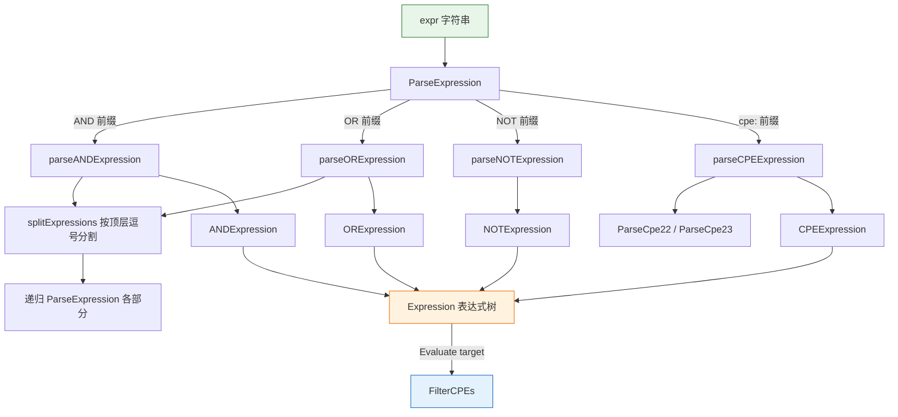

# 🧩 适用性表达式

`applicability` 模块实现了 CPE 适用性语言：一种小型表达式语言，将 CPE 匹配检查与逻辑 AND、OR、NOT 运算符组合在一起。`Expression` 可从字符串解析得到，对目标 CPE 求值，或用于过滤 CPE 列表。

## 类型：ExpressionType

```go
type ExpressionType int
```

枚举支持的表达式种类。

```go
const (
    ExpressionTypeCPE ExpressionType = iota // 0，单个 CPE 匹配
    ExpressionTypeAND                       // 1，子表达式的逻辑 AND
    ExpressionTypeOR                        // 2，子表达式的逻辑 OR
    ExpressionTypeNOT                       // 3，子表达式的逻辑 NOT
)
```

## 类型：Expression

```go
type Expression interface {
    Type() ExpressionType
    Evaluate(target *CPE) bool
    String() string
}
```

`Expression` 是所有表达式类型共同实现的接口。`Type` 返回表达式种类，`Evaluate` 测试表达式是否匹配 `target`，`String` 返回便于调试的文本形式。

## 类型：CPEExpression

```go
type CPEExpression struct {
    CPE *CPE
}
```

```go
func (e *CPEExpression) Type() ExpressionType
func (e *CPEExpression) Evaluate(target *CPE) bool
func (e *CPEExpression) String() string
```

叶子表达式，当内嵌 CPE 匹配目标时匹配成立（委托给 `CPE.Match`）。`Type()` 返回 `ExpressionTypeCPE`；`String()` 返回内嵌 CPE 的 2.3 URI。

| 参数 | 类型 | 说明 |
| --- | --- | --- |
| `target` | `*CPE` | 待测试的目标 CPE（`Evaluate`） |

| 返回值 (Type) | 类型 | 说明 |
| --- | --- | --- |
| 第 1 个 | `ExpressionType` | 恒为 `ExpressionTypeCPE` |

| 返回值 (Evaluate) | 类型 | 说明 |
| --- | --- | --- |
| 第 1 个 | `bool` | 内嵌 CPE 匹配 `target` 时返回 `true` |

| 返回值 (String) | 类型 | 说明 |
| --- | --- | --- |
| 第 1 个 | `string` | 内嵌 CPE 的 2.3 URI |

## 类型：ANDExpression

```go
type ANDExpression struct {
    Expressions []Expression
}
```

```go
func (e *ANDExpression) Type() ExpressionType
func (e *ANDExpression) Evaluate(target *CPE) bool
func (e *ANDExpression) String() string
```

对其子表达式求逻辑 AND。`Type()` 返回 `ExpressionTypeAND`。`Evaluate` 仅当所有子表达式都求值为 `true` 时返回 `true`。`String()` 返回 `AND(e1, e2, ...)`。

| 参数 | 类型 | 说明 |
| --- | --- | --- |
| `target` | `*CPE` | 待测试的目标 CPE（`Evaluate`） |

| 返回值 (Type) | 类型 | 说明 |
| --- | --- | --- |
| 第 1 个 | `ExpressionType` | 恒为 `ExpressionTypeAND` |

| 返回值 (Evaluate) | 类型 | 说明 |
| --- | --- | --- |
| 第 1 个 | `bool` | 仅当所有子表达式都匹配时为 `true` |

| 返回值 (String) | 类型 | 说明 |
| --- | --- | --- |
| 第 1 个 | `string` | `AND(e1, e2, ...)` |

## 类型：ORExpression

```go
type ORExpression struct {
    Expressions []Expression
}
```

```go
func (e *ORExpression) Type() ExpressionType
func (e *ORExpression) Evaluate(target *CPE) bool
func (e *ORExpression) String() string
```

对其子表达式求逻辑 OR。`Type()` 返回 `ExpressionTypeOR`。`Evaluate` 当至少一个子表达式求值为 `true` 时返回 `true`。`String()` 返回 `OR(e1, e2, ...)`。

| 参数 | 类型 | 说明 |
| --- | --- | --- |
| `target` | `*CPE` | 待测试的目标 CPE（`Evaluate`） |

| 返回值 (Type) | 类型 | 说明 |
| --- | --- | --- |
| 第 1 个 | `ExpressionType` | 恒为 `ExpressionTypeOR` |

| 返回值 (Evaluate) | 类型 | 说明 |
| --- | --- | --- |
| 第 1 个 | `bool` | 任一子表达式匹配即为 `true` |

| 返回值 (String) | 类型 | 说明 |
| --- | --- | --- |
| 第 1 个 | `string` | `OR(e1, e2, ...)` |

## 类型：NOTExpression

```go
type NOTExpression struct {
    Expression Expression
}
```

```go
func (e *NOTExpression) Type() ExpressionType
func (e *NOTExpression) Evaluate(target *CPE) bool
func (e *NOTExpression) String() string
```

对单个子表达式求逻辑 NOT。`Type()` 返回 `ExpressionTypeNOT`。`Evaluate` 返回被包裹表达式结果的否定。`String()` 返回 `NOT(e)`。

| 参数 | 类型 | 说明 |
| --- | --- | --- |
| `target` | `*CPE` | 待测试的目标 CPE（`Evaluate`） |

| 返回值 (Type) | 类型 | 说明 |
| --- | --- | --- |
| 第 1 个 | `ExpressionType` | 恒为 `ExpressionTypeNOT` |

| 返回值 (Evaluate) | 类型 | 说明 |
| --- | --- | --- |
| 第 1 个 | `bool` | 被包裹表达式不匹配时为 `true` |

| 返回值 (String) | 类型 | 说明 |
| --- | --- | --- |
| 第 1 个 | `string` | `NOT(e)` |

## 🔤 ParseExpression

```go
func ParseExpression(expr string) (Expression, error)
```

将 CPE 适用性语言表达式字符串解析为 `Expression` 树。支持的形式：

- 单个 CPE：`"cpe:2.3:a:microsoft:windows:10:*:*:*:*:*:*:*"`（2.3 形式）或 `"cpe:/a:microsoft:windows:10"`（2.2 形式）。
- `AND(e1, e2, ...)` — 所有子表达式都需匹配。
- `OR(e1, e2, ...)` — 至少一个子表达式需匹配。
- `NOT(e)` — 对包裹的表达式取反。

子表达式可任意嵌套。`AND`/`OR` 内的顶层逗号用于分隔子表达式；嵌套括号内的逗号被保留。括号必须配平。

| 参数 | 类型 | 说明 |
| --- | --- | --- |
| `expr` | `string` | 待解析的表达式字符串 |

| 返回值 | 类型 | 说明 |
| --- | --- | --- |
| 第 1 个 | `Expression` | 解析得到的表达式树，出错时为 `nil` |
| 第 2 个 | `error` | 格式无效或子表达式解析失败时非 `nil` |

```go
// 单个 CPE
cpeExpr, err := cpeskills.ParseExpression("cpe:2.3:a:microsoft:windows:10:*:*:*:*:*:*:*")
if err != nil {
    log.Fatal(err)
}

// 两个 CPE 的 OR
orExpr, err := cpeskills.ParseExpression("OR(cpe:2.3:a:microsoft:windows:10:*:*:*:*:*:*:*, cpe:2.3:a:microsoft:windows:11:*:*:*:*:*:*:*)")
if err != nil {
    log.Fatal(err)
}

// 两个通配 CPE 的 AND
andExpr, err := cpeskills.ParseExpression("AND(cpe:2.3:a:microsoft:*:*:*:*:*:*:*:*:*, cpe:2.3:a:*:windows:*:*:*:*:*:*:*:*)")
if err != nil {
    log.Fatal(err)
}

// 单个 CPE 的 NOT
notExpr, err := cpeskills.ParseExpression("NOT(cpe:2.3:a:microsoft:windows:10:*:*:*:*:*:*:*)")
if err != nil {
    log.Fatal(err)
}

target, _ := cpeskills.ParseCpe23("cpe:2.3:a:microsoft:windows:11:*:*:*:*:*:*:*")
fmt.Println("OR 匹配 Windows 11:", orExpr.Evaluate(target)) // true
fmt.Println("NOT 排除 Windows 11:", notExpr.Evaluate(target)) // true
```

## 🧹 FilterCPEs

```go
func FilterCPEs(cpes []*CPE, expr Expression) []*CPE
```

返回 `cpes` 中 `expr.Evaluate` 为 `true` 的子集，保持原始顺序。无匹配时返回空（非 `nil`）切片。

| 参数 | 类型 | 说明 |
| --- | --- | --- |
| `cpes` | `[]*CPE` | 待过滤的 CPE 列表 |
| `expr` | `Expression` | 待求值的适用性表达式 |

| 返回值 | 类型 | 说明 |
| --- | --- | --- |
| 第 1 个 | `[]*CPE` | 匹配表达式的 CPE |

```go
cpes := []*CPE{
    cpeskills.MustParse("cpe:2.3:a:microsoft:windows:10:*:*:*:*:*:*:*"),
    cpeskills.MustParse("cpe:2.3:a:microsoft:windows:11:*:*:*:*:*:*:*"),
    cpeskills.MustParse("cpe:2.3:a:adobe:reader:*:*:*:*:*:*:*:*"),
}
expr, _ := cpeskills.ParseExpression("OR(cpe:2.3:a:microsoft:windows:10:*:*:*:*:*:*:*, cpe:2.3:a:microsoft:windows:11:*:*:*:*:*:*:*)")
matched := cpeskills.FilterCPEs(cpes, expr)
for _, c := range matched {
    fmt.Println(c.GetURI())
}
```

## 📐 表达式解析与求值流程图


