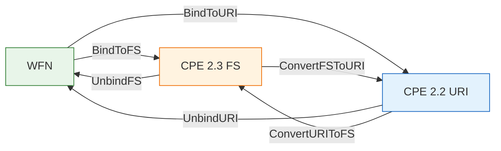

# 🔗 绑定（WFN ↔ FS / URI）

本模块负责按 NISTIR 7695 规范，将 `WFN` 绑定到 CPE 的两种序列化形式：2.3 **格式化字符串（FS）** 与 2.2 **URI**。绑定将逻辑值 `*`（ANY）、`-`（NA）以及已转义的组件值转换为线上传输表示；解绑则相反。本模块还提供两种形式之间互相转换的辅助函数。

## 🔗 BindToFS

```go
func BindToFS(w *WFN) string
```

按 NISTIR 7695 将 `WFN` 绑定为 CPE 2.3 FS 格式字符串。每个属性通过 `Get` 读取（因此未设置的属性变为 ANY），并按 FS 规则转义。结果为 13 个以冒号分隔的部分，以 `cpe:2.3:` 开头。`w` 为 `nil` 时返回空字符串。

| 参数 | 类型 | 说明 |
| --- | --- | --- |
| `w` | `*WFN` | 待绑定的 WFN |

| 返回值 | 类型 | 说明 |
| --- | --- | --- |
| 第 1 个 | `string` | CPE 2.3 FS 字符串，`w` 为 nil 时返回 `""` |

```go
wfn := &cpeskills.WFN{Part: "a", Vendor: "microsoft", Product: "windows", Version: "10"}
fmt.Println(cpeskills.BindToFS(wfn)) // cpe:2.3:a:microsoft:windows:10:*:*:*:*:*:*:*
```

## ✂️ UnbindFS

```go
func UnbindFS(fs string) (*WFN, error)
```

将 CPE 2.3 FS 字符串解绑回 `WFN`。输入必须以 `cpe:2.3:` 开头并恰好包含 13 个以冒号分隔的组件；每个组件按 FS 规则反转义。

| 参数 | 类型 | 说明 |
| --- | --- | --- |
| `fs` | `string` | CPE 2.3 FS 格式字符串 |

| 返回值 | 类型 | 说明 |
| --- | --- | --- |
| 第 1 个 | `*WFN` | 解绑得到的 WFN，出错时为 `nil` |
| 第 2 个 | `error` | 成功为 `nil`，否则为格式错误 |

```go
wfn, err := cpeskills.UnbindFS("cpe:2.3:a:microsoft:windows:10:*:*:*:*:*:*:*")
if err != nil {
    panic(err)
}
fmt.Println(wfn.Vendor, wfn.Product) // microsoft windows
```

## 🔗 BindToURI

```go
func BindToURI(w *WFN) string
```

按 NISTIR 7695 将 `WFN` 绑定为 CPE 2.2 URI 格式字符串。五个主字段（part、vendor、product、version、update）在 `cpe:/` 前缀之后以冒号分隔；扩展属性以 `~` 打包并追加。`w` 为 `nil` 时返回空字符串。

| 参数 | 类型 | 说明 |
| --- | --- | --- |
| `w` | `*WFN` | 待绑定的 WFN |

| 返回值 | 类型 | 说明 |
| --- | --- | --- |
| 第 1 个 | `string` | CPE 2.2 URI 字符串，`w` 为 nil 时返回 `""` |

```go
wfn := &cpeskills.WFN{Part: "a", Vendor: "microsoft", Product: "windows", Version: "10"}
fmt.Println(cpeskills.BindToURI(wfn)) // cpe:/a:microsoft:windows:10
```

## ✂️ UnbindURI

```go
func UnbindURI(uri string) (*WFN, error)
```

将 CPE 2.2 URI 字符串解绑回 `WFN`。输入必须以 `cpe:/` 开头。主字段按位置读取；含 `~` 的扩展属性段会被解包到 edition、language、sw_edition、target_sw、target_hw、other。

| 参数 | 类型 | 说明 |
| --- | --- | --- |
| `uri` | `string` | CPE 2.2 URI 格式字符串 |

| 返回值 | 类型 | 说明 |
| --- | --- | --- |
| 第 1 个 | `*WFN` | 解绑得到的 WFN，出错时为 `nil` |
| 第 2 个 | `error` | 成功为 `nil`，否则为格式错误 |

```go
wfn, err := cpeskills.UnbindURI("cpe:/a:microsoft:windows:10")
if err != nil {
    panic(err)
}
fmt.Println(wfn.Part, wfn.Vendor, wfn.Product, wfn.Version) // a microsoft windows 10
```

## 🔁 ConvertURIToFS

```go
func ConvertURIToFS(uri string) (string, error)
```

将 CPE 2.2 URI 字符串转换为 CPE 2.3 FS 字符串：先解绑为 `WFN`，再重新绑定为 FS。

| 参数 | 类型 | 说明 |
| --- | --- | --- |
| `uri` | `string` | CPE 2.2 URI 格式字符串 |

| 返回值 | 类型 | 说明 |
| --- | --- | --- |
| 第 1 个 | `string` | 转换得到的 CPE 2.3 FS 字符串 |
| 第 2 个 | `error` | 成功为 `nil`，否则为解绑错误 |

```go
fs, err := cpeskills.ConvertURIToFS("cpe:/a:microsoft:windows:10")
if err != nil {
    panic(err)
}
fmt.Println(fs) // cpe:2.3:a:microsoft:windows:10:*:*:*:*:*:*:*
```

## 🔁 ConvertFSToURI

```go
func ConvertFSToURI(fs string) (string, error)
```

将 CPE 2.3 FS 字符串转换为 CPE 2.2 URI 字符串：先解绑为 `WFN`，再重新绑定为 URI。

| 参数 | 类型 | 说明 |
| --- | --- | --- |
| `fs` | `string` | CPE 2.3 FS 格式字符串 |

| 返回值 | 类型 | 说明 |
| --- | --- | --- |
| 第 1 个 | `string` | 转换得到的 CPE 2.2 URI 字符串 |
| 第 2 个 | `error` | 成功为 `nil`，否则为解绑错误 |

```go
uri, err := cpeskills.ConvertFSToURI("cpe:2.3:a:microsoft:windows:10:*:*:*:*:*:*:*")
if err != nil {
    panic(err)
}
fmt.Println(uri) // cpe:/a:microsoft:windows:10
```

## 📐 绑定流程示意图


