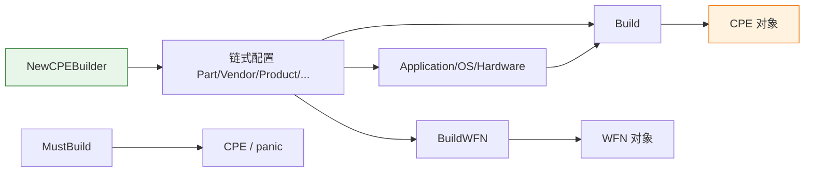

# 🏗️ CPE 构建器

`CPEBuilder` 提供流式（chainable）API 来构建 CPE 对象，内部基于 WFN（Well-Formed Name）表示。

## 类型：CPEBuilder

```go
type CPEBuilder struct {
    // 包含未导出字段
}
```

`CPEBuilder` 是不透明结构体，通过 `NewCPEBuilder()` 创建，并使用链式方法配置各属性。

## 🆕 NewCPEBuilder

```go
func NewCPEBuilder() *CPEBuilder
```

创建一个新的 `CPEBuilder` 实例。

| 返回值 | 类型 | 说明 |
| --- | --- | --- |
| 第 1 个 | `*CPEBuilder` | 新的构建器实例 |

```go
b := cpeskills.NewCPEBuilder()
```

## ⚙️ 链式属性方法

以下方法均返回 `*CPEBuilder`，支持链式调用：

```go
func (b *CPEBuilder) Part(part string) *CPEBuilder
func (b *CPEBuilder) Vendor(vendor string) *CPEBuilder
func (b *CPEBuilder) Product(product string) *CPEBuilder
func (b *CPEBuilder) Version(version string) *CPEBuilder
func (b *CPEBuilder) Update(update string) *CPEBuilder
func (b *CPEBuilder) Edition(edition string) *CPEBuilder
func (b *CPEBuilder) Language(language string) *CPEBuilder
func (b *CPEBuilder) SoftwareEdition(swEdition string) *CPEBuilder
func (b *CPEBuilder) TargetSoftware(targetSw string) *CPEBuilder
func (b *CPEBuilder) TargetHardware(targetHw string) *CPEBuilder
func (b *CPEBuilder) Other(other string) *CPEBuilder
```

| 参数 | 类型 | 说明 |
| --- | --- | --- |
| 各方法首参 | `string` | 对应属性值 |

| 返回值 | 类型 | 说明 |
| --- | --- | --- |
| 第 1 个 | `*CPEBuilder` | 返回构建器自身以支持链式调用 |

```go
b := cpeskills.NewCPEBuilder().
    Part("a").
    Vendor("microsoft").
    Product("windows").
    Version("10")
```

## 🏷️ Application / OS / Hardware

```go
func (b *CPEBuilder) Application() *CPEBuilder
func (b *CPEBuilder) OS() *CPEBuilder
func (b *CPEBuilder) Hardware() *CPEBuilder
```

便捷方法，分别将 Part 设为应用（`a`）、操作系统（`o`）、硬件（`h`）。

| 返回值 | 类型 | 说明 |
| --- | --- | --- |
| 第 1 个 | `*CPEBuilder` | 返回构建器自身 |

```go
b := cpeskills.NewCPEBuilder().Application().Vendor("adobe").Product("acrobat_reader")
```

## 🏁 Build

```go
func (b *CPEBuilder) Build() (*CPE, error)
```

构建并返回 `CPE` 对象。若任一属性非法则返回错误。

| 返回值 | 类型 | 说明 |
| --- | --- | --- |
| 第 1 个 | `*CPE` | 构建的 CPE 对象 |
| 第 2 个 | `error` | 构建失败时返回错误 |

```go
cpe, err := cpeskills.NewCPEBuilder().
    Application().Vendor("microsoft").Product("windows").Version("10").
    Build()
```

## 🚀 MustBuild

```go
func (b *CPEBuilder) MustBuild() *CPE
```

构建并返回 `CPE` 对象，构建失败时 panic。

| 返回值 | 类型 | 说明 |
| --- | --- | --- |
| 第 1 个 | `*CPE` | 构建的 CPE 对象 |

```go
cpe := cpeskills.NewCPEBuilder().Application().Vendor("microsoft").Product("windows").MustBuild()
```

## 🔧 BuildWFN

```go
func (b *CPEBuilder) BuildWFN() (*WFN, error)
```

构建并返回底层 WFN（Well-Formed Name）对象。

| 返回值 | 类型 | 说明 |
| --- | --- | --- |
| 第 1 个 | `*WFN` | 构建的 WFN 对象 |
| 第 2 个 | `error` | 构建失败时返回错误 |

```go
wfn, err := cpeskills.NewCPEBuilder().Application().Vendor("microsoft").BuildWFN()
```

## 🧭 构建器流程


